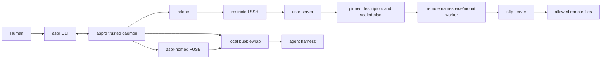
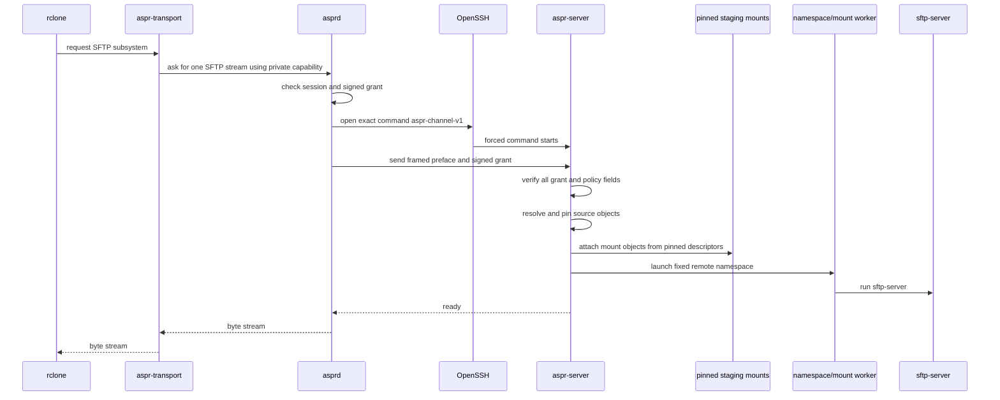
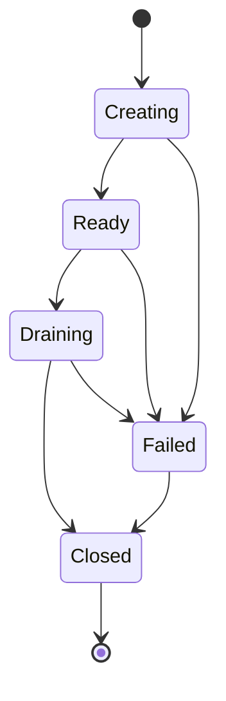
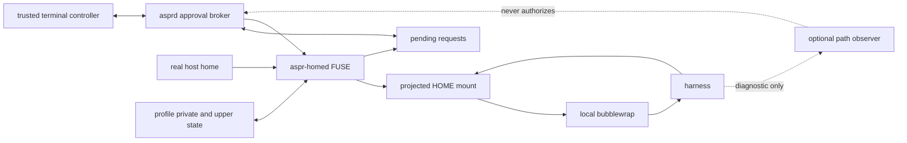
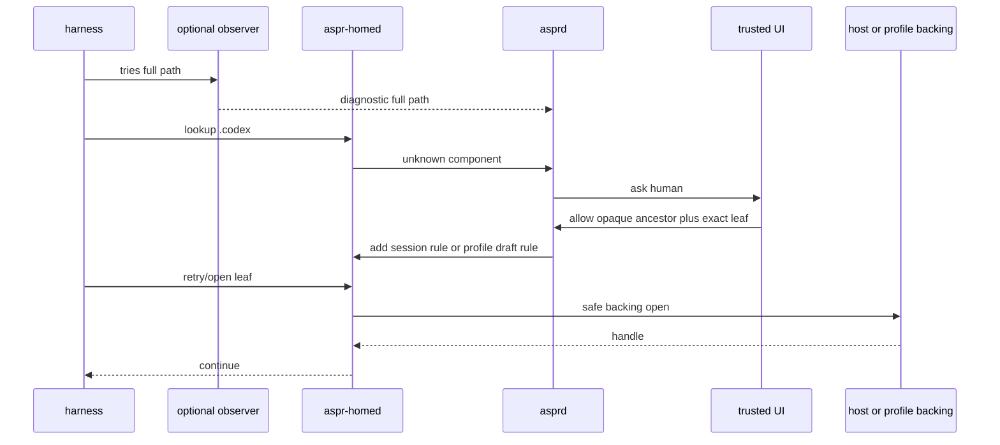
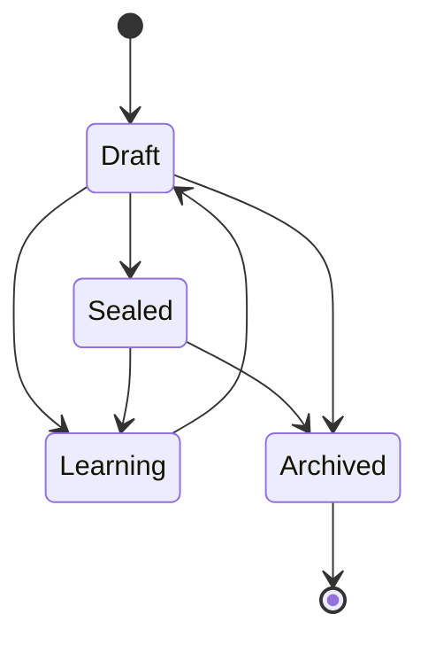

# Astral Project Architecture
## Caveman Version

**Tool name:** Astral Project  
**Commands:** `astral-project` and `aspr`  
**First platform:** Linux  
**Main language:** Python 3.12 for version 1  
**Status:** Packet 15 canonical remote architecture; Packet 16 integration baseline.

---

# 1. Big idea

Agent need file power.

Agent must not get all file power.

Human pick remote paths.
Human say read-only or read-write.
Astral Project make a small remote world.
Only picked paths exist in that world.
Agent use normal file tools against that world.
Agent get no normal SSH key.
Agent get no remote shell.
Agent cannot add more paths.

Local machine may also have secret files.
Optional local sandbox hide those files.
Agent still need normal Codex, Claude Code, Pi, Hermes, or other setup.
Astral Project make a fake home directory with only approved config and state.
`aspr profile learn` asks human when program needs a new home path.
Profile stays for later projects.

No harness-specific security code.
Harness is just a process.
Kernel boundary does security.

---

# 2. Two separate walls

There are two problems.
Do not mix them.

## Wall A: remote wall

Remote server has sensitive data.
Grant names exact allowed paths.
Signed grant enters remote `aspr-server`/broker request.
Root broker authenticates peer and checks grant plus server ceiling.
Source resolves under target-user DAC.
Broker pins descriptors and seals bounded plan.
Namespace worker builds private synthetic root.
Fixed digest-verified `sftp_v1` runtime loses setup authority.
Final confined OpenSSH `sftp-server` serves view.
This is not remote bubblewrap production backend.
Rclone talks to SFTP server.

## Wall B: local wall

Local workstation may have sensitive data.
Agent runs inside local bubblewrap sandbox.
Real home directory is hidden.
FUSE projected home shows only approved config and state.

MCP is not wall.
Skill is not wall.
Harness setting is not wall.
Rclone filter is not wall.

Packet 15 wall is frozen: root broker sole namespace authority; caller stays unprivileged; peer credentials authenticate but do not authorize alone; grant and root ceiling both checked; target-user DAC; pinned descriptors; sealed bounded plan; fixed `sftp_v1`; final child gets no mount, user namespace, network, shell, or broker-state power; RO stays kernel RO; expiry/cancel kill supervised work; failure closes.

Certified POC target: Ubuntu 26.04 amd64. Ubuntu 24.04 packaged AppArmor gate failed and stays uncertified. Support needs evidence per distro/release/architecture. Debian, Fedora, Rocky are future targets. systemd/AppArmor are Ubuntu host integration, not protocol authority. Bubblewrap remains local-agent sandbox tool only.



---

# 3. Hard rules

These rules are not optional.

1. Agent never gets normal SSH private key.
2. Agent never gets unrestricted SSH agent socket.
3. Agent never gets remote shell through Astral Project.
4. Agent cannot choose host, remote user, or new path after grant is signed.
5. Path not in grant does not exist in remote view.
6. Read-only path is kernel-mounted read-only.
7. Rclone include and exclude rules do not enforce security.
8. Remote source path is pinned before mount. No check-path-then-open-path race.
9. Agent sandbox gets no main daemon socket.
10. Agent sandbox gets no private transport socket.
11. Agent sandbox gets no raw rclone config.
12. Agent sandbox gets no `/dev/fuse` in version 1.
13. Agent sandbox gets no mount power in version 1.
14. Remote mounts are made before sandbox starts.
15. Agent cannot approve its own profile request.
16. Unknown profile access times out and fails closed.
17. Expired or revoked grant cannot open new session.
18. Active remote session dies at expiry or revocation.
19. No hidden file descriptor may leak secret access into child.
20. Failure to build secure boundary means command fails. No weak fallback.
21. Trusted Python processes run in isolated mode.
22. Trusted process import path cannot include project directory, current directory, user site-packages, or user `PYTHONPATH`.
23. Production dependencies come from locked and verified artifacts.
24. `shell=True` is forbidden.
25. Any native syscall shim is tiny, typed, reviewed, and policy-free.

---

# 4. Threat model

## Trust these

- Human operator.
- `asprd` local daemon.
- `aspr-homed` FUSE daemon.
- `aspr-server` remote helper.
- Bubblewrap.
- OpenSSH.
- OpenSSH `sftp-server`.
- Rclone.
- Linux kernel.

These are trusted computing base.
Keep them small where possible.
Pin tested versions where needed.

## Do not trust these

- Agent harness.
- Agent plugins.
- Agent hooks.
- Project-local config.
- Code agent writes.
- Child process made by agent.
- Text printed by agent.
- Paths or arguments supplied by agent.
- Network attacker.

## Agent may try

- `..` path escape.
- Symlink escape.
- Rename race.
- Hardlink trick.
- Source replacement race.
- Read hidden local home.
- Find SSH keys.
- Use Docker socket.
- Use keyring socket.
- Spoof approval prompt.
- Flood approval queue.
- Replace rclone config.
- Run another `ssh` binary.
- Relay a narrow session capability over network.
- Write code that human or CI runs later.

## Out of scope

Astral Project does not beat:

- compromised kernel;
- root on local machine;
- root on remote machine;
- bug in trusted dependency;
- human who already has direct access;
- later execution of bad code that agent was allowed to write.

---

# 5. Main parts

Use one `uv`-managed Python project.
Keep one main Python package.
Install two command launchers:

```text
~/.local/bin/astral-project
~/.local/bin/aspr
```

Both launch same CLI entry point.
Trusted launchers use a fixed Python interpreter and fixed application path.
Trusted daemon and remote helper run Python in isolated mode.
They must ignore user `PYTHONPATH`, user site-packages, and current working directory imports.

Use:

- `pyproject.toml`;
- `uv.lock`;
- pinned Python version;
- Ruff for format and lint;
- mypy in strict mode;
- pytest;
- coverage for security-critical branches.

Use Python for policy, protocol, orchestration, state, and CLI code.
Do not use `shell=True`.
Pass subprocess arguments as typed lists.
Do not load plugins into trusted daemon, remote helper, transport wrapper, or FUSE daemon.

Python standard library may not expose every Linux mount syscall needed by the pinned-mount design.
The descriptor-pinned mount gate must prove one of these:

1. safe implementation with existing Python OS interfaces;
2. tiny reviewed `ctypes` syscall module;
3. tiny reviewed native extension or helper.

Native part may expose only narrow syscall wrappers.
Native part must contain no grant policy, path policy, protocol parsing, or user interface.
Most project code stays Python.

## `aspr` CLI

Human-facing command.

Does:

- parse command;
- talk to local daemon;
- show grants, sessions, mounts, profiles, approvals, audit;
- start trusted terminal controller for profile learning;
- print text or JSON.

Does not:

- read signing key directly;
- read SSH key directly;
- build raw bubblewrap command from user text;
- open remote shell.

## `asprd`

Trusted local daemon.

Owns:

- grant signing key;
- dedicated per-host SSH keys;
- SQLite state;
- sessions;
- rclone processes;
- rclone mounts;
- FUSE projected-home processes;
- local bubblewrap sandboxes;
- approvals;
- audit.

Has two socket classes:

1. Main control socket for trusted host user.
2. Narrow session sockets for sandbox or transport child.

## `aspr-transport`

Small bridge used by daemon-run rclone.

Does:

- accept only expected SFTP subsystem invocation;
- use private environment token and private socket;
- ask daemon for one SFTP stream;
- copy bytes between rclone and daemon;
- reject shell, checksum command, forwarding, host selection, user selection, and arbitrary options.

Has no SSH key.
Has no grant-selection power.

## `aspr-server`

Remote forced-command helper.

Does:

- accept only exact marker `aspr-channel-v1`;
- parse bounded binary preface;
- verify grant signature;
- verify host, user, time, revocation, issuer, and server policy;
- resolve and pin source paths;
- build private staging mount tree;
- request root broker namespace construction from typed signed grant;
- run `sftp-server`;
- supervise expiry and revocation.

## `aspr-homed`

Trusted FUSE daemon.

Does:

- present fake home at normal `$HOME` path;
- apply profile rules on every lookup, read, write, list, rename, and other operation;
- read approved host-backed files;
- store private and overlay state;
- create pending approval requests;
- keep inode and handle tables;
- fail unknown request closed.

## Rclone

Rclone stays outside agent sandbox in version 1.

Rclone gives:

- `ls`;
- `mount`;
- normal file operations over SFTP.

Rclone does not decide authorization.

## Bubblewrap

Bubblewrap builds planned local agent sandbox only. Remote production namespace comes from root broker and namespace/mount worker.

Astral Project builds fixed argv.
No raw bwrap flags from human, grant, profile, or agent.

## OpenSSH `sftp-server`

Preferred remote file server.

Why:

- speaks SFTP on stdin/stdout;
- uses actual mounted filesystem;
- many connections see same backing state;
- no rclone server VFS split-state problem.

`rclone serve sftp --stdio` is only experimental fallback.

---

# 6. State layout

Use XDG paths.
Canonical app directory name stays `astral-project`.
Internal names use `aspr` and `ASPR_`.

## Local config

```text
$XDG_CONFIG_HOME/astral-project/
├── config.toml
├── hosts/
│   └── <host-id>.toml
└── profiles/
    └── <profile-name>.toml
```

## Local state

```text
$XDG_STATE_HOME/astral-project/
├── state.sqlite3
├── keys/
│   ├── grant-signing.key
│   └── ssh/
├── profiles/
│   └── <profile-id>/
│       ├── upper/
│       ├── private/
│       └── metadata.sqlite3
├── rclone-cache/
└── audit/
```

## Local runtime

```text
$XDG_RUNTIME_DIR/astral-project/
├── daemon.sock
├── homes/<session-id>/
├── mounts/<session-id>/
├── sessions/<session-id>/
│   ├── transport.sock
│   ├── agent.sock
│   └── ephemeral-rclone.conf
└── approvals.sock
```

## Remote state

```text
~/.local/libexec/astral-project/aspr-server
~/.config/astral-project/server.toml
~/.local/state/astral-project/
├── issuer-keys/
├── revoked-grants/
└── audit/

/etc/astral-project/server-policy.toml   # optional root-owned ceiling
```

## Modes

- Config directory: `0700`.
- Runtime directory: `0700`.
- Socket: `0600`.
- Private key: `0600`.
- Audit log: `0600`.
- Wrong owner or loose mode: fail closed.

---

# 7. Host enrollment

Command:

```bash
aspr host enroll alice@cluster.example
```

Enrollment is one trusted setup action.
It may use normal user SSH setup.
Agent never gets that setup.

## Enrollment steps

1. Connect with existing SSH.
2. Show and pin remote SSH host key fingerprint.
3. Find remote user and home.
4. Check Linux and CPU architecture.
5. Check bubblewrap and user namespaces.
6. Check `openat2`.
7. Check `open_tree`, `move_mount`, and `mount_setattr`.
8. Check Landlock ABI.
9. Find OpenSSH `sftp-server`.
10. Find dynamic loader and required libraries.
11. Find effective `AuthorizedKeysFile` and `AuthorizedPrincipalsFile` paths.
12. Inspect filesystem and nested mount behavior.
13. Install exact version-pinned remote Python runtime and `aspr-server` application bundle.
14. Make dedicated per-host SSH keypair.
15. Install public key with forced command and `restrict`.
16. Install grant issuer public key.
17. Record critical control-file identity and link count.
18. Run harmless end-to-end test.
19. Remove test data.
20. Save host record.

Conceptual authorized key:

```text
restrict,command="/home/alice/.local/libexec/astral-project/aspr-server server ssh-entry --transport-key <key-id>" <public-key>
```

## Enrollment must fail when

- host key is not trusted;
- forced command cannot be installed;
- helper cannot verify signatures;
- no safe SFTP runtime exists;
- empty namespace cannot be built;
- source cannot be pinned without path reopen;
- read-only bind is writable;
- unapproved host path appears in test namespace;
- control files are inside grantable tree in unsafe way;
- required kernel feature is missing for selected backend.

## Python runtime rule

Do not trust random system Python on remote host.

Enrollment must do one of these:

1. upload a supported, version-pinned CPython runtime and locked application bundle;
2. verify an existing interpreter by exact version and ABI, then install into a private locked environment.

Offline host must support uploaded bundle.
Remote helper startup uses isolated Python mode.
Remote environment removes all `PYTHON*` variables.
Remote code and dependencies are digest checked.
Remote update is atomic and rollback-capable.

`aspr host doctor` explains exact reason.
No silent downgrade.

---

# 8. Grants

Grant is signed capability.
Grant says what remote data exists for session.

Example:

```bash
aspr grant create cluster \
  --name project-4821 \
  --rw /scratch/alice/project/src \
  --ro /scratch/alice/project/docs \
  --ttl 8h
```

Optional target path:

```bash
aspr grant create cluster \
  --rw /scratch/alice/project/src:/project/src \
  --ro /datasets/reference:/reference
```

## Grant fields

Grant envelope contains:

```text
format version
grant ID
issuer key ID
host ID
SSH host key fingerprint
remote user
issued time
not-before time
expiry time
nonce
exports
requested features
optional server-policy hash
signature
```

Use canonical CBOR.
Use Ed25519.
Signature covers all fields except signature.

## Export fields

Each export has:

```text
requested source
canonical source
virtual target
read-only or read-write
file or directory
source identity fields
```

Useful identity fields:

- device;
- inode;
- mount ID;
- filesystem type;
- object type.

## Grant validation

Before local daemon signs grant, remote helper checks path.

Remote helper:

1. requires absolute path;
2. rejects empty, NUL, `.`, and `..` tricks;
3. resolves path safely;
4. checks file type;
5. checks remote user DAC access;
6. records identity;
7. finds nested mounts;
8. applies server policy ceiling;
9. returns canonical result tied to nonce;
10. asks human to approve changed canonical path or topology.

Every connection checks again.
Old validation is not permanent truth.

## Positive policy only

Good:

```text
allow RO /project/docs
allow RW /project/src
```

Bad:

```text
allow /
deny /secret
```

Version 1 has no remote deny holes.
Broad root grants usually fail because protected control paths sit underneath.

## Overlap rules

- Exact duplicates merge.
- Nested exports with same mode may collapse.
- Nested exports with different mode fail.
- Two exports cannot use same target.
- Export target cannot overlap Astral runtime.
- Root, remote home, and broad parents usually fail.

Example:

```text
RW /project
RO /project/secrets
```

Result:

```text
Rejected. Use disjoint allowed subtrees.
```

---

# 9. Remote server policy ceiling

Grant cannot override server policy.
Effective power is intersection:

```text
root admin policy
AND remote user policy
AND signed grant
```

Example policy:

```toml
version = 1
allowed_roots = ["/scratch/alice", "/datasets/public"]
forbidden_roots = ["/scratch/alice/secrets"]
max_ttl_seconds = 28800
max_exports = 16
allow_read_write = true
allow_regular_files = true
allow_directories = true
allow_nested_mounts = false
require_source_identity = true
issuer_key_ids = ["issuer_01J..."]
```

Policy may only narrow.
Policy change applies to new connection.
Old policy hash does not grandfather grant.

## Never grant control-plane paths

Never grant:

- effective `authorized_keys` files;
- effective authorized principals files;
- remote `.ssh` tree by default;
- `aspr-server` application bundle, Python runtime, and parent control directory;
- issuer keys;
- server policies;
- revocation state;
- audit control files;
- SFTP runtime bundle;
- sockets;
- device nodes;
- procfs;
- sysfs;
- cgroupfs;
- debugfs;
- tracefs;
- securityfs;
- configfs;
- bpffs.

Reject export if reserved object is inside export or export sits inside reserved control tree in unsafe way.

Check critical control-file inode, digest where useful, and hardlink count.
Link count over one is strict failure.

Also warn on writable execution and persistence paths:

- shell startup files;
- user service files;
- scheduler hooks;
- autostart files;
- CI config;
- scripts trusted service may run later.

Astral Project cannot make writable code harmless.

---

# 10. Remote connection flow



## Remote preface

Use small length-prefixed binary protocol.
Preface says operation type and carries signed grant.

Operations may include:

- validate grant draft;
- open SFTP stream;
- write revocation marker;
- probe server health.

Every frame has hard size limit.
Unknown version fails.
Unknown mandatory field fails.
Standard output stays protocol-clean.
Diagnostics go to standard error.

## Exact SSH command

Dedicated SSH key accepts only:

```text
aspr-channel-v1
```

Forced command ignores arbitrary executable request.
`SSH_ORIGINAL_COMMAND` must exactly match marker.
No PTY.
No forwarding.
No agent forwarding.
No shell.

---

# 11. Safe remote source pinning

This is hard part.
Do not fake it.

Bad flow:

```text
check /path
attacker swaps /path
mount /path
```

Good flow:

```text
resolve path safely
open and pin object descriptor
clone or attach mount from pinned object
never reopen mutable path string
```

Preferred Linux tools:

- `openat2`;
- `open_tree`;
- `move_mount`;
- `mount_setattr`;
- private user and mount namespaces.

Use descriptor-based mount attachment.
A `/proc/self/fd/N` source is allowed only after adversarial proof.
If host cannot do proven pinned attachment, strict mode rejects host.

## Source recheck on every connection

Compare:

- device;
- inode;
- mount ID;
- type;
- filesystem identity where available.

Reject changed export root unless grant explicitly allows replacement semantics.
Identity pin is for export root.
Files inside writable directory may change normally.

## Nested mounts

Grant validation finds subordinate mounts.
Default:

- show them to human;
- require explicit policy;
- hide them if proven possible;
- otherwise reject strict grant.

Do not guess bind-mount behavior on NFS, Lustre, GPFS, autofs, or other filesystems.
Test.

---

# 12. Remote namespace

Root broker receives remote request. It checks peer identity, signed grant, and server ceiling. It resolves source under target-user DAC, pins descriptors, seals bounded plan, and gives plan plus descriptors to namespace/mount worker. Worker builds private synthetic root, verifies fixed runtime, removes setup authority, and runs confined fixed `sftp_v1`. Bubblewrap is not production remote backend; it remains local-agent sandbox tool.

Conceptual final tree:

```text
/
├── scratch/alice/project/src      RW
├── scratch/alice/project/docs     RO
└── .astral-project-runtime/       RO, minimal runtime only
```

Nothing else exists.

Historical remote-bubblewrap command (not production path; retained only as rationale):

```bash
bwrap \
  --unshare-pid \
  --unshare-ipc \
  --unshare-uts \
  --unshare-net \
  --new-session \
  --die-with-parent \
  --clearenv \
  --setenv HOME / \
  --ro-bind /.aspr-staging/runtime /.astral-project-runtime \
  --bind /.aspr-staging/scratch/alice/project/src /scratch/alice/project/src \
  --ro-bind /.aspr-staging/scratch/alice/project/docs /scratch/alice/project/docs \
  /.astral-project-runtime/ld.so ...
```

Real code builds argv directly.
No shell interpolation.
Staging root is private.

## SFTP runtime closure

Dynamic `sftp-server` may need:

- loader;
- libc;
- NSS files or libraries;
- other shared libraries.

Enrollment builds content-addressed manifest.
Runtime bundle contains only known files.
Server starts with explicit loader where needed.
Unexpected dependency fails enrollment.

A mature static SFTP server may later replace closure.
Do not use immature embedded server merely to avoid libraries.

## Landlock

Use as second wall where available.
Allow only:

- granted roots;
- minimal SFTP runtime;
- standard streams.

Mount namespace stays main wall.
Landlock absence must be visible in `doctor` and audit.

---

# 13. Rclone transport

Generated remote:

```ini
[aspr-session]
type = sftp
ssh = /path/to/aspr transport
disable_hashcheck = true
```

Do not set external `ssh` and `shell_type = none` together.
Current rclone rejects that combination.

`aspr-transport` accepts only expected `-s sftp` shape.
It rejects:

- host argument;
- user argument;
- arbitrary SSH option;
- shell command;
- checksum command;
- `df` command;
- forwarding.

All power comes from private daemon-created socket and random environment token.
Token is not in config.
Token is not on command line.
Agent does not see token.

## Compatibility gate

Test pinned rclone versions.
Test:

- `ls`;
- stat;
- mount;
- read;
- write;
- rename;
- unmount.

Capture every external SSH invocation.
If rclone needs forbidden shell behavior, direct wrapper design fails.
Then use daemon-owned loopback SSH proxy.

Loopback proxy gives rclone normal SFTP-only SSH endpoint.
Proxy still uses Astral grant protocol behind it.
Agent still gets no credential.

No later mount work should continue until one transport design passes.

---

# 14. Rclone commands

## `ls`

```bash
aspr ls project-4821:/scratch/alice/project/src --recursive
```

Daemon still uses rclone `lsjson` under hood.
Public command is `ls`, not `lsjson`.

Default output is reader-friendly text:

```text
TYPE  SIZE       MODIFIED                  PATH
dir   -          2026-07-26T19:42:11Z      src/
file  12.4 KiB   2026-07-26T19:44:03Z      src/main.py
file  842 B      2026-07-26T19:44:10Z      README.md
```

Default formatter:

- parses rclone JSON;
- prints stable columns;
- uses human-readable sizes;
- uses unambiguous ISO 8601 timestamps;
- marks directories clearly;
- escapes tabs, newlines, control bytes, and terminal escape bytes in names;
- never writes untrusted filename bytes as active terminal control sequences;
- gives stable errors for malformed rclone output.

Support:

- recursive;
- non-recursive;
- stat;
- max depth;
- hashes when SFTP supports without shell;
- convenience filters;
- timeout;
- cancellation;
- `--no-header`;
- `--sort path|name|size|modified|type`;
- `--reverse`.

Output modes:

```bash
aspr ls grant:/path              # reader-friendly table
aspr ls grant:/path --json       # normalized Astral Project JSON
aspr ls grant:/path --raw        # exact underlying rclone lsjson bytes
```

`--raw` is escape hatch.
It preserves rclone payload exactly.
It is for debugging or consumers that need native rclone fields.

`--json` uses stable Astral Project schema.
It is better automation interface than `--raw`.

`--raw`, `--json`, and table-only formatting flags are mutually exclusive where they conflict.

Sandbox API method is `RunLs`.
Agent may list only paths inside session grant.
Agent cannot name another grant.

## `mount`

```bash
aspr mount project-4821:/scratch/alice/project/src ./remote-src
```

Daemon:

1. validates grant and local mountpoint;
2. makes session config and cache;
3. starts rclone outside sandbox;
4. waits for real readiness;
5. records PID, mount ID, cache, grant, capability;
6. watches health and expiry;
7. drains writes before close when possible;
8. warns if forced close may lose writes;
9. cleans stale mount after daemon restart.

Candidate defaults:

```text
--vfs-cache-mode writes
--cache-dir <session-cache>
--sftp-disable-hashcheck
--umask 077
```

Exact VFS settings are test gate.
Do not claim safe writeback before destructive tests.

## Mount states



Forced close says “possible unflushed writes.”
Never report clean close after flush failure.

---

# 15. Sandbox remote views

Version 1 creates remote mount before sandbox launch.

Example:

```bash
aspr sandbox \
  --profile agents-default \
  --remote project-4821:/scratch/alice/project/src=/workspace/project \
  --remote project-4821:/datasets/reference=/workspace/reference:ro
```

Flow:

1. Daemon creates host-side rclone mounts.
2. Daemon proves each mount ready.
3. Local bubblewrap starts.
4. Bubblewrap bind-mounts remote views at fixed targets.
5. Agent sees normal files.
6. Agent sees no rclone config, SSH key, transport socket, or `/dev/fuse`.

One sandbox uses one signed grant in version 1.
Multiple paths from same grant are fine.
New remote path means restart sandbox.

Default on remote loss:

```text
terminate sandbox
```

Optional compatibility mode may keep sandbox alive while mount returns errors.

## Narrow sandbox session API

Sandbox may call:

```text
DescribeSession
RunLs
GetRemoteMounts
GetExpiry
CloseOwnSession
```

Sandbox may not call:

```text
OpenSftpStream
CreateMount
RenewGrant
ChangeGrant
ReadRcloneConfig
ApproveProfile
AdministerProfile
```

Treat session socket as bearer capability.
Agent can relay it if network is inherited.
Therefore socket must give no more power than signed grant already gives.

---

# 16. Local sandbox

Local sandbox is optional.
Remote capability still works without it.

## Remote-only mode

```bash
aspr mount project-4821:/path ./remote
codex
```

Good:

- all normal local config works;
- easy.

Bad:

- agent can read normal local files.

Label honestly.

## Learned-profile mode

```bash
aspr sandbox --profile agents-default --grant project-4821
```

Default opens restricted shell.
Human runs any harness inside.

Or:

```bash
aspr sandbox --profile agents-default --grant project-4821 -- codex
```

This is generic `exec`.
Not Codex integration.

## Visible in sandbox

- read-only system runtime;
- selected toolchains;
- project directories;
- pre-mounted remote views;
- projected home at normal path;
- approved sockets;
- minimal `/tmp`;
- minimal `/dev`;
- selected environment;
- narrow session socket.

## Hidden in sandbox

- real home outside rules;
- SSH keys;
- unrestricted SSH agent;
- unapproved cloud credentials;
- Docker or Podman socket;
- system D-Bus;
- keyring socket;
- unrelated project trees;
- unrelated mounts;
- main daemon socket;
- transport socket;
- rclone config;
- `/dev/fuse`;
- mount helpers;
- host PID namespace;
- host `/proc`.

## Bubblewrap baseline

- empty mount namespace;
- read-only system runtime;
- private `/tmp`;
- minimal `/dev`;
- separate PID, IPC, UTS namespaces;
- sandbox-local `/proc` if needed;
- `--new-session`;
- close all extra file descriptors;
- bind projected home at ordinary `$HOME`;
- bind project and remote views explicitly;
- no `CAP_SYS_ADMIN` after setup;
- no raw mount power.

## Network modes

```text
inherit  = normal host network. Good compatibility. Weak isolation.
none     = new network namespace. Loopback only.
proxy    = future filtered egress.
```

Do not silently choose.
Profile or organization policy chooses.

Outer sandbox should not break harness inner sandbox without reason.
Do not add aggressive seccomp in first release.
Test Codex, Claude Code, and others as compatibility tests only.

---

# 17. Projected home and profile learning

Command:

```bash
aspr profile learn agents-default -- codex
```

Later:

```bash
aspr profile learn agents-default -- claude
aspr profile learn agents-default -- pi
```

Same profile works for all.
Profile is user asset, not project asset.

## Main idea

Host path:

```text
/home/alice
```

Sandbox path:

```text
/home/alice
```

Same string.
Different filesystem.
Sandbox path is FUSE projected home.

This keeps:

- `$HOME` config;
- absolute paths in hooks;
- plugins;
- user binaries;
- package-manager paths;
- normal harness behavior.

## Architecture



FUSE is enforcement.
Optional observer only improves prompt text.
Observer failure never grants access.

## Profile rule modes

### `host-ro`

Live host content.
Read-only.

Use for config.

### `host-rx`

Live host content.
Read-only.
Executable bits visible.

Use for hooks and user binaries.
This does not stop interpreted execution.
Readable script can still run through interpreter.

### `private-rw`

Profile-owned writable directory.
No host lower layer.

Use for cache, logs, private state.

### `overlay-rw`

Host content is lower read-only layer.
Profile state is writable upper layer.

Reads:

```text
upper exists -> upper
whiteout -> absent
else -> host lower
```

Writes:

```text
copy lower to upper if needed
write upper only
```

Use for app state that needs old host setup but must not modify real home.

### `deny`

Explicit deny.
Local FUSE may support exact deny in first release.
Subtree deny only after precedence and tests are solid.

## Operation classes

Policy must distinguish:

- lookup/traverse;
- stat;
- directory list;
- read;
- create;
- write;
- truncate;
- rename;
- hardlink;
- symlink;
- unlink;
- mkdir/rmdir;
- chmod/chown;
- xattr;
- lock;
- fsync;
- executable mode exposure.

Known file lookup does not imply sibling listing.
This matters.

---

# 18. Unknown path learning

Kernel resolves path one component at a time.
FUSE may see `.codex` before it knows program wants `.codex/config.toml`.
Do not pretend otherwise.

## Unknown request flow



## Opaque traversal

Opaque directory rule says:

- directory exists;
- named child lookup may continue;
- `readdir` denied;
- sibling names hidden;
- extra metadata minimized.

This leaks guessed directory existence and type.
Document it.
User who wants zero leak must pre-seed exact rules or use sealed deny mode.

## Unknown request choices

Human may choose:

```text
Allow once
Opaque traverse once
Persist opaque traverse
Exact host-ro
Subtree host-ro
Exact overlay-rw
Subtree overlay-rw
Private-rw
Deny once
Persist deny
Inspect limited metadata
```

Version 1 does not write directly to real host home.
All writable rules use overlay or private state.

Credential, socket, broad subtree, shell history, SSH config, cloud config, browser profile, Docker socket, and D-Bus requests need stronger warning.

## Queue behavior

- Coalesce same request.
- Rate-limit alerts.
- Group ancestor and leaf only when evidence supports it.
- Never widen because many requests happened.
- Cap pending request count.
- Cap memory.
- Give every held FUSE request a deadline.
- Timeout returns `EACCES` or `ENOENT` according to profile.

---

# 19. Trusted approval UI

Agent can print fake prompt.
Therefore approval cannot be normal child text.

Default one-terminal design:

1. Parent owns PTY.
2. Parent reserves `Ctrl-]`.
3. Pending request may ring bell or show small status only.
4. Human presses `Ctrl-]`.
5. Parent stops forwarding child input.
6. Parent pauses or buffers child output.
7. Parent shows trusted UI with session ID and request number.
8. Human decides.
9. Parent returns to child terminal.

Only input after trusted transition can approve.
Child never sees approval keys.
Child never sees admin socket.

Alternate mode:

```bash
aspr profile learn --approval-ui external agents-default -- codex
aspr approvals --session <id>
```

Need tests for:

- full-screen terminal apps;
- resize;
- signals;
- job control;
- suspend/resume;
- crash restoration;
- fake prompt spam;
- child trying to consume escape key.

---

# 20. FUSE safety

`aspr-homed` opens real home as `O_PATH` root descriptor.
All host-backed operations are relative to that descriptor.

Use:

- `openat2` safe flags where available;
- component-by-component dirfd fallback;
- no magic links;
- no path escape;
- open backing descriptors;
- synthetic inode numbers;
- separate authorization from path cache.

Do not authorize string then reopen absolute string.

## Overlay constraints for first release

May return stable errors for:

- cross-rule rename: `EXDEV`;
- hardlink across overlay roots;
- device nodes;
- setuid/setgid bits;
- unsupported xattrs: `ENOTSUP`;
- exotic leases;
- exotic locks;
- unproven mmap behavior.

Clear setuid and setgid bits.
Use synthetic ownership.
Document limits.

Need crash-safe whiteouts and copy-up.
Need SQLite WAL, lock, rename, mmap, concurrent process tests before broad claim.

---

# 21. Profile format and lifecycle

Example:

```toml
version = 1
id = "profile_01J..."
name = "agents-default"
unknown_learning = "prompt"
unknown_sealed = "hide"
sealed = false

[environment]
inherit = ["PATH", "LANG", "LC_ALL", "TERM", "EDITOR", "PAGER"]
unset = [
  "SSH_AUTH_SOCK",
  "AWS_ACCESS_KEY_ID",
  "AWS_SECRET_ACCESS_KEY",
  "AWS_SESSION_TOKEN",
  "KUBECONFIG"
]

[network]
mode = "inherit"

[remote]
on_loss = "terminate-sandbox"

[[home.rules]]
path = ".codex/config.toml"
scope = "exact"
mode = "host-ro"
sensitivity = "configuration"

[[home.rules]]
path = ".codex/auth.json"
scope = "exact"
mode = "host-ro"
sensitivity = "credential"

[[home.rules]]
path = ".codex"
scope = "subtree"
mode = "overlay-rw"
sensitivity = "application-state"

[[home.rules]]
path = ".local/bin"
scope = "subtree"
mode = "host-rx"
sensitivity = "executables"

[[home.rules]]
path = ".cache/codex"
scope = "subtree"
mode = "private-rw"
sensitivity = "cache"
```

Rule order:

1. Exact before subtree.
2. Longer path before shorter path.
3. Deny before allow at same specificity.
4. Equal ambiguous conflict is validation error.

Lifecycle:



Commands:

```bash
aspr profile create agents-default
aspr profile learn agents-default -- codex
aspr profile review agents-default
aspr profile diff agents-default
aspr profile edit agents-default
aspr profile seal agents-default
aspr profile unseal agents-default
aspr profile export agents-default
aspr profile import profile.toml
aspr profile archive agents-default
```

Sealed means unknown access fails.
Sealed does not mean cryptographically immutable.

---

# 22. Environment, sockets, and credentials

Filesystem learner cannot see program reading environment variable from memory.
Environment needs explicit policy.

## Environment

- Inherit small allowlist.
- Remove known secret variables.
- Show suspicious variable names before launch.
- Never log secret values.
- Every `PATH` entry must exist inside sandbox or be removed.

## Sockets

Socket can be more powerful than file.
Default deny:

- SSH agent;
- Docker;
- Podman;
- system D-Bus;
- GPG agent;
- secret service;
- desktop keyring;
- Kubernetes broker;
- cloud broker;
- arbitrary app control socket.

Approved socket is exact bind and explicit capability.
Abstract Unix sockets are not used for trusted control because mount namespace cannot hide them.

## Credentials

If harness reads credential file, harness knows secret.
No magic.

Choices:

- expose read-only;
- use short-lived limited credential;
- use proxy;
- use broker protocol;
- authenticate outside sandbox.

Credential path always gets sensitivity label and strong confirmation.

## Inherited file descriptors

Before child starts, close everything except:

- stdin;
- stdout;
- stderr;
- needed PTY descriptors;
- deliberately documented sealed descriptors.

Use separate PID namespace and sandbox `/proc`.
Agent must not inspect or signal trusted host process by normal PID path.

---

# 23. Public command tree

```text
aspr
├── doctor
├── host
│   ├── enroll
│   ├── list
│   ├── show
│   ├── doctor
│   ├── update-server
│   └── remove
├── grant
│   ├── create
│   ├── validate
│   ├── list
│   ├── show
│   ├── renew
│   └── revoke
├── session
│   ├── open
│   ├── list
│   ├── show
│   └── close
├── ls
├── mount
├── unmount
├── rclone
├── sandbox
├── profile
│   ├── create
│   ├── learn
│   ├── review
│   ├── diff
│   ├── edit
│   ├── seal
│   ├── unseal
│   ├── list
│   ├── export
│   ├── import
│   └── archive
├── approvals
├── audit
│   ├── list
│   ├── show
│   └── export
└── version
```

Both names work:

```bash
astral-project ...
aspr ...
```

Info commands support:

```text
--json
--quiet
--no-color
```

Every error gives:

- stable error code;
- short cause;
- security result;
- fix suggestion;
- nested dependency error when useful.

---

# 24. Normal user flow

## One-time local setup

```bash
aspr doctor
aspr host enroll alice@cluster.example
aspr profile create agents-default
aspr profile learn agents-default -- codex
aspr profile learn agents-default -- claude
aspr profile seal agents-default
```

## New project

```bash
aspr grant create cluster \
  --name simulation-42 \
  --rw /scratch/alice/simulation-42 \
  --ro /datasets/reference \
  --ttl 8h
```

## Human use

```bash
aspr ls simulation-42:/scratch/alice/simulation-42 --recursive
aspr mount simulation-42:/scratch/alice/simulation-42 ./remote
```

## Agent use

```bash
aspr sandbox --profile agents-default --grant simulation-42
```

Inside:

```bash
codex
# or claude
# or pi
# or any program
```

## Harness config changed

```bash
aspr profile learn agents-default -- codex
```

Only new paths prompt.
Old rules and profile state stay.

---

# 25. Audit

Record:

- enrollment;
- host key change;
- key rotation;
- grant create, validate, renew, expire, revoke;
- session start and stop;
- SFTP stream start;
- effective export hash;
- rclone start and exit;
- mount ready and unmount;
- profile request;
- approval and denial;
- profile edit and seal;
- sandbox start;
- missing hardening;
- degraded mode.

Never log:

- private key;
- credential content;
- file content by default;
- secret environment value;
- secret-bearing command argument.

Paths may be secret.
Audit export supports hashing or redaction.

Persisted profile rule provenance:

```text
created time
local UID
source session
observed operation
diagnostic executable
approval choice
previous profile revision
```

Executable name is diagnostic only.
It is not security identity.

---

# 26. Failure behavior

Fail closed.

Examples:

- Signature bad: no session.
- Grant expired: no session.
- Host key changed: no connection.
- Source inode changed: no connection.
- Safe mount pinning unavailable: no strict host support.
- Rclone wrapper behavior changed: no supported rclone use.
- Unknown profile path: wait, then deny/hide.
- Approval UI lost: deny pending operations.
- FUSE daemon dies: sandbox home becomes unusable; terminate sandbox.
- Remote mount dies: default terminate sandbox.
- Flush fails: report possible lost writes.
- Revocation remote host unreachable: revoke local, report partial remote failure.
- User namespaces disabled: report unsupported backend; do not improvise privilege.

---

# 27. Main known gaps

These need spikes and tests.

## Gap A: rclone external SSH behavior

Need prove wrapper sees only usable SFTP call.
Need loopback proxy fallback.

## Gap B: pinned staging mounts

Need prove descriptor-pinned attachment on target kernels and filesystems.
No pathname reopen.

## Gap C: nested mounts

Need exact behavior on ext4, XFS, tmpfs, NFS, Lustre, GPFS, autofs.

## Gap D: SFTP runtime closure

Need minimal loader/library/NSS bundle.
Need detect dependency drift.

## Gap E: user namespaces disabled

Need later root-owned service or site runtime design.
Not first rootless release.

## Gap F: overlay filesystem fidelity

Need tests for:

- SQLite WAL;
- locks;
- mmap;
- rename;
- hardlink;
- concurrent processes;
- crash recovery.

## Gap G: unknown-parent learning

Optional syscall observer may fight nested harness sandbox or ptrace rules.
Must remain optional and non-authorizing.

## Gap H: trusted terminal UX

Need strong tests with full-screen apps and crash.

## Gap I: network policy

Only `inherit` and `none` are simple.
Filtered proxy is future work.

## Gap J: credentials

General secret broker is future work.

## Gap K: rclone VFS writeback

Need destructive tests before safe defaults.

## Gap L: active remote revocation

Need bounded remote revocation polling or watch.
Short TTL remains main backstop.

## Gap M: same-UID trusted process isolation

Need hidden pathname sockets, PID namespace, closed descriptors, no abstract trusted sockets.

## Gap N: hardlink alias to control files

Rootless mode cannot fully stop another same-user process creating alias during active session.
State this limit.
Administrator-owned control state on non-grantable filesystem is stronger.

---

# 28. Test plan

## Unit tests

- canonical grant bytes;
- signature;
- replay binding;
- policy normalization;
- profile precedence;
- protocol frames;
- audit redaction;
- rclone argv;
- bubblewrap argv;
- stable errors.

## Remote tests

Make sentinels:

```text
allowed-ro/file
allowed-rw/file
denied/file
runtime/file
```

Prove:

- allowed read works;
- RO write fails;
- RW write works;
- denied absent;
- `..` fails;
- symlink escape fails;
- rename race fails;
- source replacement race fails;
- pinned mount does not reopen path;
- nested mount policy works;
- runtime has no secret host data;
- expiry kills stream;
- revocation kills stream;
- multiple SFTP connections see coherent state.

## FUSE tests

- exact host-ro;
- subtree host-ro;
- stat without list;
- opaque ancestor traversal;
- private create/write/rename/delete;
- overlay copy-up;
- whiteout;
- merged list;
- symlink safety;
- hardlink limits;
- cross-rule rename;
- mmap behavior;
- concurrent open;
- lower-layer changes;
- observer on and off;
- timeout;
- approval persistence;
- sealed denial;
- crash recovery.

## Harness compatibility tests

For common harnesses:

- starts;
- finds approved config;
- runs approved hook;
- uses explicitly approved auth;
- reads project-local config;
- inner sandbox works;
- sees pre-mounted remote;
- cannot see unrelated home;
- learning works without observer.

Harness test does not become security branch.

## Environment matrix

Distributions:

- Ubuntu LTS;
- Debian stable;
- Fedora;
- RHEL-compatible;
- HPC-like host with user namespaces disabled.

Filesystems:

- ext4;
- XFS;
- tmpfs;
- NFS;
- Lustre or GPFS where available.

Rclone matrix:

- every supported version;
- list;
- stat;
- mount;
- read;
- write;
- rename;
- unmount;
- direct wrapper;
- loopback proxy fallback.

## Adversarial tests

- symlink race;
- rename race;
- hardlink alias;
- `/proc/self/fd`;
- inherited FD;
- socket discovery;
- fake approval prompt;
- path flood;
- broad-rule manipulation;
- alternate SSH;
- rclone config replacement;
- session replay;
- grant replay wrong host;
- grant replay wrong user;
- expired grant;
- writeback after revoke;
- unknown-parent brute force;
- session capability relay;
- same-UID trusted process attack.

---

# 29. Release shape

## Milestone 0: prove hard mechanisms

Must prove before big build:

- rclone transport strategy;
- safe path resolution;
- descriptor-pinned staging mount;
- remote synthetic root and namespace worker;
- minimal SFTP runtime;
- rootless capability detection.

## Milestone 1: remote capability MVP

Have:

- enrollment;
- signed grants;
- remote policy;
- restricted SSH;
- SFTP;
- `ls`;
- host mount;
- expiry;
- revocation;
- audit.

## Milestone 2: local agent environment

Have:

- local bubblewrap;
- pre-mounted remote views;
- FUSE projected home;
- integrated interactive learning;
- trusted approval UI;
- profiles;
- private and overlay state;
- environment and socket policy.

## Milestone 3: security candidate

Have:

- remote and local adversarial suites;
- distro and filesystem matrix;
- rclone matrix;
- common harness compatibility tests;
- packaging;
- operations docs;
- failure cleanup.

## Milestone 4: later ecosystem work

May add:

- MCP;
- recipes;
- filtered network proxy;
- credential brokers;
- restricted-userns service;
- dynamic mounts;
- other operating systems.

---

# 30. First stable release done when

All true:

1. Both `astral-project` and `aspr` work.
2. Host enrollment is idempotent and rollback-safe.
3. Host key pinning works.
4. Dedicated SSH key cannot get shell or forwarding.
5. Grant signature is canonical and replay-bound.
6. Remote policy ceiling only narrows.
7. Reserved control-plane files cannot be granted.
8. Export roots are safely resolved and pinned.
9. Remote namespace contains only allowed paths and minimal runtime.
10. RO is kernel-enforced.
11. Rclone transport matrix passes.
12. `ls` works with formatted, normalized JSON, and raw modes.
13. Host mount works.
14. Mount drain and uncertainty reporting work.
15. Expiry and revocation stop sessions.
16. Local sandbox hides ordinary home and credentials.
17. Agent receives no main socket, transport socket, rclone config, `/dev/fuse`, or mount power.
18. FUSE projected home enforces rules.
19. Unknown-parent learning works with observer off.
20. Trusted approval cannot be forged by child text.
21. Private and overlay writes never touch real home.
22. Sealed profile fails unknown access closed.
23. Environment, PATH, sockets, and descriptors are controlled.
24. Audit redacts secrets.
25. Remote and local adversarial tests pass.
26. Supported distro, filesystem, and rclone matrix is published.
27. Unsupported host fails clearly.
28. Install, upgrade, uninstall, and residue cleanup work.
29. Known residual risks are documented.
30. No MCP, recipe, or harness plugin is needed for security.

---

# 31. Final shape

Human does this:

```bash
aspr host enroll alice@cluster
aspr profile learn agents-default -- codex
aspr grant create cluster --rw /project/src --ro /project/docs --ttl 8h
aspr sandbox --profile agents-default --grant project
```

Agent sees this:

```text
normal tools
normal approved harness config
project files
only granted remote files
```

Agent does not see this:

```text
normal SSH key
remote shell
ungranted remote files
unapproved local home
main daemon authority
mount authority
approval authority
```

That is Astral Project.
