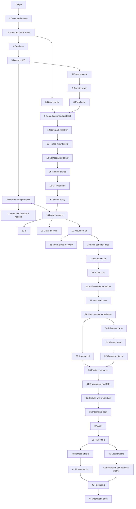

# Astral Project Implementation Instructions
## Caveman Version

**Tool:** Astral Project  
**Commands:** `astral-project` and `aspr`  
**Primary architecture file:** `astral-project-architecture-caveman.md`  
**Primary platform:** Linux  
**Primary language:** Python 3.12 for version 1
**Package manager:** `uv`

This file tells coding agent what to build.
Do packets in order unless packet says otherwise.
Most packet should fit one normal five-hour ChatGPT Plus coding window.
Some small packets may combine.
Some release-gate packet may consume whole window.
If packet finds architecture contradiction, stop. Write ADR. Do not make secret workaround.

---

# 1. Rules for every coding packet

At start of packet:

1. Read architecture file.
2. Read this packet only.
3. Read ADRs named by packet.
4. Inspect current repo.
5. Run current tests.
6. State exact packet goal in work log.

During packet:

1. Keep change narrow.
2. Do not add unrelated feature.
3. Do not weaken failure behavior to make test green.
4. Do not add harness-specific security branch.
5. Do not accept raw shell string where argv can be typed.
6. Do not log secret.
7. Add tests with code.
8. Add stable error code for new failure class.
9. Update docs when public behavior changes.
10. Record unresolved question immediately.
11. Never use `shell=True`.
12. Pass subprocess arguments as lists.
13. Keep trusted import paths fixed and isolated.
14. Do not load user plugins into trusted process.
15. Keep any `ctypes` or native syscall wrapper in one narrow reviewed module.

At end of packet:

1. Format code.
2. Run lint with warnings denied.
3. Run unit tests.
4. Run packet integration tests.
5. Update ADR or protocol fixture if needed.
6. Make clean commit or clean patch set.
7. Write handoff note.
8. Handoff note says:
   - what changed;
   - files changed;
   - tests run;
   - known failures;
   - next packet entry point;
   - security assumptions added or removed.

Do not start next packet while current acceptance test fails.

---

# 2. Repository target

Suggested workspace:

```text
astral-project/
├── pyproject.toml
├── uv.lock
├── .python-version
├── src/
│   └── astral_project/
│       ├── __init__.py
│       ├── cli.py
│       ├── core/
│       ├── protocol/
│       ├── crypto/
│       ├── daemon/
│       ├── host/
│       ├── server/
│       ├── transport/
│       ├── rclone/
│       ├── sandbox/
│       ├── homed/
│       ├── overlay/
│       ├── audit/
│       └── test_support/
├── native/
│   └── README.md
├── tests/
│   ├── unit/
│   ├── integration/
│   ├── adversarial/
│   └── fixtures/
├── packaging/
│   ├── systemd-user/
│   ├── launchers/
│   ├── shell-completions/
│   └── install/
├── docs/
│   ├── architecture.md
│   ├── threat-model.md
│   ├── protocol.md
│   ├── profile-format.md
│   └── operations.md
└── scripts/
```

Use one Python distribution unless a later ADR proves a split is needed.
Keep security-sensitive boundaries in explicit modules.
Install `astral-project` and `aspr` as two launchers for the same CLI.
Trusted launchers must use a fixed interpreter, fixed application path, and Python isolated mode.
Do not execute trusted services through `uv run` in production.

---

# 3. Dependency order



Packet 45 and later are post-core.

---

# Phase 0. Foundation

## Packet 0 — Make Python project

**Goal:** Build empty `uv` Python project that always passes checks.

**Do:**

1. Make `pyproject.toml`.
2. Pin Python minor version in `.python-version`.
3. Use `requires-python = ">=3.12,<3.13"` for version 1 unless ADR changes it.
4. Make `src/astral_project` package tree.
5. Make and commit `uv.lock`.
6. Add Ruff format and lint.
7. Add strict mypy.
8. Add pytest and coverage.
9. Add CI for lock, format, lint, type, test.
10. Add license and contribution file.
11. Add architecture and ADR directories.
12. Add test-helper script entry point.
13. Add dependency review and lockfile diff check.
14. Document isolated Python launch for trusted production processes.

**Do not:**

- add network protocol yet;
- add real daemon yet;
- pick FUSE library without ADR;
- add native code before syscall gate proves need;
- allow unlocked runtime dependency.

**Tests:**

```bash
uv sync --locked --all-groups
uv run ruff format --check .
uv run ruff check .
uv run mypy src tests
uv run pytest
```

**Stop when:** Empty Python project green.

**Handoff:** List module purpose, dependency list, and reason for each dependency.

---

## Packet 1 — Make both command names

**Goal:** `astral-project` and `aspr` behave same.

**Do:**

1. Add the public Python CLI entry point.
2. Add `version` command.
3. Add text and JSON output.
4. Add two generated launchers, `astral-project` and `aspr`, that call the same CLI entry point.
5. Add hidden internal subcommand dispatch for daemon, server, transport, and FUSE modes.
6. Add package version, git revision if available, Python version, target platform, and protocol version fields.

**Tests:**

- both names return same text;
- both names return byte-identical JSON;
- unknown command gives stable error;
- old short name does not exist anywhere.

**Stop when:** Command identity fixed.

---

## Packet 2 — Core IDs, paths, permissions, errors

**Goal:** Shared safe primitives.

**Do:**

1. Add typed IDs:
   - host;
   - grant;
   - session;
   - profile;
   - issuer key;
   - transport capability;
   - request number.
2. Use random sortable IDs or UUID design chosen by ADR.
3. Add XDG path resolver.
4. Add secure directory and file creation helpers.
5. Add ownership and mode checks.
6. Add atomic file write helper.
7. Add stable error enum and numeric/string codes.
8. Add text and JSON error envelope.
9. Add config loader with strict unknown-field policy.

**Tests:**

- invalid ID rejected;
- path traversal in names rejected;
- wrong owner rejected;
- group/world-writable key dir rejected;
- atomic write leaves no partial file;
- error JSON golden files stable.

**Stop when:** Other modules can depend on the core package safely.

---

## Packet 3 — Canonical grant and crypto

**Goal:** Signed grant bytes are deterministic and replay-bound.

**Do:**

1. Define grant envelope types.
2. Define export types.
3. Define read-only/read-write enum.
4. Define source identity fields.
5. Add canonical CBOR serializer.
6. Add Ed25519 key generation, storage, signing, verify.
7. Bind grant to:
   - host ID;
   - SSH host key fingerprint;
   - remote user;
   - time window;
   - nonce;
   - issuer ID.
8. Define mandatory and optional extension rules.
9. Add zeroization where library supports it.
10. Add golden fixtures checked into repo.

**Tests:**

- same structure gives same bytes;
- every field mutation breaks signature;
- wrong host fails;
- wrong user fails;
- wrong host fingerprint fails;
- not-before fails early;
- expiry fails late;
- unknown mandatory extension fails;
- unknown optional extension survives if policy says so.

**Stop when:** Grant format frozen as version 1 ADR.

---

## Packet 4 — SQLite schema

**Goal:** Durable local state with safe migrations.

**Do:**

1. Add SQLite database.
2. Add migrations table.
3. Add tables for:
   - hosts;
   - grants;
   - sessions;
   - mounts;
   - profiles metadata;
   - approvals;
   - audit events;
   - revocation state.
4. Add transaction helpers.
5. Add state version check.
6. Add backup-before-destructive-migration hook.
7. Add restrictive file mode checks.

**Tests:**

- create from empty;
- reopen;
- migrate from fixture;
- failed migration rolls back;
- wrong file mode fails;
- concurrent read works;
- transaction crash fixture leaves valid DB.

**Stop when:** State survives restart.

---

## Packet 5 — Local daemon and main IPC

**Goal:** Trusted local daemon answers local CLI.

**Do:**

1. Add `aspr daemon` internal mode.
2. Create pathname Unix socket under XDG runtime.
3. Use `SO_PEERCRED`.
4. Reject other UID.
5. Define framed request/response protocol.
6. Add request IDs and cancellation IDs.
7. Add daemon startup lock.
8. Add stale socket recovery.
9. Add CLI auto-start or explicit service behavior by ADR.
10. Add `doctor` ping and daemon status.

**Do not:**

- use abstract Unix socket;
- expose signing key through API;
- expose generic process spawn.

**Tests:**

- same UID works;
- other UID fails;
- malformed frame does not crash;
- oversized frame fails;
- stale socket repaired;
- two daemon starts do not race;
- restart preserves database.

**Stop when:** CLI can call daemon and receive typed response.

---

# Phase 1. Host enrollment and remote primitive proof

## Packet 6 — Probe protocol and host record

**Goal:** Define what enrollment must learn before touching server.

**Do:**

1. Define machine-readable capability report.
2. Define host record TOML schema.
3. Include:
   - OS;
   - architecture;
   - remote user/home;
   - bubblewrap version;
   - user namespace result;
   - `openat2`;
   - `open_tree`;
   - `move_mount`;
   - `mount_setattr`;
   - Landlock ABI;
   - `sftp-server` path;
   - loader and libraries;
   - filesystems;
   - mount topology;
   - effective authorized-key paths;
   - effective authorized-principals paths.
4. Add capability status: supported, unsupported, unknown, degraded.
5. Add reason and evidence fields.

**Tests:**

- strict parse;
- unknown field policy;
- host record round-trip;
- fixture for supported host;
- fixture for restricted HPC host.

**Stop when:** Probe output contract frozen.

---

## Packet 7 — Run non-modifying remote probe

**Goal:** Use existing SSH to inspect host. Change nothing.

**Do:**

1. Add trusted SSH invocation wrapper.
2. Respect user SSH config for enrollment only.
3. Capture host key fingerprint.
4. Execute a temporary probe application or script chosen by ADR.
5. Probe all Packet 6 fields.
6. Discover effective OpenSSH settings with server config tools where possible.
7. Detect filesystem types for candidate roots.
8. Detect autofs and nested mounts.
9. Return exact command failure evidence without secrets.
10. Implement `aspr host probe` and `aspr host doctor --probe-file`.

**Do not:**

- install key;
- write remote state;
- assume `~/.ssh/authorized_keys` is effective path.

**Tests:**

- local SSH test container;
- changed host key fixture;
- missing bwrap;
- disabled userns;
- missing SFTP server;
- weird authorized-key path;
- remote command error redaction.

**Stop when:** Probe is read-only and reliable.

---

## Packet 8 — Enrollment install and rollback

**Goal:** Install remote helper and dedicated restricted key.

**Do:**

1. Copy the exact remote Python runtime and server application bundle atomically.
2. Create remote config/state dirs with strict modes.
3. Generate per-host SSH key locally.
4. Install issuer public key.
5. Add forced-command authorized-key line at effective path.
6. Use OpenSSH `restrict` and explicit no-PTY/no-forwarding options where needed.
7. Record the remote runtime and application-bundle digests.
8. Record control-plane file inode, digest, and link count.
9. Make enrollment idempotent.
10. Add rollback journal.
11. Add `host update-server` and `host remove` skeleton.
12. Run harmless forced-command smoke test.

**Tests:**

- repeat enrollment no duplicate key;
- partial copy failure rolls back;
- partial authorized-key edit rolls back safely;
- host-key change blocks;
- key cannot get shell;
- key cannot forward TCP;
- key cannot request PTY;
- wrong marker rejected;
- control file with link count over one fails strict enrollment.

**Stop when:** Enrolled host has no general key authority.

---

## Packet 9 — Remote forced command and preface framing

**Goal:** Remote key opens only Astral protocol.

**Do:**

1. Add `aspr server ssh-entry`.
2. Require exact `SSH_ORIGINAL_COMMAND=aspr-channel-v1`.
3. Define bounded length-prefixed preface.
4. Define messages:
   - validate;
   - open SFTP;
   - revoke;
   - health.
5. Verify grant signature before path work.
6. Verify issuer key.
7. Verify host/user/time fields.
8. Add nonce-bound ready/error response.
9. Keep stdout binary-clean.
10. Send diagnostics to stderr.
11. Add parser fuzz target.

**Tests:**

- empty command fails;
- wrong command fails;
- oversized frame fails;
- truncated frame fails;
- bad signature fails before path resolution;
- stdout contains only protocol bytes;
- unknown protocol version fails.

**Stop when:** Remote entry is narrow and fuzzable.

---

## Packet 10 — Rclone external-SSH release gate

**Goal:** Learn whether direct `aspr transport` wrapper works with rclone.

**This is spike. No production mount code yet.**

**Do:**

1. Pin candidate rclone versions.
2. Build stub external SSH wrapper.
3. Record exact argv and environment rclone gives wrapper.
4. Test SFTP-only fake endpoint.
5. Test:
   - `lsjson`;
   - stat;
   - mount temporary directory;
   - read;
   - write;
   - rename;
   - unmount.
6. Set `disable_hashcheck=true`.
7. Do not set `shell_type=none` with external `ssh`.
8. Record all rejected non-SFTP probes.
9. Check whether rejection breaks operation.
10. Write ADR selecting direct wrapper or fallback.

**Accept direct wrapper only if:**

- required operations pass;
- no shell command is needed;
- no host/user override is needed;
- wrapper can reject all non-SFTP commands;
- behavior is stable across supported versions.

**Stop when:** Transport choice is made.

---

## Packet 11 — Loopback SSH fallback spike

**Run only if Packet 10 direct wrapper fails or looks fragile.**

**Goal:** Give rclone normal local SSH/SFTP endpoint without giving agent remote credential.

**Do:**

1. Start daemon-owned loopback-only SSH endpoint on Unix socket or localhost port chosen by ADR.
2. Give rclone ephemeral local credential.
3. Restrict endpoint to SFTP subsystem only.
4. Forward SFTP byte stream through daemon remote protocol.
5. Reject forwarding, PTY, shell, exec, agent forwarding.
6. Bind endpoint lifetime to session.
7. Test same rclone matrix as Packet 10.
8. Compare attack surface and complexity.
9. Freeze transport ADR.

**Tests:**

- endpoint unreachable outside owner/session as designed;
- local credential cannot be reused after session;
- shell fails;
- forwarding fails;
- all required rclone operations pass.

**Stop when:** One transport method is mandatory and documented.

---

## Packet 12 — Safe remote path resolver

**Goal:** Resolve export source without escape.

**Do:**

1. Open trusted root descriptors.
2. Implement `openat2` resolver with safe flags.
3. Add component-dirfd fallback only if equally reasoned.
4. Reject:
   - NUL;
   - relative path;
   - `.`;
   - `..`;
   - magic link;
   - forbidden type;
   - unsupported symlink behavior.
5. Return canonical path and open descriptor.
6. Collect device, inode, mount ID, file type, filesystem type.
7. Handle autofs explicitly.
8. Report nested mount topology.
9. Never reopen absolute path after validation.

**Tests:**

- traversal corpus;
- absolute symlink out;
- relative symlink out;
- symlink loop;
- rename during resolve;
- deleted path;
- NFS fixture where possible;
- autofs mock or integration fixture.

**Stop when:** Resolver API returns pinned handle, not just string.

---

## Packet 13 — Make pinned mount work with AppArmor

**Goal:** Astral pin real source object. Astral mount pinned object read-only. AppArmor allow small trusted setup step. Final child get no mount power.

**Need first:**

* Packet 12 done.
* Disposable enrolled Linux host ready.
* Host have bwrap.
* Host have needed mount syscalls.
* Host have AppArmor tools when AppArmor used.
* Human run probe from trusted shell. Agent sandbox not run final gate.

**Do:**

### A. Make probe say exactly where fail

1. Split probe into stages:

   * bwrap start;
   * user namespace;
   * UID/GID map;
   * mount namespace;
   * make mounts private;
   * open trusted root;
   * resolve and pin source;
   * `open_tree`;
   * `mount_setattr`;
   * `move_mount`;
   * directory checks;
   * file checks;
   * nested-mount checks.

2. Every failure print JSON with:

   * result;
   * stage;
   * syscall or operation;
   * errno;
   * evidence;
   * kernel;
   * distro;
   * bwrap version;
   * AppArmor userns setting;
   * filesystem type;
   * mount options.

3. Results mean:

   * `passed`: all security checks pass;
   * `failed`: syscall ran, but security rule broke;
   * `unsupported`: host kernel or policy cannot run backend;
   * `inconclusive`: strange environment problem. Cannot decide.

4. Do not call every `EPERM` same thing.

5. Remove `--cap-add ALL`.

6. Add test that command never use `--cap-add ALL`.

### B. Packet 13A — Unprofiled negative controls

7. Parent captures UID/GID before child namespace creation.

8. Parent writes child `setgroups`, `uid_map`, and `gid_map` through `/proc/<pid>/`.

9. Preserve direct-Python identity-map denial and unprofiled mount-namespace denial as AppArmor negative controls.

### C. Packet 13B — Administrator-bootstrapped broker contract

10. Freeze root-owned broker as primary Ubuntu namespace authority after one-time package install. Ordinary callers remain unprivileged.

11. Broker authenticates signed GrantV1/session request, independently validates root-owned server ceiling, owns atomic replay state, opens/pins descriptors, forks worker, and selects fixed `sftp_v1` workload.

12. Worker receives sealed `memfd` plan and inherited pinned descriptors. No source/staging path authority, command, argv, environment, profile, mount flags, or workload selector crosses this boundary.

13. AppArmor confines broker/fixed workload; it never authorizes caller. Final workload has no mount or user-namespace authority. No internal plan signature unless later ADR proves sealed memfd insufficient.

14. No broker or mount code until Packet 14, 14A, and 14B schemas, canonical fixtures, signature fixtures, replay tests, and server-ceiling tests pass.

### D. Prove pinned mount rules

17. Open and pin directory.

18. Rename real directory away.

19. Put attacker directory at old pathname.

20. Mount from pinned descriptor.

21. Prove mounted data comes from original directory, not attacker directory.

22. Prove pinned file mount shows original file.

23. Prove read-only directory rejects write.

24. Prove read-only file rejects write.

25. Prove nonrecursive clone does not include nested mount.

26. Prove nested mountpoint directory still exists.

27. Prove final child cannot:

* mount;
* clone mount with `open_tree`;
* change mount with `mount_setattr`;
* attach mount with `move_mount`;
* make new user namespace;
* change staging tree.

28. Prove random Python, raw `unshare`, and random bwrap child do not get Astral setup power.

**Do not:**

* disable AppArmor;
* change global userns sysctl as production fix;
* give `CAP_SYS_ADMIN` to final SFTP or agent;
* use `--cap-add ALL`;
* reopen source by pathname;
* call AppArmor denial a pinning failure;
* start Packet 14 before Packet 13B authority ADR is approved;
* claim support for untested distro or filesystem.

**Tests:**

* every result kind tested;
* every stage error tested;
* Ubuntu UID-map AppArmor denial fixture;
* AppArmor mount-operation denial fixture;
* generated bwrap argv never have `--cap-add ALL`;
* random launcher argument rejected;
* user-owned launcher rejected;
* pathname swap attack blocked;
* file read-only test;
* directory read-only test;
* nested mount excluded;
* final child cannot mount;
* final child cannot make user namespace;
* unrelated process cannot use setup launcher;
* real probe pass on disposable enrolled host.

**Save proof:**

* full JSON probe result;
* kernel version;
* distro version;
* AppArmor package and profile version;
* bwrap version;
* filesystem and mount options;
* syscall trace;
* AppArmor audit log;
* exact Astral commit;
* ADR.

**Stop when:** Packet 13A negative controls are recorded and Packet 13B authority ADR is approved. Positive Ubuntu mount acceptance moves to Packet 15F.

**Handoff:** Give Packet 14 frozen authority, plan, replay, server-ceiling, worker, and fixed-workload interfaces.

---

## Packet 14 — Typed remote namespace planner

**Goal:** Convert grant into deterministic mount plan.

**Do:**

1. Normalize target paths.
2. Build ancestor tree.
3. Reject target collisions.
4. Merge exact duplicate exports.
5. Collapse nested same-mode export if safe.
6. Reject nested different-mode export.
7. Add runtime reservation.
8. Add control-plane reservation checks.
9. Add deterministic ordering.
10. Make plan serializable for tests and audit.
11. Add only pure `LaunchPlanV1` structural schemas and validation hooks; no process, mount, descriptor, or worker call.

**Tests:**

- same grant same plan;
- random export order same plan;
- target collision fails;
- runtime overlap fails;
- nested RO/RW fails;
- root grant fails when reserved descendant present.

**Stop when:** Planner makes no process or mount call.

---

## Packet 14A — Session and broker operation schemas

**Goal:** Freeze bounded request, response, and stable failure schemas for `OpenSessionV1`, remote signed-grant request, and `CreateNamespaceV1`.

**Stop when:** Golden canonical-byte fixtures pass; no execution path exists.

---

## Packet 14B — Broker signing and replay state

**Goal:** Define broker-only `LaunchPlanV1` signing, nonce state transitions, expiry, revocation, and server-ceiling tests.

**Stop when:** Signature, replay, expiry, revocation, and independent ceiling tests pass; no launcher exists.

---

## Packet 15 — Root broker skeleton (no mounts)

**Goal:** Start root-owned broker socket and authenticate peers. No namespace or mount call.

**Do:**

1. Add system-owned Unix socket skeleton.
2. Read and validate `SO_PEERCRED`.
3. Accept only bounded broker operation schema.
4. Emit stable audit result and failure schema.
5. Reject every mount, command, descriptor, and execution request.

**Stop when:** Authenticated broker skeleton has no mount syscall.

---

## Packet 15A — Namespace creation and UID/GID mapping

**Goal:** Broker-forked worker creates synchronized user/mount namespace and parent maps child IDs.

**Stop when:** Mapping tests pass; no descriptor mount call.

---

## Packet 15B — Descriptor-pinned mount worker

**Goal:** Worker consumes sealed plan and inherited descriptors for reviewed `open_tree` sequence.

**Stop when:** Descriptor-pinning invariants pass.

---

## Packet 15C — Minimal fixed SFTP runtime closure

**Goal:** Build digest-verified loader, `sftp-server`, libraries, and generated identity files for empty synthetic root.

**Stop when:** Fixed workload reaches SFTP handshake without host `/usr`, `/lib`, or `/etc`.

---

## Packet 15D — Final namespace, authority drop, and fixed workload

**Goal:** Attach closure at `/.astral-project-runtime`, switch to synthetic root, drop setup authority, and run only fixed `sftp_v1`.

**Stop when:** Final workload cannot mount, create user namespace, reach host root, or execute another program.

---

## Packet 15E — systemd/AppArmor package

**Goal:** One-time administrator package install; ordinary user needs no administrator action afterward.

**Stop when:** Broker, worker, closure, and fixed workload package installs and starts safely.

---

## Packet 15F — Ubuntu descriptor-pinned mount and confinement gate

**Goal:** Run final external Ubuntu gate after broker, worker, closure, AppArmor, and packaging exist.

**Stop when:** `result=passed`: descriptor-pinning invariants pass and final workload has no mount or user-namespace authority.

---

## Packet 16 — SFTP runtime closure and server

**Goal:** Run OpenSSH `sftp-server` inside remote namespace.

**Do:**

1. Discover loader and library closure at enrollment.
2. Build content-addressed runtime manifest.
3. Copy or bind only required runtime files.
4. Decide NSS behavior.
5. Start `sftp-server` with explicit loader if needed.
6. Keep stdout for SFTP only.
7. Send log to stderr.
8. Parent supervises child.
9. Add ready signal before daemon returns stream.
10. Test multiple concurrent SFTP connections.

**Tests:**

- normal SFTP client lists, reads, writes, renames;
- RO enforced;
- two clients see same changes;
- runtime manifest has no unexplained file;
- missing library fails clear;
- stdout remains protocol-clean.

**Stop when:** SFTP works only inside synthetic tree.

---

## Packet 17 — Server policy and remote validation

**Goal:** Grant cannot exceed server ceiling.

**Do:**

1. Parse root-owned admin policy if present.
2. Parse user policy.
3. Intersect admin, user, grant.
4. Enforce allowed roots, forbidden roots, TTL, export count, RW flag, type flags, nested mount flag, issuer list.
5. Reserve control-plane paths.
6. Recheck critical file inode, digest, and link count.
7. Detect hardlink aliases where practical.
8. Add ambient execution/persistence warning class.
9. Implement validation response with canonical path, identity, mount topology, policy digest.
10. Require human approval when canonical target changed.
11. Re-evaluate policy on every connection.

**Tests:**

- admin only narrows;
- user only narrows;
- TTL cap works;
- forbidden root fails;
- reserved ancestor/descendant fails;
- changed source identity fails;
- critical link count over one fails;
- obsolete policy hash gets re-evaluated.

**Stop when:** Remote helper can validate but not yet local lifecycle.

---

# Phase 2. Local remote access

## Packet 18 — Private local transport capability

**Goal:** Daemon opens SFTP. Wrapper has no ambient power.

**Do:**

1. Create private per-rclone transport socket.
2. Create random environment-bound token.
3. Spawn `aspr transport` with token and socket.
4. Parse only selected rclone SFTP invocation shape.
5. Reject host, user, arbitrary option, command, forwarding.
6. Ask daemon `OpenSftpStream` with private capability.
7. Daemon selects fixed host and signed grant.
8. Daemon opens OpenSSH exact marker.
9. Exchange preface.
10. Proxy stdin/stdout.
11. Add cancellation and shutdown.
12. Ensure diagnostics stay stderr.

**Tests:**

- token absent from command line;
- token absent from rclone config;
- wrong token fails;
- socket copied without token fails;
- shell invocation fails;
- host override fails;
- stdout byte-for-byte proxy.

**Stop when:** Stub rclone can open real remote SFTP stream.

---

## Packet 19 — `ls`

**Goal:** Human and sandbox can list grant safely. Normal output easy to read. Raw rclone JSON only by request.

**Do:**

1. Generate ephemeral rclone config.
2. Sanitize all `RCLONE_*` variables.
3. Run pinned rclone `lsjson` under daemon.
4. Implement host CLI `aspr ls`.
5. Implement narrow sandbox `RunLs`.
6. Limit sandbox method to session grant.
7. Support recursion, stat, depth, filters, timeout, cancellation.
8. Parse rclone JSON into typed entries.
9. Default output is stable table:
   - type;
   - human size;
   - ISO 8601 modified time;
   - path.
10. Escape newline, tab, control byte, bad byte representation, and terminal escape in every shown name.
11. Add `--no-header`, sort, and reverse options.
12. Add `--json` for stable Astral normalized JSON.
13. Add `--raw` for exact rclone `lsjson` bytes.
14. Make conflicting output flags fail.
15. Keep diagnostics on stderr.
16. Add stable exit mapping.
17. Bound JSON size and fail on malformed JSON.

**Tests:**

- default table matches golden fixture;
- hostile filename cannot control terminal;
- `--raw` matches direct pinned rclone bytes;
- `--json` matches Astral schema fixture;
- `--raw` plus `--json` fails;
- sandbox cannot name another grant;
- config override blocked;
- transport replacement blocked;
- cancellation kills child;
- malformed remote path fails before rclone;
- malformed rclone JSON fails closed.

**Stop when:** `aspr ls` works in formatted, normalized JSON, and raw modes.

---

## Packet 20 — Grant lifecycle commands

**Goal:** Human can create, inspect, renew, and revoke grants.

**Do:**

1. Add `grant create` draft builder.
2. Call remote validation.
3. Show canonical changes and nested mounts.
4. Require explicit human approval.
5. Sign canonical grant.
6. Store grant.
7. Add list/show/validate.
8. Add renew with fresh validation and signature.
9. Add local revoke marker.
10. Send signed remote revocation request.
11. Report partial failure when remote offline.
12. Add grant audit events.

**Tests:**

- no sign before remote validation;
- changed canonical path needs approval;
- renew cannot silently widen;
- revoke blocks new local session immediately;
- remote offline reports partial state;
- revoked grant cannot be re-imported as active.

**Stop when:** Grant lifecycle is complete without mounts.

---

## Packet 21 — Host rclone mount creation

**Goal:** Trusted daemon creates remote mount.

**Do:**

1. Validate local mountpoint.
2. Create session config and cache.
3. Spawn rclone mount outside agent sandbox.
4. Use selected transport ADR.
5. Set candidate safe options.
6. Detect readiness positively.
7. Record PID, mount ID, grant, cache, transport capability.
8. Add health probe.
9. Add `aspr mount`, `session open`, `session list`, `session show`.
10. Restrict modes and local path ownership.

**Tests:**

- RO remote is RO;
- RW remote writes;
- readiness detects failure without sleep guess;
- mountpoint collision fails;
- stale config not reused;
- agent user cannot read ephemeral config through normal path.

**Stop when:** Host mount reaches Ready state.

---

## Packet 22 — Mount close, drain, restart recovery

**Goal:** Mount ends honestly and cleans residue.

**Do:**

1. Implement state machine: Creating, Ready, Draining, Failed, Closed.
2. Add close request.
3. Stop new work where possible.
4. Wait bounded write flush.
5. Unmount.
6. Kill child if needed.
7. Report possible unflushed writes.
8. Recover state after daemon restart.
9. Find stale mounts and stale cache.
10. React to grant expiry.
11. React to revocation.
12. Add remote-loss policy hook.

**Tests:**

- clean close;
- flush timeout;
- rclone crash;
- daemon crash/restart;
- remote network loss;
- expiry during write;
- revoke during write;
- no false clean result after failed flush.

**Stop when:** Mount lifecycle survives crash tests.

---

# Phase 3. Local sandbox and learned profile

## Packet 23 — Local sandbox skeleton

**Goal:** Run arbitrary command in empty local bubblewrap.

**Do:**

1. Add typed local sandbox plan.
2. Bind read-only system runtime.
3. Add private `/tmp`.
4. Add minimal `/dev` without `/dev/fuse`.
5. Add separate PID, IPC, UTS namespaces.
6. Add sandbox `/proc`.
7. Add new session.
8. Drop capabilities.
9. Close all unneeded FDs.
10. Hide real home.
11. Hide main daemon and transport sockets.
12. Add shell mode and `-- command` mode.
13. Add network mode `inherit` and `none`.

**Tests:**

- arbitrary `/bin/sh` runs;
- real home absent;
- host PIDs absent;
- SSH keys absent;
- `/dev/fuse` absent;
- main daemon socket absent;
- `network=none` has only loopback.

**Stop when:** Empty local sandbox works with no profile.

---

## Packet 24 — Bind pre-mounted remote views

**Goal:** Sandbox sees daemon-created remote files.

**Do:**

1. Parse repeated `--remote` arguments.
2. Restrict all paths to one signed grant in version 1.
3. Start and verify each host mount before sandbox.
4. Bind each mount at fixed sandbox target.
5. Add `--grant` shorthand.
6. Add target collision checks.
7. Add default remote-loss behavior: terminate sandbox.
8. Bind narrow session socket.
9. Implement `DescribeSession`, `GetRemoteMounts`, `GetExpiry`, `CloseOwnSession`.
10. Do not expose mount creation or SFTP stream method.

**Tests:**

- multiple subpaths same grant work;
- second grant rejected in v1;
- target collision fails;
- agent sees remote;
- agent cannot see rclone config;
- agent cannot mount new path;
- remote loss terminates sandbox by default.

**Stop when:** Agent uses remote files as normal files.

---

## Packet 25 — FUSE core

**Goal:** Mount empty projected home reliably.

**Do:**

1. Choose and pin the Python FUSE3 binding and async runtime by ADR; prefer `pyfuse3` with Trio unless testing rejects it.
2. Add `aspr homed` internal mode.
3. Create mount lifecycle.
4. Build synthetic inode table.
5. Build file-handle table.
6. Handle lookup, getattr, open, release, forget with empty/deny behavior.
7. Handle request cancellation.
8. Bound request queue and memory.
9. Add crash cleanup.
10. Bind FUSE mount into sandbox at ordinary `$HOME` path.
11. Keep admin socket outside sandbox.

**Tests:**

- empty home mounts;
- concurrent lookup does not corrupt table;
- forget works;
- cancelled request releases state;
- daemon crash makes mount unusable;
- stale mount cleaned;
- sandbox sees correct `$HOME` string.

**Stop when:** FUSE plumbing stable. No real host file yet.

---

## Packet 26 — Profile schema and matcher

**Goal:** Deterministic rule answer for path and operation.

**Do:**

1. Implement profile TOML schema.
2. Add rule modes:
   - host-ro;
   - host-rx;
   - private-rw;
   - overlay-rw;
   - deny.
3. Add exact/subtree scope.
4. Add operation classes.
5. Implement precedence:
   - exact before subtree;
   - longer before shorter;
   - deny before allow at same specificity;
   - equal conflict invalid.
6. Add validation for overlapping writable roots.
7. Add sensitivity labels.
8. Add draft/sealed state fields.
9. Compile profile into matcher optimized for FUSE calls.

**Tests:**

- golden precedence table;
- ambiguous conflict fails;
- parent subtree and child exact works;
- deny behavior deterministic;
- path normalization rejects escape;
- serialize/parse round-trip.

**Stop when:** Pure matcher has no filesystem side effects.

---

## Packet 27 — Host-backed read-only projected home

**Goal:** Approved host config appears safely.

**Do:**

1. Open real home with `O_PATH` root descriptor.
2. Implement safe relative resolver.
3. Add host-ro exact.
4. Add host-ro subtree.
5. Add host-rx.
6. Separate lookup/stat/read/readdir permission.
7. Add synthetic inode mapping to backing descriptors.
8. Prevent symlink escape.
9. Prevent magic-link escape.
10. Keep live host changes visible.
11. Never write host.

**Tests:**

- exact config read works;
- sibling listing denied;
- subtree listing allowed only with list permission;
- host symlink out fails;
- absolute symlink out fails;
- host change becomes visible;
- chmod/write/truncate fail.

**Stop when:** Existing harness config can be read under explicit rules.

---

## Packet 28 — Unknown path mediation

**Goal:** FUSE asks human instead of exposing unknown path.

**Do:**

1. Add pending request type.
2. Include path component, operation, session, request number, timeout.
3. Hold FUSE request for bounded time.
4. Add allow-once session rule.
5. Add deny/hide response.
6. Add opaque ancestor traversal.
7. Deny `readdir` for opaque ancestor.
8. Minimize metadata.
9. Coalesce duplicate requests.
10. Rate-limit and cap queue.
11. Add provenance skeleton.
12. Add optional full-path observer interface.
13. Observer output is diagnostic only.
14. Feature works when observer disabled.

**Tests:**

- unknown parent then child can progress;
- opaque ancestor cannot list siblings;
- timeout fails closed;
- queue flood stays bounded;
- duplicate requests coalesce;
- observer off changes prompt quality only;
- observer lie cannot grant path.

**Stop when:** Unknown access is safely held or denied.

---

## Packet 29 — Trusted approval terminal

**Goal:** Child text cannot approve request.

**Do:**

1. Run child under PTY controlled by parent.
2. Reserve `Ctrl-]` or configurable key.
3. Intercept key before child.
4. Add non-authoritative pending status.
5. On trusted transition:
   - stop forwarding input;
   - pause/buffer child output;
   - show session ID;
   - show monotonic request number;
   - show operation/path/sensitivity;
   - accept decision.
6. Restore terminal.
7. Add external approval mode.
8. Handle resize, signals, job control, suspend/resume.
9. Restore terminal after crash with guard process or robust cleanup.
10. Never expose approval socket to sandbox.

**Tests:**

- fake child prompt gives no authority;
- child cannot consume approval choice;
- repeated escape works;
- full-screen test app works;
- resize works;
- SIGINT behavior defined;
- crash restores terminal;
- external terminal can approve exact session.

**Stop when:** Trusted UI security test passes.

---

## Packet 30 — Private writable profile state

**Goal:** Harness can write cache/state without host write.

**Do:**

1. Add per-profile private backing root.
2. Implement create, open, read, write, truncate.
3. Implement mkdir/rmdir.
4. Implement rename/unlink within one private root.
5. Implement fsync.
6. Add synthetic ownership and mode rules.
7. Clear setuid/setgid.
8. Reject device node.
9. Add quota hooks or size limits.
10. Persist across projects.
11. Keep per-session locks safe.

**Tests:**

- write survives new session;
- host home unchanged;
- rename/unlink works;
- concurrent writes defined;
- quota fails stable;
- setuid cleared;
- unsupported xattr stable error.

**Stop when:** `private-rw` usable for caches and logs.

---

## Packet 31 — Overlay read and copy-up

**Goal:** Harness sees host config but writes copy.

**Do:**

1. Define lower host and upper profile roots.
2. Lookup upper first.
3. Respect whiteout marker format.
4. Fallback to lower.
5. Copy regular lower file to upper on first write.
6. Preserve safe mode and timestamps policy.
7. Clear dangerous bits.
8. Add merged directory listing.
9. Add lock ordering.
10. Make lower changes visible until shadowed.
11. Ensure copy-up uses descriptors and atomic temp rename.

**Tests:**

- lower read works;
- first write copies up;
- lower not changed;
- lower update visible before shadow;
- lower update hidden after shadow;
- concurrent copy-up gives one valid upper;
- merged list no duplicate.

**Stop when:** Overlay read path and copy-up solid.

---

## Packet 32 — Overlay mutation, whiteouts, recovery

**Goal:** Full basic writable overlay behavior.

**Do:**

1. Implement create.
2. Implement unlink with whiteout.
3. Implement directory whiteout.
4. Implement rename within overlay root.
5. Return `EXDEV` across rule roots.
6. Restrict hardlinks to safe same-root case or deny.
7. Add crash-consistent metadata journal.
8. Recover after daemon restart.
9. Add randomized model test.
10. Document unsupported POSIX behavior.
11. Add mmap/lock feature flags based on tests.

**Tests:**

- whiteout survives restart;
- deleted lower stays hidden;
- rename lower source works through copy-up;
- crash at each mutation phase recovers;
- randomized operation sequence matches model;
- host lower never changes.

**Stop when:** Overlay survives destructive tests.

---

## Packet 33 — Profile commands and sealing

**Goal:** Human can manage reusable profiles.

**Do:**

1. Add create.
2. Add learn draft transaction.
3. Add review.
4. Add diff.
5. Add edit through safe editor temp file.
6. Add seal/unseal.
7. Add list.
8. Add export/import.
9. Add archive.
10. Add provenance for persisted approvals.
11. Add profile revision number.
12. Make import strict and path-safe.
13. Make sealed unknown behavior deny or hide.

**Tests:**

- profile survives two projects;
- export/import same semantics;
- bad conflict rejected;
- sealed unknown path fails;
- unseal explicit;
- failed learning session does not corrupt prior revision;
- provenance preserved.

**Stop when:** Profile lifecycle complete.

---

## Packet 34 — Environment, PATH, and file descriptors

**Goal:** Remove ambient authority not controlled by FUSE.

**Do:**

1. Add environment allowlist.
2. Add explicit unset list.
3. Detect secret-like variable names.
4. Show names, never values.
5. Validate each PATH component is visible.
6. Remove invisible PATH component.
7. Close all FDs except documented set.
8. Add FD inventory debug test mode.
9. Ensure child PID namespace and sandbox `/proc`.
10. Sanitize rclone and SSH-related environment.
11. Add stable warning/error policy.

**Tests:**

- SSH_AUTH_SOCK absent;
- AWS secret vars absent;
- secret values absent from logs;
- invisible PATH entry removed;
- inherited secret FD absent;
- only documented FDs survive.

**Stop when:** Environment and descriptor boundary proven.

---

## Packet 35 — Sockets and credentials

**Goal:** Bind only exact approved sockets and credentials.

**Do:**

1. Add profile socket entries.
2. Default deny known dangerous sockets.
3. Bind exact pathname sockets only.
4. Reject abstract trusted sockets.
5. Add sensitivity and warning levels.
6. Add credential file sensitivity prompt.
7. Add raw socket authority warning.
8. Add short-lived credential recipe interface only if generic.
9. Do not build full broker yet.
10. Redact socket and credential audit details as configured.

**Tests:**

- Docker socket absent;
- SSH agent absent;
- approved harmless socket works;
- different socket path fails;
- credential approval requires strong confirmation;
- no credential content logged.

**Stop when:** Ambient socket power is explicit.

---

## Packet 36 — Integrated `profile learn`

**Goal:** Ship one complete learner. No trace-only half-feature.

**Do:**

1. Join local sandbox.
2. Join projected home.
3. Join profile matcher.
4. Join unknown mediation.
5. Join trusted approval UI.
6. Join private and overlay state.
7. Join environment/socket policy.
8. Join pre-mounted remote views.
9. Add optional observer.
10. Add clean session teardown.
11. Add restart under sealed profile.
12. Add command:

```bash
aspr profile learn agents-default -- any-program
```

13. Add noninteractive external approval mode.
14. Do not expose feature as stable until all acceptance tests pass.

**End-to-end acceptance:**

- customized harness starts;
- known config appears;
- unknown config prompts;
- human approves through trusted UI;
- rule persists;
- private/overlay writes persist;
- real home is unchanged;
- unrelated home stays hidden;
- second project reuses profile;
- sealed session needs no prompt for known config;
- observer disabled still secure and usable.

**Stop when:** Whole promised user flow works.

---

# Phase 4. Audit, hardening, attacks, release

## Packet 37 — Audit system

**Goal:** Record security events without leaking secrets.

**Do:**

1. Define event schema and versions.
2. Add enrollment events.
3. Add grant events.
4. Add session and transport events.
5. Add mount events.
6. Add profile request and approval events.
7. Add sandbox launch event.
8. Add degradation event.
9. Add path hashing/redaction mode.
10. Add `audit list/show/export`.
11. Add provenance links to profile revisions.
12. Add rotation and retention config.

**Tests:**

- no private key;
- no credential content;
- no secret env value;
- path redaction deterministic when configured;
- event chain references valid IDs;
- malformed old event does not crash reader.

**Stop when:** Security review can reconstruct session without reading secrets.

---

## Packet 38 — Landlock and process hardening

**Goal:** Add second walls. Do not replace main wall.

**Do:**

1. Detect Landlock ABI.
2. Add remote SFTP child Landlock rules.
3. Add practical `aspr-homed` Landlock restriction.
4. Add daemon restrictions that do not break function.
5. Set `no_new_privs` where valid.
6. Drop capabilities.
7. Set rlimits.
8. Set core-dump policy.
9. Use secure temp files.
10. Add dependency version reporting.
11. Add parser fuzz jobs.
12. Report unavailable hardening in doctor and audit.

**Tests:**

- Landlock on path limits access;
- Landlock off does not enlarge beyond namespace;
- capability list empty where expected;
- core dumps disabled for secret-owning process;
- fuzz corpus runs in CI.

**Stop when:** Hardening failure is explicit, not hidden.

---

## Packet 39 — Remote adversarial suite

**Goal:** Turn every remote invariant into executable attack.

**Do:**

Build tests for:

1. `..` traversal.
2. Absolute symlink escape.
3. Relative symlink escape.
4. Symlink swap race.
5. Rename race.
6. Export source replacement race.
7. `/proc/self/fd` escape.
8. Inherited FD escape.
9. Nested mount surprise.
10. Wrong-host grant replay.
11. Wrong-user grant replay.
12. Expired grant.
13. Revoked grant.
14. Runtime bundle leakage.
15. Multi-connection incoherence.
16. Hardlink alias to authorized keys.
17. Hardlink alias to server application or runtime file.
18. Concurrent alias creation.
19. Writable persistence path warning.
20. Forced-command shell attempt.

**Accept:**

- each architecture invariant maps to test ID;
- failures print useful evidence;
- known rootless hardlink race is marked residual, not fake pass.

**Stop when:** Remote threat table is executable.

---

## Packet 40 — Local adversarial suite

**Goal:** Attack sandbox and projected home.

**Do:**

Build tests for:

1. hidden home read;
2. host `/proc` inspection;
3. same-UID daemon signal/ptrace attempt;
4. main socket discovery;
5. abstract socket discovery;
6. SSH key search;
7. SSH agent use;
8. Docker socket use;
9. inherited FD;
10. FUSE symlink escape;
11. hardlink restriction;
12. prompt flooding;
13. unknown-parent brute force;
14. fake approval screen;
15. child trying to consume `Ctrl-]`;
16. approval request replay;
17. session socket relay;
18. rclone config replacement;
19. alternate SSH execution;
20. FUSE daemon crash;
21. overlay crash recovery;
22. terminal crash restoration.

**Accept:**

- every local invariant maps to test;
- queue and memory limits measured;
- no attack becomes broad approval.

**Stop when:** Local threat table is executable.

---

## Packet 41 — Rclone compatibility matrix automation

**Goal:** Know exactly which rclone versions work.

**Do:**

1. Create matrix runner.
2. Download or use pinned test binaries through CI-approved mechanism.
3. Test selected transport strategy.
4. Test fallback strategy if supported.
5. Test:
   - list;
   - stat;
   - mount;
   - read;
   - write;
   - rename;
   - unmount;
   - expiry;
   - revoke;
   - crash.
6. Capture wrapper argv.
7. Capture forbidden command attempts.
8. Publish machine-readable result.
9. Teach `doctor` supported ranges.

**Tests:** Matrix itself has fixture mode and failure detection.

**Stop when:** Supported rclone versions are explicit.

---

## Packet 42 — Filesystem, distro, and harness matrix

**Goal:** Know where system really works.

This may need several physical environments.
Split execution by environment, but keep automation in one packet.

**Do:**

1. Build reusable matrix runner.
2. Test distributions:
   - Ubuntu LTS;
   - Debian stable;
   - Fedora;
   - RHEL-compatible;
   - HPC-like restricted-userns host.
3. Test filesystems:
   - ext4;
   - XFS;
   - tmpfs;
   - NFS;
   - Lustre or GPFS where available.
4. Test:
   - path identity;
   - pinned mount;
   - nested mounts;
   - locks;
   - mmap;
   - rename;
   - FUSE;
   - rclone mount.
5. Run compatibility smoke tests for common harnesses.
6. Test nested native harness sandbox.
7. Publish JSON result.
8. Teach `doctor` unsupported combinations.

**Important:** Harness failures may produce recipe or compatibility note. Do not add harness branch to security engine.

**Stop when:** Support matrix is honest and repeatable.

---

## Packet 43 — Packaging and service lifecycle

**Goal:** Normal user can install and update safely.

**Do:**

1. Build the locked Python wheel, source distribution, and production launcher bundle with `uv build`.
2. Install both command launchers from the same locked application bundle.
3. Add systemd user service/socket activation or chosen equivalent, using a fixed interpreter and Python isolated mode.
4. Add shell completion.
5. Add man pages or command help generation.
6. Add remote runtime and application-bundle update with digests and rollback.
7. Add local database migration path.
8. Add uninstall.
9. Add residue scanner.
10. Add version skew checks between local and remote.
11. Add key rotation procedure.
12. Add package signatures/checksums.

**Tests:**

- clean install;
- repeat install;
- upgrade old fixture;
- failed remote update rolls back;
- both command names work;
- uninstall reports remote residue;
- version skew blocks unsafe protocol.

**Stop when:** Supported distro can install without hand edits.

---

## Packet 44 — Operations and incident documents

**Goal:** Operator knows what to do when bad thing happens.

**Do:**

Write:

1. install guide;
2. host enrollment guide;
3. grant guide;
4. profile learning guide;
5. sandbox mode guide;
6. remote-only warning;
7. network mode warning;
8. credential warning;
9. revocation guide;
10. lost-key response;
11. changed host-key response;
12. stale mount cleanup;
13. FUSE cleanup;
14. failed writeback response;
15. remote residue cleanup;
16. audit export/redaction guide;
17. known residual risks;
18. unsupported userns host explanation.

**Tests:**

- every documented command in smoke script;
- examples use `aspr` and `astral-project` correctly;
- no old command alias;
- no promise stronger than tests.

**Stop when:** Fresh operator can reproduce supported workflow.

---

# Phase 5. Optional and later work

## Packet 45 — Generic MCP adapter

**Goal:** Nice tool calls. No new authority.

**Prerequisite:** Stable CLI and narrow session API.

**Do:**

1. Expose only narrow operations such as session description and `ls`.
2. Never expose grant signing, SSH stream, main daemon socket, or approval.
3. Use same sandbox session capability.
4. Make adapter removable.
5. Add tests proving removal changes no security property.

**Stop when:** MCP is convenience only.

---

## Packet 46 — Declarative compatibility recipes

**Goal:** Seed common profile paths without hard-coded engine branches.

**Do:**

1. Define recipe schema.
2. Recipe may suggest:
   - config paths;
   - private cache paths;
   - overlay state paths;
   - executable paths;
   - environment names;
   - socket warnings.
3. Recipe cannot auto-approve credential.
4. Recipe cannot override organization policy.
5. Add sample recipes for common harnesses.
6. Mark recipes advisory and versioned.

**Tests:**

- unknown harness works with no recipe;
- recipe removal changes no security invariant;
- credential suggestion still asks human.

**Stop when:** Recipe is data, not security code.

---

## Packet 47 — Restricted-user-namespace backend architecture

**This is separate design project. Do not implement casually.**

**Goal:** Support sites where rootless namespaces are disabled.

Possible forms:

- root-owned `aspr-serverd`;
- administrator-installed namespace launcher;
- site container runtime integration;
- embedded path-mediating SFTP server.

**Before code:**

1. Write new threat model.
2. Define privileged API.
3. Define authentication.
4. Define per-user isolation.
5. Define policy ownership.
6. Define audit.
7. Define upgrade and rollback.
8. Get security review.

**Stop:** No implementation until ADR approved.

---

# 4. Release gates

## Python runtime injection gate

Before daemon, remote helper, transport wrapper, or FUSE daemon is treated as trusted:

1. launch it with a fixed interpreter and fixed application path;
2. use Python isolated mode;
3. prove `PYTHONPATH`, user site-packages, current directory, and user-controlled `.pth` files cannot inject code;
4. sanitize all `PYTHON*` environment variables;
5. verify dependency lock and installed artifact digests;
6. prove no trusted process imports harness or project plugins.

No security-candidate build before this gate passes.


These gates block later work.

## Gate 1: transport

Packet 10 or 11 must prove one rclone transport.
No mount feature before pass.

## Gate 2: pinned mount

Packet 15F must prove no pathname reopen and final-workload confinement.
No strict remote release before pass.

## Gate 3: SFTP runtime

Packet 16 must prove minimal coherent SFTP runtime.
No remote MVP before pass.

## Gate 4: integrated learner

Packets 25 through 36 must all pass.
Do not ship trace-only learner.
Do not ship prompt UI without FUSE enforcement.
Do not ship FUSE view without trusted approval.

## Gate 5: attack suites

Packets 39 and 40 must map every invariant to test.
No security-candidate label before pass.

## Gate 6: compatibility matrix

Packets 41 and 42 define supported versions and hosts.
No “works on Linux” claim without exact matrix.

---

# 5. Suggested coding-agent session bundles

Each bundle is a reasonable set for one fresh context window.
Do not combine release gates with unrelated work.
Small packets may share window when first finishes cleanly.

```text
Window A: Packet 0 + Packet 1
Window B: Packet 2
Window C: Packet 3
Window D: Packet 4 + Packet 5
Window E: Packet 6
Window F: Packet 7
Window G: Packet 8
Window H: Packet 9
Window I: Packet 10
Window J: Packet 11 only if needed
Window K: Packet 12
Window L: Packet 13
Window M: Packet 14
Window N: Packet 15
Window O: Packet 16
Window P: Packet 17
Window Q: Packet 18
Window R: Packet 19 + small part of Packet 20 if clean
Window S: finish Packet 20
Window T: Packet 21
Window U: Packet 22
Window V: Packet 23
Window W: Packet 24
Window X: Packet 25
Window Y: Packet 26
Window Z: Packet 27
Window AA: Packet 28
Window AB: Packet 29
Window AC: Packet 30
Window AD: Packet 31
Window AE: Packet 32
Window AF: Packet 33
Window AG: Packet 34 + Packet 35 if narrow
Window AH: Packet 36
Window AI: Packet 37
Window AJ: Packet 38
Window AK: Packet 39
Window AL: Packet 40
Window AM: Packet 41
Window AN: Packet 42 automation
Window AO+: run Packet 42 on each external environment
Window AP: Packet 43
Window AQ: Packet 44
Window AR: Packet 45 + Packet 46, post-core
```

This list is estimate, not law.
If one packet grows, split it at natural interface.
Do not squeeze security work to fit clock.

---

# 6. Required ADR list

Create ADR before or during named packet.

```text
ADR-0001 Python version, uv project layout, typing, and test policy
ADR-0002 ID format
ADR-0003 Canonical CBOR and extension rules
ADR-0004 Daemon IPC framing
ADR-0005 Daemon activation model
ADR-0006 Remote probe method
ADR-0007 Rclone transport choice
ADR-0008 Safe remote path resolution
ADR-0009 Descriptor-pinned mount syscall sequence
ADR-0010 Remote namespace plan rules
ADR-0011 SFTP runtime closure
ADR-0012 Server policy merge rules
ADR-0013 Local sandbox runtime binds
ADR-0014 Python FUSE library and async runtime
ADR-0015 Projected-home inode model
ADR-0016 Unknown ancestor behavior
ADR-0017 Trusted terminal transition
ADR-0018 Overlay metadata and whiteout format
ADR-0019 Environment and socket policy
ADR-0020 Audit redaction
ADR-0021 Supported version matrix
ADR-0022 Python/native syscall boundary and review rules
ADR-0023 Admin-assisted namespace backend deferral
ADR-0023 Remote Python runtime and application-bundle format
```

ADR says:

- problem;
- choices;
- chosen choice;
- security effect;
- rejected choices;
- tests that prove choice;
- future reconsideration trigger.

---

# 7. Stable error groups

Implement early.
Keep codes stable.

Suggested groups:

```text
ASPR_CONFIG_*
ASPR_PERMISSION_*
ASPR_DAEMON_*
ASPR_PROTOCOL_*
ASPR_CRYPTO_*
ASPR_HOSTKEY_*
ASPR_ENROLL_*
ASPR_CAPABILITY_*
ASPR_GRANT_*
ASPR_POLICY_*
ASPR_PATH_*
ASPR_MOUNT_*
ASPR_RCLONE_*
ASPR_TRANSPORT_*
ASPR_SFTP_*
ASPR_SANDBOX_*
ASPR_PROFILE_*
ASPR_APPROVAL_*
ASPR_FUSE_*
ASPR_OVERLAY_*
ASPR_AUDIT_*
ASPR_UNSUPPORTED_*
```

Every error says:

```text
code
short message
what was denied or stopped
why boundary would be unsafe
safe next action
source dependency error if useful
```

---

# 8. Security review checklist before stable release

Reviewer must answer yes to all.

## Keys and protocol

- Grant key private only in daemon state.
- SSH key private only in daemon state.
- Transport token not in argv or config.
- SSH host key pinned.
- Forced command exact.
- Frame lengths bounded.
- Signature canonical.
- Wrong host/user replay fails.

## Remote filesystem

- Positive grants only.
- Source pinned by descriptor.
- No path reopen.
- RO kernel-enforced.
- Reserved paths unreachable.
- Nested mount behavior proven.
- Runtime closure minimal.
- SFTP child supervised.
- Expiry and revoke kill child.

## Rclone

- Supported version pinned or checked.
- External SSH behavior recorded.
- Shell probes rejected.
- Config override blocked.
- VFS writeback uncertainty reported.

## Local sandbox

- Real home hidden.
- Main daemon socket hidden.
- Transport socket hidden.
- SSH keys hidden.
- SSH agent hidden.
- Docker socket hidden.
- `/dev/fuse` hidden.
- Host PID namespace hidden.
- Extra FDs closed.

## Profile learner

- FUSE is enforcement.
- Observer is diagnostic only.
- Unknown parent works with observer off.
- Opaque traversal cannot list siblings.
- Prompt queue bounded.
- Timeout fails closed.
- Child cannot approve.
- Real home never written in version 1.
- Overlay crash recovery tested.
- Sealed mode fails closed.

## Operations

- Audit redacts secret.
- Install idempotent.
- Upgrade rollback works.
- Uninstall finds residue.
- Unsupported host fails early.
- Known gaps documented.

---

# 9. Final implementation finish line

First stable release is ready only when all of this works:

```bash
aspr doctor
aspr host enroll alice@cluster
aspr profile create agents-default
aspr profile learn agents-default -- codex
aspr profile seal agents-default
aspr grant create cluster --name job --rw /project/src --ro /project/docs --ttl 8h
aspr ls job:/project/src --recursive
aspr mount job:/project/src ./remote
aspr sandbox --profile agents-default --grant job
aspr grant revoke job
```

And all of this remains true:

```text
Agent has normal approved config.
Agent has project files.
Agent has only granted remote files.
Agent has no normal SSH key.
Agent has no remote shell.
Agent has no unapproved local home.
Agent has no mount power.
Agent has no approval power.
Unknown access fails closed.
Revocation stops session.
Audit tells what happened without secret content.
```

Build that.
Do not build weaker thing and call it same thing.
