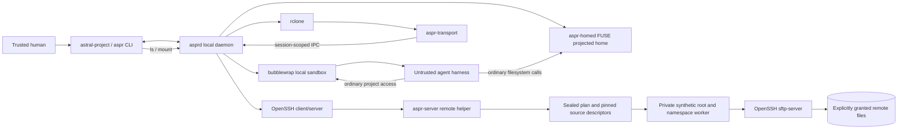
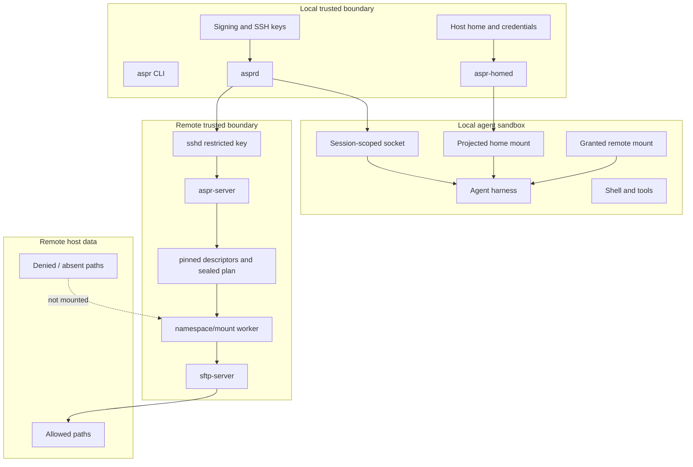
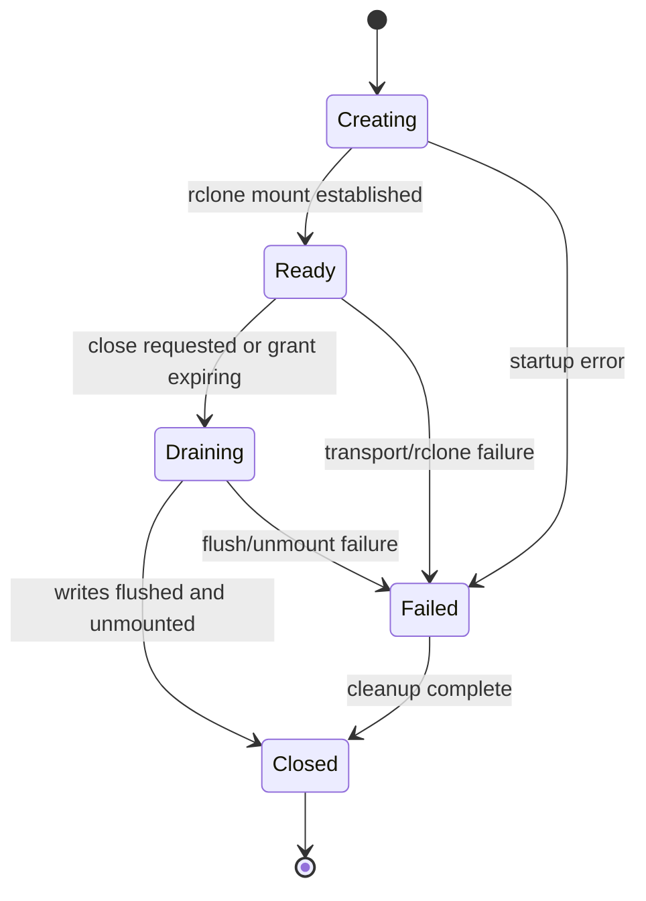
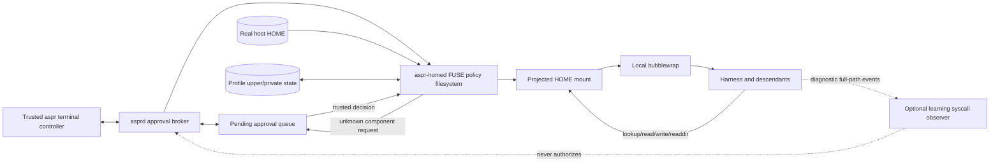
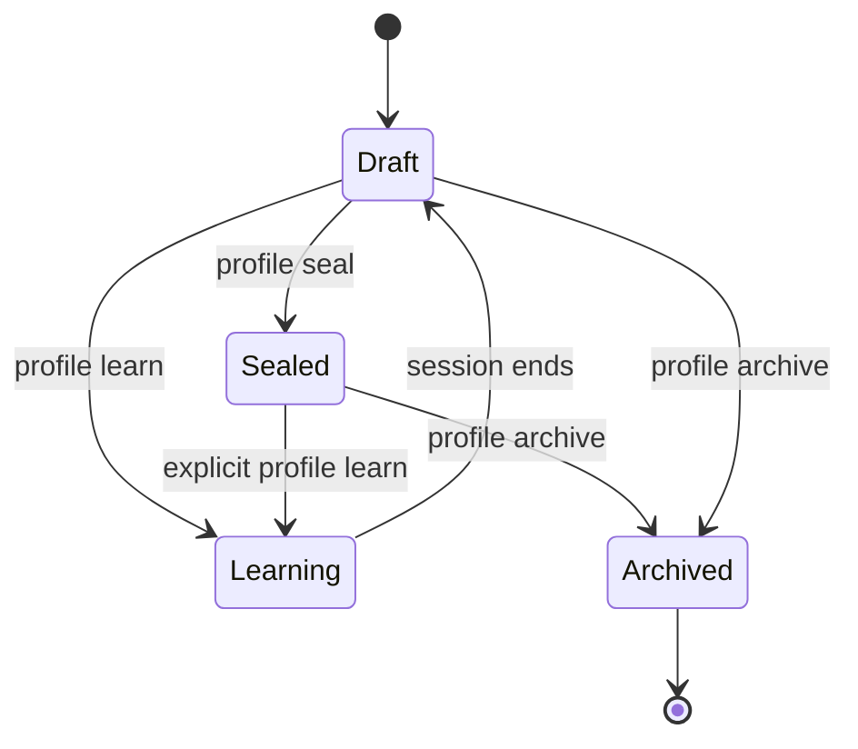

# Astral Project (`astral-project` / `aspr`)
## Final Architecture and Implementation Plan

**Status:** Packet 15 canonical remote architecture; Packet 16 integration baseline
**Revision:** 3  
**Primary platform:** Linux  
**Primary language:** Python 3.12+  
**Packaging and dependency manager:** `uv`  
**Canonical command:** `astral-project`  
**Required command alias:** `aspr`  
**Canonical application identifier:** `astral-project`  
**Intended readers:** implementers, security reviewers, operators, and coding agents

---

## 1. Executive Summary

Astral Project is a capability-scoped remote-filesystem access system for humans and arbitrary agent harnesses. It permits a trusted user to expose selected remote files or directories through rclone without granting the agent ordinary SSH access or visibility into unselected remote data.

The architecture establishes two independent boundaries:

1. **Remote capability boundary.**  
   A signed grant enters remote `aspr-server`/broker request. Root-owned broker authenticates peer, independently validates grant and server ceiling, resolves sources under target-user DAC, pins descriptors, seals a bounded internal plan, and gives it to namespace/mount worker. Worker builds private synthetic root, verifies fixed digest-verified `sftp_v1` runtime, removes setup authority, and starts final confined OpenSSH `sftp-server`. This is not a bubblewrap-constructed production remote sandbox. Daemon-supervised client-side rclone provides `ls`, `mount`, and other file operations.

2. **Local agent boundary.**  
   An optional bubblewrap sandbox prevents the harness from reading unrelated local data and credentials. A FUSE projected-home daemon presents the harness with its ordinary home pathname while exposing only approved configuration, state, executables, and sockets. `profile learn` performs live, interactive policy learning through this FUSE boundary. Profiles are persistent and reusable across projects; users do not recreate harness configuration for each project.

Astral Project shall not depend upon Codex, Claude Code, Hermes, Pi, or any other harness behaving in a particular way. Harnesses are ordinary child processes. Skills, MCP servers, and extensions may improve ergonomics later, but they are not security boundaries and are not required for the core product.

The recommended implementation is a `uv`-managed Python 3.12+ project with one primary package and two equivalent command launchers, `astral-project` and `aspr`. Hidden/internal subcommands may implement the local daemon, transport bridge, remote SSH entry point, FUSE daemon, and sandbox launcher. Trusted Python processes shall use a fixed interpreter and application path, isolated interpreter mode, locked dependencies, and a sanitized import environment.

---

## 2. Final Architectural Decisions

The following decisions are adopted unless contradicted by a later security review or an implementation spike expressly marked as a release gate.

### 2.1 Adopted decisions

1. **Root broker is sole remote namespace authority.**
   Astral Project owns policy compilation. Root-owned broker and fixed namespace/mount worker construct remote synthetic root from descriptor-pinned sources and sealed plan. Bubblewrap remains only planned local-agent sandbox mechanism. Raw bubblewrap arguments are never accepted from grants, profiles, agents, or untrusted configuration.

2. **Authorization is positive and capability-based.**  
   A path is inaccessible unless a signed grant explicitly exposes it. Rclone include/exclude filters are convenience filters only and shall never enforce authorization.

3. **Rclone normally runs under the trusted local daemon.**  
   Human commands invoke daemon-supervised rclone. Agent sandboxes receive pre-mounted remote views and a narrow `RunLs` session method. V1 shall not require rclone, SSH credentials, or generic mount authority inside the agent sandbox.

4. **OpenSSH `sftp-server` is the preferred remote protocol backend.**  
   It speaks SFTP over standard input and output and operates directly upon the constructed namespace. `rclone serve sftp --stdio` may exist as an experimental fallback only after concurrency and write-coherency testing.

5. **A local daemon owns ambient credentials.**  
   The agent sandbox shall not receive ordinary SSH private keys, an unrestricted SSH agent, the main Astral Project daemon socket, the internal transport socket, or generic remote-login capability.

6. **Remote grants are signed.**  
   Human-readable policy is compiled into a canonical signed grant envelope. The remote helper validates the signature, host binding, remote user, expiration, source identity, and server-side policy ceiling.

7. **The local sandbox is optional but strongly recommended for agents.**  
   Remote-only use remains possible for maximum compatibility. Local confidentiality requires the sandbox.

8. **Profile learning begins with the integrated FUSE-mediated interactive design.**  
   Enforcement, discovery, prompting, classification, persistence, and the trusted approval channel are one feature. A syscall observer may supplement path discovery, but it is never the authorization mechanism and there shall be no separately shipped trace-only learner.

9. **Profiles are reusable user assets, not per-project homes.**  
   A user may learn `agents-default` once and use it with every project grant.

10. **No harness-specific branches exist in the security engine.**  
    Optional declarative recipes may seed common paths, but the kernel-facing implementation understands paths, operations, environment variables, sockets, mounts, and process execution—not product names.

11. **Linux is the initial supported operating system.**  
    macOS, Windows, and container-only environments are later work.

12. **The project exposes both command names.**  
    `astral-project` and `aspr` launch the same Python CLI entry point and have identical behavior. Internal components and environment variables use the `aspr` / `ASPR_` prefix; persistent XDG state remains beneath `astral-project`.

13. **Rclone’s external-SSH behavior is an early release gate.**  
    Current rclone documentation states that `shell_type = none` must not be combined with the external `ssh` option. Therefore Astral Project shall not emit that invalid combination. The transport wrapper rejects every non-SFTP invocation, and a pinned-version compatibility spike must prove that listing and mounting succeed without obtaining shell access. A loopback SSH proxy is the designated fallback if upstream behavior cannot be made reliable.

14. **Dynamic mounts inside an already-running rootless sandbox are deferred.**  
    V1 mounts remote views under daemon supervision before sandbox launch and bind-mounts them into the sandbox. Dynamic mount injection, `/dev/fuse` exposure, and agent-launched rclone are post-v1 features requiring a separate threat and portability review.

15. **The learner may reveal only minimal directory existence while discovering a deeper path.**  
    Unknown ancestor directories are exposed, if approved, as opaque traversal-only objects: no listing and no child access save subsequent mediated lookups. This limitation and its metadata leakage are explicit.

16. **Python is the primary implementation language.**  
    Version 1 targets Python 3.12+ and uses `uv` for locking, development environments, builds, and packaging. Trusted services shall not inherit user import paths or run through an ambient project environment. A small, separately reviewed native syscall shim is permitted only where Python lacks the Linux descriptor-based mount interfaces required by the design. That shim contains mechanism only, never policy.

17. **The public listing command is `aspr ls`.**  
    Human-readable, terminal-safe output is the default. `--json` returns Astral Project’s stable normalized schema for automation. `--raw` returns the exact underlying rclone `lsjson` bytes for debugging or consumers that require native rclone fields.

### 2.2 Explicitly deferred decisions

The following remain open and are treated as implementation gaps later in this document:

- Portability evidence for distributions/releases/architectures beyond current certified Ubuntu 26.04 amd64.
- Whether the strict remote staging tree can use `open_tree`/`move_mount` on every supported kernel and filesystem, or needs a narrower alternative.
- Whether to ship a static SFTP runtime rather than a vetted dynamic-loader bundle.
- Exact semantics for nested exports with differing access modes.
- Full POSIX fidelity of the profile overlay filesystem.
- Network egress filtering beyond `inherit` or `none`.
- General credential brokering.
- Dynamic mounts inside a running sandbox.
- Cross-platform support.
- Organization-wide administrative policy and multi-user deployment.
- Python runtime-bundle portability and update strategy across supported distributions and architectures.
- Whether the projected-home FUSE implementation in Python meets required latency and POSIX-fidelity targets without a native hot-path component.

---

## 3. Goals and Non-Goals

### 3.1 Goals

Astral Project shall:

- expose arbitrary selected files and directories from an arbitrary enrolled server;
- support read-only and read-write grants;
- provide `aspr ls` with reader-friendly output by default, normalized `--json`, exact rclone `--raw`, and support `rclone mount`;
- be useful directly by humans;
- be callable by any program capable of invoking a CLI;
- require no harness-specific integration;
- prevent agents from obtaining ordinary SSH access through Astral Project;
- provide a local sandbox that hides unrelated local data;
- preserve a user’s existing harness configuration through reusable learned profiles;
- prompt interactively when a harness requests previously unseen configuration;
- permit unattended sealed-profile operation;
- retain clear audit records;
- minimize per-project setup;
- fail closed when the security boundary cannot be constructed.

### 3.2 Non-goals for the first stable release

Astral Project shall not initially:

- infer whether an arbitrary file is morally or operationally safe;
- permit arbitrary blacklist policies such as “allow all except these globs”;
- conceal a credential from a harness that must directly parse that credential;
- provide a general-purpose container runtime;
- replace rclone;
- replace SSH;
- provide a full remote shell;
- provide perfect POSIX behavior for every obscure filesystem operation;
- support arbitrary device access;
- promise defense against a compromised kernel, bubblewrap, FUSE kernel module, OpenSSH, rclone, or the trusted Astral Project processes;
- prevent an authorized human from accessing data the human can already access outside Astral Project;
- make arbitrary read-write edits safe to execute later: a human, CI job, scheduler, shell, or service that later runs agent-modified code remaineth a separate trust decision.

---

## 4. Threat Model

### 4.1 Principals

| Principal | Trust level | Authority |
|---|---:|---|
| Human operator | Trusted | May create grants and approve profile accesses |
| Agent harness and its descendants | Untrusted | May execute arbitrary code inside the sandbox |
| Local `asprd` daemon | Trusted computing base | Owns signing keys, SSH transport keys, sessions, mounts, and approvals |
| Local `aspr-homed` FUSE daemon | Trusted computing base | Can resolve host-home paths during learning and read approved host-backed content |
| Local `aspr-transport` bridge | Narrowly trusted | Opens only a session-scoped SFTP stream through `asprd` |
| Remote `aspr-server` helper | Trusted computing base | Validates grants and constructs the remote namespace |
| Bubblewrap | Trusted dependency | Constructs namespaces from Astral Project’s fixed argument compiler |
| OpenSSH and `sftp-server` | Trusted dependency | Authenticates transport and serves the constructed namespace |
| Rclone | Trusted dependency | Supplies client listing and mounting behavior |
| Network attacker | Untrusted | May observe, drop, replay, or modify network traffic absent cryptographic protection |
| Remote system administrator | Outside protection scope | Can inspect or alter the remote user’s processes and files |
| Local system administrator | Outside protection scope | Can inspect or alter local processes and files |

### 4.2 Attacker abilities

Assume the agent may:

- invoke arbitrary binaries visible in the sandbox;
- spawn descendants;
- issue arbitrary filesystem operations;
- craft path traversal, symlink, rename, hardlink, and race attempts;
- invoke `aspr`, `rclone`, `ssh`, language runtimes, hooks, and plugins if visible;
- modify every read-write granted file;
- inspect environment variables and inherited file descriptors;
- attempt to connect to local or remote sockets;
- generate misleading terminal output to spoof an approval request;
- intentionally request many paths to induce overbroad approvals;
- exploit project-local configuration to cause a harness to request additional resources;
- place delayed payloads in writable code or configuration which a human, scheduler, CI system, or service may execute later.

Assume the agent does **not** possess:

- a kernel exploit;
- control of trusted Astral Project binaries before launch;
- the unrestricted local daemon socket;
- the local grant-signing private key;
- the dedicated remote SSH private key;
- a general SSH agent socket;
- ungranted local paths;
- ungranted remote paths.

### 4.3 Security invariants

The implementation shall preserve these invariants:

1. The agent cannot enlarge a grant.
2. The agent cannot select a different host or remote user for a session.
3. The agent cannot obtain the dedicated SSH private key or private transport capability.
4. The agent cannot request a generic SSH command through a session capability.
5. The remote SFTP process sees no sensitive host path outside the synthetic namespace.
6. Grant paths are resolved and attached without traversal, symlink substitution, or validate-then-reopen races.
7. A read-only export is kernel-mounted read-only.
8. The local sandbox sees only explicit system runtime paths, project mounts, pre-mounted remote views, projected home paths, and approved sockets.
9. The local sandbox receives no raw rclone configuration, `/dev/fuse`, mount authority, host process namespace, or trusted abstract socket.
10. The sandbox session endpoint granteth only the already-signed grant and fixed expiry, even if relayed.
11. The agent cannot approve its own profile requests; approval requires a trusted parent-controlled transition.
12. Unknown projected-home operations fail closed after a finite timeout.
13. Revoked or expired grants cannot create new connections.
14. Active sessions terminate at grant expiry, and remote-loss behavior is explicit.
15. No inherited descriptor silently confers access to a hidden path.
16. Rclone filters and harness-specific behavior do not participate in authorization.
17. Failure or absence of an optional learning observer never enlarges filesystem access.
18. Trusted Python processes use a fixed interpreter and application path in isolated mode.
19. `PYTHONPATH`, user site-packages, the current working directory, project-local modules, and user-controlled `.pth` files cannot inject code into trusted processes.
20. Production dependencies are locked, verified, and loaded only from the application environment.
21. Trusted code never uses `shell=True`, unsafe deserialization, `eval`, or dynamic plugin loading.
22. Any native syscall shim is narrow, typed, reviewed, fuzzed or property-tested where applicable, and free of authorization policy.

---

## 5. System Context

### 5.1 High-level diagram



### 5.2 Trust boundaries



### 5.3 Fundamental separation

```text
REMOTE CAPABILITY SECURITY
    signed grant
        -> remote aspr-server/broker request
        -> root broker and peer/grant/ceiling validation
        -> target-user DAC source resolution
        -> pinned descriptors and sealed plan
        -> namespace/mount worker
        -> private synthetic root
        -> fixed sftp_v1 runtime and authority removal
        -> confined OpenSSH sftp-server
        -> rclone lsjson internally / mount

LOCAL AGENT SECURITY
    learned profile
        -> FUSE projected home
        -> local bwrap namespace
        -> ordinary harness process

These boundaries are independent.
MCP, skills, and harness settings are not boundaries.
```

### 5.4 Packet 15 boundary and platform status

Packet 15 is frozen: root broker sole namespace authority; ordinary callers unprivileged; `SO_PEERCRED` authentication input only; signed grant and root-owned ceiling independently enforced; target-user DAC resolution; descriptor pinning without pathname reopen; sealed bounded plan plus inherited pinned descriptors; fixed `sftp_v1`; no caller-selected executable, argv, environment, profile, staging root, mount flags, or workload; final workload has no mount, user-namespace, network, shell, or broker/control-state authority; kernel read-only exports; supervised cancellation/expiry; fail-closed construction.

Current certified POC target is Ubuntu 26.04 amd64. Ubuntu 24.04 amd64 packaged gate failed AppArmor integration and remains uncertified. Support is evidence-based per distribution/release/architecture. Debian, Fedora, and Rocky Linux are future targets, not current claims. systemd and AppArmor are Ubuntu host integration, never protocol authority.

---

## 6. Deployment Components

The recommended codebase is one `uv`-managed Python project with a `src` layout and explicit security-boundary modules. Installation should remain simple, while trusted launchers pin the interpreter and application path and invoke Python in isolated mode.

### 6.1 User-visible commands

Both of these shall work identically:

```bash
astral-project ...
aspr ...
```

Recommended installation:

```text
~/.local/bin/astral-project
~/.local/bin/aspr
```

Both launchers call the same CLI entry point. Production launchers shall execute a fixed interpreter in isolated mode rather than relying upon an activated virtual environment or `uv run`.

### 6.2 Internal invocation modes

The same installed application may be entered through hidden subcommands:

```text
aspr daemon
aspr transport
aspr homed
aspr server ssh-entry
aspr server validate
```

These are implementation details and need not be advertised as stable public interfaces.

### 6.2.1 Trusted Python process rules

The local daemon, transport bridge, remote helper, and projected-home daemon are trusted security-boundary processes. Each shall:

- execute a fixed Python interpreter and fixed application module or entry point;
- use Python isolated mode;
- remove all `PYTHON*` environment variables before launch;
- exclude the current working directory, project directories, user site-packages, and user-controlled `.pth` files from `sys.path`;
- load dependencies only from the locked application environment;
- reject dynamic plugins and import hooks in trusted modes;
- set a safe fixed working directory;
- close inherited file descriptors except an explicit allowlist;
- invoke subprocesses with argument vectors and `shell=False`;
- avoid `pickle`, `marshal` for untrusted data, unsafe YAML loading, `eval`, and `exec`.

Development may use `uv run`. Installed trusted services shall not depend upon a caller’s activated environment or invoke `uv run` at runtime.

### 6.3 Component responsibilities

#### `aspr` CLI

- parse human commands;
- render statuses, grants, profiles, sessions, and approvals;
- connect only to the local daemon;
- never directly read private transport or signing keys;
- launch the interactive PTY frontend for profile learning;
- provide machine-readable JSON output for all principal commands.

#### `asprd`

- run as the local user;
- own the grant-signing key and dedicated SSH transport keys;
- own the authoritative SQLite state database;
- create and destroy sessions;
- spawn rclone;
- spawn and supervise FUSE projected-home instances;
- spawn and supervise local bubblewrap sandboxes;
- expose a main control socket to the trusted host user;
- create narrow session-scoped sockets for sandboxes and transport bridges;
- supervise remote connections, mounts, grant expiry, and revocation;
- write audit events.

#### `aspr-transport`

- be invoked only by daemon-supervised rclone as an external SSH command;
- accept only rclone’s expected invocation arguments and an environment-bound internal transport capability;
- connect to a private transport socket not exposed to the agent sandbox;
- request exactly one SFTP byte stream;
- proxy standard input and output;
- possess no SSH key and no general daemon authority;
- reject shell commands, checksum commands, forwarding, and unknown arguments;
- emit structured diagnostics on standard error without corrupting the SFTP byte stream.

#### `aspr-server`

- run as the remote target user under an SSH forced command;
- accept only the exact `SSH_ORIGINAL_COMMAND` marker `aspr-channel-v1`;
- parse a small binary-framed preface before SFTP traffic begins;
- verify signed grants and issuer authorization;
- enforce the effective user and administrator policy ceilings;
- safely resolve and pin export source paths;
- construct a private staging mount tree from pinned source objects;
- construct the final bubblewrap namespace from typed policy;
- launch a vetted SFTP runtime;
- optionally apply Landlock;
- remain outside the SFTP sandbox as supervisor so expiry and revocation can terminate the child.

#### `aspr-homed`

- run outside the agent sandbox;
- implement the projected home through FUSE;
- enforce profile rules on every filesystem operation;
- provide lower host-backed, private writable, and overlay writable views;
- issue pending approval events;
- block or deny unknown requests;
- maintain per-session inode and handle state;
- maintain overlay metadata and whiteouts;
- never expose its administrative socket to the sandbox.

#### Rclone

- run under `asprd`, outside the agent sandbox, for v1;
- use generated session-scoped configuration and cache directories;
- use `aspr-transport` as its external SSH command;
- set `disable_hashcheck = true`;
- **not** combine external `ssh` with `shell_type = none`, because current rclone rejects that configuration;
- rely upon `aspr-transport` to reject every appended non-SFTP command;
- remain pinned to tested rclone versions until the external-SSH compatibility gate is satisfied;
- expose listings and mounted files to the sandbox through narrow daemon methods and pre-mounted bind views, never through SSH credentials.

#### Bubblewrap

- construct the remote export namespace;
- construct the local agent sandbox;
- receive only arguments generated by trusted Python policy-compilation code;
- never parse user-authored command fragments.

#### OpenSSH `sftp-server`

- serve the synthetic remote namespace over standard input and output;
- be discovered and validated at host enrollment;
- be launched through either a vetted runtime bundle and explicit dynamic loader or a proven host-runtime closure;
- log to standard error where supported, never standard output;
- receive no shell and no network authority.

---

## 7. Persistent and Runtime State

Use XDG paths under the canonical application identifier.

### 7.1 Local paths

```text
$XDG_CONFIG_HOME/astral-project/
├── config.toml
├── hosts/
│   └── <host-id>.toml
└── profiles/
    └── <profile-name>.toml

$XDG_STATE_HOME/astral-project/
├── state.sqlite3
├── keys/
│   ├── grant-signing.key
│   └── ssh/
├── profiles/
│   └── <profile-id>/
│       ├── upper/
│       ├── private/
│       └── metadata.sqlite3
├── rclone-cache/
└── audit/

$XDG_RUNTIME_DIR/astral-project/
├── daemon.sock
├── homes/
│   └── <session-id>/
├── mounts/
│   └── <session-id>/
├── sessions/
│   └── <session-id>/
│       ├── transport.sock
│       ├── agent.sock
│       └── ephemeral-rclone.conf
└── approvals.sock
```

Permissions:

- configuration directories: `0700`;
- private keys: `0600`;
- daemon and session sockets: `0600`;
- runtime session directories: `0700`;
- audit logs: `0600` by default.

### 7.2 Remote paths

```text
~/.local/libexec/astral-project/aspr-server
~/.config/astral-project/server.toml
/etc/astral-project/server-policy.toml   # optional, root-owned ceiling
~/.local/state/astral-project/
├── issuer-keys/
├── revoked-grants/
└── audit/
```

A system-wide deployment may instead use root-owned paths and a privileged service. That is not required for the rootless first release.

---

## 8. Host Enrollment

### 8.1 Command

```bash
aspr host enroll alice@cluster.example
```

Equivalent:

```bash
astral-project host enroll alice@cluster.example
```

### 8.2 Enrollment workflow

1. Use the user’s existing SSH setup for this one trusted installation operation.
2. Pin and display the remote SSH host-key fingerprint.
3. Probe:
   - operating system and architecture;
   - remote username and home;
   - bubblewrap availability and version;
   - unprivileged user namespace viability;
   - OpenSSH `sftp-server` location;
   - dynamic runtime dependencies required by `sftp-server`;
   - `openat2`, `open_tree`, `move_mount`, and `mount_setattr` availability;
   - ability to construct and attach a pinned staging mount without pathname reopening;
   - Landlock ABI availability;
   - dynamic-loader and library closure required by `sftp-server`;
   - `$XDG_RUNTIME_DIR` behavior;
   - relevant remote filesystem types;
   - exact supported Python interpreter and ABI, if an existing interpreter may be reused;
   - whether the release-built Python runtime bundle is usable on this architecture and libc environment.
4. Install an exact, version-pinned remote Python runtime and locked Astral Project server application bundle in the remote user’s private libexec directory, or verify and privately provision a compatible pre-existing interpreter under the rules below.
5. Generate a dedicated per-host SSH keypair locally.
6. Install the public key into the remote user’s `authorized_keys` with:
   - forced command;
   - `restrict`;
   - no PTY;
   - no agent forwarding;
   - no X11 forwarding;
   - no TCP forwarding;
   - no arbitrary user-supplied command; only the protocol marker `aspr-channel-v1` is accepted by the forced helper.
7. Install the grant-issuer public key on the server.
8. Write the host record locally.
9. Run an end-to-end probe against a harmless temporary directory.
10. Remove probe artifacts.

Conceptual authorized-key entry:

```text
restrict,command="/home/alice/.local/libexec/astral-project/aspr-server server ssh-entry --transport-key <key-id>" <public-key>
```

### 8.3 Host record

Example:

```toml
version = 1
id = "host_01J..."
name = "cluster"
ssh_destination = "alice@cluster.example"
remote_user = "alice"
host_key_fingerprint = "SHA256:..."
server_entrypoint = "/home/alice/.local/libexec/astral-project/bin/aspr-server"
python_runtime = "/home/alice/.local/libexec/astral-project/runtime/bin/python3"
application_digest = "sha256:..."
sftp_server = "/usr/lib/openssh/sftp-server"
sftp_runtime_digest = "sha256:..."
isolation_backend = "staged-mount+bwrap-rootless"
openat2 = true
open_tree = true
move_mount = true
landlock_abi = 6
enrolled_at = "2026-07-25T18:00:00Z"
```

### 8.4 Remote Python runtime rule

Astral Project shall not trust an arbitrary system Python installation merely because `python3` exists.

Enrollment must choose one supported path:

1. install a release-built, version-pinned CPython runtime and locked Astral Project application bundle; or
2. verify an existing interpreter by exact implementation, version, ABI, architecture, and required standard-library behavior, then install a private locked application environment for that interpreter.

The first path must support offline enrollment by uploading previously built artifacts. The runtime and application bundle are content-addressed, digest-verified, installed atomically, and rollback-capable. The remote launcher uses a fixed interpreter in isolated mode and clears all `PYTHON*` variables. No remote trusted component imports from the user’s home, current directory, project tree, or system-wide third-party site-packages.

The exact portable-runtime format is an implementation release gate. `uv` manages project locking and builds, but the production remote process shall not depend upon network access or an ambient `uv run` environment.

### 8.5 Enrollment failure policy

Enrollment shall fail closed when:

- host-key validation is unresolved;
- the forced command cannot be installed;
- the remote helper cannot validate issuer signatures;
- no supported SFTP backend exists;
- the selected isolation backend cannot construct an empty namespace;
- a pinned source cannot be attached without reopening a mutable pathname;
- the SFTP runtime closure is incomplete or unexpectedly broad;
- a read-only bind can be written through;
- the namespace exposes an unapproved host path;
- no supported Python runtime and locked application-bundle deployment path can be verified;
- the trusted remote launcher cannot prove isolated imports and fixed application identity.

`aspr doctor --host cluster` shall render exact failed probes and suggested remedies.

---

## 9. Grants

### 9.1 User workflow

```bash
aspr grant create cluster \
    --name project-4821 \
    --rw /scratch/alice/project/src \
    --ro /scratch/alice/project/docs \
    --ttl 8h
```

Optional virtual targets:

```bash
aspr grant create cluster \
    --rw /scratch/alice/project/src:/project/src \
    --ro /datasets/reference:/reference
```

Default behavior should preserve the canonical remote absolute path in the synthetic namespace. Explicit virtual targets improve ergonomics where desired.

### 9.2 Grant model

Human-readable draft:

```toml
version = 1
name = "project-4821"
host_id = "host_01J..."
remote_user = "alice"
issued_at = "2026-07-25T18:00:00Z"
expires_at = "2026-07-26T02:00:00Z"

[[exports]]
requested_source = "/scratch/alice/project/src"
canonical_source = "/scratch/alice/project/src"
target = "/scratch/alice/project/src"
access = "rw"
kind = "directory"
pin_identity = true
device = 259
inode = 1234567

[[exports]]
requested_source = "/scratch/alice/project/docs"
canonical_source = "/scratch/alice/project/docs"
target = "/scratch/alice/project/docs"
access = "ro"
kind = "directory"
pin_identity = true
device = 259
inode = 1234599
```

### 9.3 Signed envelope

The signed wire format should be canonical CBOR, not TOML or JSON.

Recommended envelope:

```text
GrantEnvelope {
    format_version
    grant_id
    issuer_key_id
    host_id
    ssh_host_key_fingerprint
    remote_user
    issued_at
    not_before
    expires_at
    nonce
    exports[]
    requested_features[]
    server_policy_hash?
    signature
}
```

Recommended signature: Ed25519.

The signature covers every field except the signature itself.

### 9.4 Grant validation

Before signing, the local daemon shall request remote validation through the restricted server entry point.

The remote helper shall:

1. require absolute source paths;
2. reject empty paths, NUL bytes, `.` and `..` components;
3. resolve requested paths with `openat2` or the documented safe dirfd fallback;
4. reject unsupported file types;
5. collect device, inode, mount ID, and filesystem identity where available;
6. verify current read or write access under the remote user’s DAC;
7. apply the effective server policy ceiling;
8. identify nested mounts and symlink behavior;
9. return a nonce-bound validation response over the already authenticated and host-key-pinned SSH channel;
10. require the human to approve any canonical-path or mount-topology change.

The local daemon then signs the canonical grant. Every later connection repeats source resolution and identity checks; validation is not treated as permanent authority.

### 9.5 Server policy ceiling

V1 shall define a small, deterministic ceiling rather than leave “server policy” abstract. Effective policy is the intersection of:

1. a root-owned administrator policy, when present;
2. the remote user’s own policy;
3. the signed grant.

Example:

```toml
version = 1
allowed_roots = ["/scratch/alice", "/datasets/public"]
forbidden_roots = ["/scratch/alice/secrets"]
max_ttl_seconds = 28800
max_exports = 16
allow_read_write = true
allow_regular_files = true
allow_directories = true
allow_nested_mounts = false
require_source_identity = true
issuer_key_ids = ["issuer_01J..."]
```

Rules:

- administrator policy may only narrow user policy;
- user policy may only narrow grant authority;
- path ceilings are resolved and compared canonically;
- policy changes apply to new connections immediately;
- a grant carrying an obsolete policy hash is re-evaluated, not grandfathered;
- policy files and issuer keys are not mounted into the SFTP namespace.

#### Non-overridable remote control-plane reservations

Certain paths preserve the boundary itself and shall never be grantable, even with a “dangerous” override. Enrollment records their canonical locations. A grant is rejected if an export is equal to, descends from, or is an ancestor of a reserved path such that the reserved object would become reachable.

Mandatory reservations include:

- every effective OpenSSH `AuthorizedKeysFile` and `AuthorizedPrincipalsFile` applicable to the remote user;
- the remote user’s `.ssh` tree unless an administrator proves a narrower safe reservation;
- the installed `aspr-server` application bundle, its Python runtime, launchers, and their parent control directory;
- issuer keys, policy files, revocation state, audit-control files, and SFTP runtime bundles;
- sockets, device nodes, and security-sensitive pseudo-filesystems such as procfs, sysfs, cgroupfs, debugfs, tracefs, securityfs, configfs, and bpffs.

Critical regular control files shall have expected identity, digest where applicable, and link count checked at enrollment and connection time. A link count greater than one is a strict-mode failure because a hardlink inside an otherwise granted tree could alias the same inode. Administrator-owned control files on a non-grantable filesystem are preferred.

A second category, **ambient execution and persistence paths**, is denied by default but may be enabled by explicit server policy: shell startup files, user service definitions, autostart directories, scheduler hooks, and similar paths. This list cannot be exhaustive. Every read-write grant already permiteth delayed compromise if a trusted person or service later executes modified content; Astral Project shall warn rather than pretend otherwise.

The default user policy should also reserve common remote credential trees (`.aws`, `.kube`, cloud CLIs, Kerberos caches, and similar), but administrators may tune these because locations vary. Broad exports such as the remote home or `/` will ordinarily be rejected when they contain mandatory reservations. V1 shall not subtract deny holes from a broad remote export.

### 9.6 Export overlap rules for v1

To avoid ambiguous mount behavior:

- exact duplicates are merged;
- nested exports with the same access mode may be collapsed;
- nested exports with differing modes are rejected;
- two exports may not map to the same target;
- a target may not overlap Astral Project’s runtime paths;
- filesystem roots such as `/`, `/home`, and the remote home are normally impossible because they contain mandatory control-plane reservations; no override may expose those reserved descendants;
- blacklist holes are not supported.

Example rejection:

```text
RW /project
RO /project/secrets

Rejected: v1 does not support nested exports with differing access.
Grant explicit disjoint subtrees instead.
```

---

## 10. Remote Connection and SFTP Transport

### 10.1 Sequence diagram

```mermaid
sequenceDiagram
    participant RC as rclone
    participant T as aspr-transport
    participant D as asprd
    participant SSH as OpenSSH
    participant RS as aspr-server
    participant B as root-owned broker
    participant MT as pinned descriptors and sealed plan
    participant NW as namespace/mount worker
    participant SF as sftp-server
    participant FS as Granted remote files

    RC->>T: exec external SSH command: "-s sftp"
    T->>D: OpenSftpStream(environment-bound capability)
    D->>D: authorize session and fetch signed grant
    D->>SSH: exec exact requested command "aspr-channel-v1"
    SSH->>RS: forced command starts; original command validated
    D->>RS: length-prefixed protocol preface + grant
    RS->>B: broker request
    B->>B: peer authentication, grant and server-ceiling validation
    B->>B: target-user-DAC source resolution
    B->>MT: pin descriptors and seal bounded plan
    MT->>NW: inherited pinned descriptors and sealed plan
    NW->>NW: private synthetic root, runtime verification, authority removal
    NW->>SF: exec fixed confined sftp-server
    RS-->>D: protocol status/ready
    D-->>T: connected byte stream
    T-->>RC: transparent SFTP stream
    RC->>SF: SFTP requests
    SF->>FS: permitted filesystem operations
```

### 10.2 Local transport design

Rclone’s generated SFTP configuration shall use an external SSH command:

```ini
[aspr-session]
type = sftp
ssh = /path/to/aspr transport
disable_hashcheck = true
```

Do **not** emit `shell_type = none` together with `ssh`; current rclone documentation declares that combination invalid. Instead:

- `aspr-transport` accepts only the subsystem form required for SFTP;
- checksum, shell-detection, `df`, and arbitrary command invocations are rejected without opening remote authority;
- the generated config is ephemeral and version-pinned;
- an early compatibility suite determines whether the rejected probe is harmless for every supported rclone version and operation;
- if rclone cannot operate reliably under these conditions, the supported fallback is a daemon-owned loopback SSH proxy which presents an ordinary SFTP-only SSH endpoint to rclone and forwards the stream through Astral Project’s remote preface protocol.

After validating rclone’s local `-s sftp` invocation, the daemon opens OpenSSH with one exact requested command, `aspr-channel-v1`. The forced command still determines the executable; `SSH_ORIGINAL_COMMAND` is accepted only when it exactly matchest that protocol marker. Validation, open, and revocation are distinguished by the framed preface, not by arbitrary remote commands.

The transport program shall not accept:

- a host argument;
- a remote user argument;
- a path grant;
- arbitrary SSH options;
- an arbitrary command;
- forwarding instructions.

All authority comes from a private per-rclone transport socket and random token supplied through the daemon-controlled child environment. Neither value appears in the rclone config or command line, and neither is exposed to the agent sandbox.

### 10.2.1 Split transport and sandbox APIs

Two sockets exist because their powers differ.

**Private transport socket** — visible only to daemon-supervised `aspr-transport`:

```text
OpenSftpStream(environment_bound_capability)
CancelStream(stream_id)
```

**Sandbox session socket** — bound into the agent sandbox:

```text
DescribeSession
RunLs
GetRemoteMounts
GetExpiry
CloseOwnSession
```

The sandbox API shall not expose `OpenSftpStream`, raw rclone configuration, mount creation, grant renewal, or profile administration in v1.

Forbidden methods include:

```text
CreateGrant
RenewGrant
SelectHost
SelectRemoteUser
ReadSigningKey
InstallHost
ExposeAdditionalLocalPath
ModifyProfile
ApproveProfileRequest
OpenSftpStream
CreateMount
```

The sandbox-visible `aspr` detects:

```text
ASPR_SESSION_SOCKET=/run/astral-project/session.sock
ASPR_SESSION_ID=<session-id>
```

and uses only the narrow session API. Inside the sandbox, `aspr ls /path` addresses a path inside the bound grant; host or grant selectors are rejected. The session socket is itself a bearer capability limited to one grant and expiry; Astral Project cannot prevent an agent with network access from relaying its own already-limited capability, so the protocol must remain safe under such relay.

### 10.3 Remote preface protocol

Before raw SFTP traffic, the client daemon and remote helper need a narrow framed protocol.

Recommended framing:

```text
magic:          "ASPRSSH"
protocol:       u16
message_length: u32
message:        canonical CBOR
```

Request union:

```text
Request =
    OpenExport {
        session_id
        grant_envelope
        client_nonce
        requested_backend
        audit_context
    }
  | ValidateGrantDraft {
        draft
        client_nonce
    }
  | RevokeGrant {
        signed_revocation
        client_nonce
    }
  | DoctorProbe {
        requested_checks
        client_nonce
    }
```

Response union:

```text
Response =
    Ready {
        server_version
        backend
        effective_exports_hash
        expires_at
        client_nonce
    }
  | ValidationResult { ... }
  | RevocationResult { ... }
  | DoctorResult { ... }
  | Error {
        stable_error_code
        human_message
        retryable
        client_nonce
    }
```

Only `OpenExport -> Ready` transitions into transparent SFTP bytes. Every administrative request endeth after its framed response. The bridge must consume and authenticate the response before exposing any stream to rclone. Message sizes, recursion, export counts, strings, and audit-context fields are bounded before allocation.

### 10.4 Preferred SFTP backend

The preferred backend is OpenSSH `sftp-server`, executed as a child of the remote supervisor.

The final namespace shall contain:

- explicitly granted paths;
- empty ancestor directories necessary to reach target paths;
- a reserved runtime bundle at `/.astral-project-runtime`;
- minimal `/dev/null`, `/dev/zero`, and randomness devices only if tests prove them necessary;
- no host `/proc`, `/sys`, ordinary home, SSH configuration, policy files, issuer keys, or unrelated mounts.

The runtime bundle shall be content-addressed and validated at enrollment. For a dynamically linked server, launch should resemble:

```text
/.astral-project-runtime/ld.so
    --library-path /.astral-project-runtime/lib
    /.astral-project-runtime/sftp-server
    -e -l INFO
```

The exact loader and arguments are architecture-specific and must be generated from enrollment data, not guessed. NSS, locale, logging, and identity lookups must be tested; any additional runtime file is explicit in the runtime manifest. Grants may never target or overlap `/.astral-project-runtime`.

### 10.5 Race-free remote namespace construction

Remote construction is broker-owned and sealed. Broker resolves each source under target-user DAC, pins source descriptors, records identity, and creates bounded sealed internal plan. Namespace/mount worker receives only sealed plan plus inherited pinned descriptors. It creates private mount namespace, performs descriptor-based mount construction, builds private synthetic root and runtime attachment, verifies runtime manifest, removes setup authority, transitions to fixed final profile, and execs only fixed `sftp_v1`. Final workload cannot mount, create user namespace, use network, open broker/control state, run shell, or select another executable. No pathname reopen fallback exists.


**Stage A — private staging tree**

1. enter a new user and mount namespace;
2. make mount propagation private;
3. open each canonical source with safe resolution and retain a pinned descriptor;
4. create a detached clone or bind object from that descriptor using `open_tree(OPEN_TREE_CLONE | AT_EMPTY_PATH)` or an equivalently race-free mechanism;
5. apply read-only attributes with `mount_setattr` where required;
6. attach the object beneath a private staging root with `move_mount`;
7. verify the staging tree against the normalized grant.

**Final confined workload**

1. invoke bubblewrap from within the private staging namespace;
2. create a fresh empty root;
3. bind only the already-constructed staging targets and runtime bundle;
4. unshare PID, IPC, UTS, and network namespaces;
5. clear the environment and close unintended descriptors;
6. launch `sftp-server` while the parent supervisor remains outside.

Bubblewrap is not part of production remote construction. It remains planned local-agent sandbox mechanism. If descriptor-based construction cannot be proven, strict mode rejects host; no weaker fallback is permitted.

Historical design (retained only for rationale; not production path):

```bash
bwrap \
  --unshare-pid \
  --unshare-ipc \
  --unshare-uts \
  --unshare-net \
  --new-session \
  --die-with-parent \
  --clearenv \
  --setenv HOME / \
  --ro-bind /.aspr-staging/runtime /.astral-project-runtime \
  --bind /.aspr-staging/scratch/alice/project/src /scratch/alice/project/src \
  --ro-bind /.aspr-staging/scratch/alice/project/docs /scratch/alice/project/docs \
  /.astral-project-runtime/ld.so ...
```

Production remote code passes typed plan and inherited descriptors directly; no shell interpolation occurs. Staging and control state remain private to broker/worker.

### 10.6 Source identity and revalidation

The remote helper shall not trust pathname strings alone.

For every connection it shall:

1. resolve the source safely;
2. compare device, inode, mount ID, type, and other recorded identity fields where supported;
3. reject changed identity unless the grant explicitly permits replacement semantics;
4. pin the resolved object;
5. construct the staging mount from the pinned object;
6. retain necessary descriptors until the mount object is attached.

Identity pinning applies to the export root, not every mutable descendant. Ordinary changes within a granted directory remain permitted according to its access mode.

### 10.7 Landlock defense in depth

Where available, the remote helper should apply a Landlock ruleset permitting only:

- the granted export roots at their effective access level;
- the minimal SFTP runtime;
- required standard streams.

Landlock is secondary. The mount namespace remains the primary visibility boundary.

### 10.8 Expiry and revocation

The remote helper shall supervise the SFTP child.

- On grant expiry, terminate the child.
- Before launch, check the revocation store.
- During a session, poll or watch the revocation store at a bounded interval.
- On revocation, terminate the child.
- Do not rely solely on the local client to stop using an expired grant.

`aspr grant revoke` shall:

1. mark the grant revoked locally;
2. terminate local sessions;
3. send a signed revocation request to the remote helper;
4. write the remote revocation marker;
5. report partial failure if the remote host cannot be reached.

Short grant lifetimes remain the principal defense against stale offline state.

---

## 11. Rclone Integration

### 11.1 `ls`

Human command:

```bash
aspr ls project-4821:/scratch/alice/project/src --recursive
```

The daemon invokes the pinned rclone version’s `lsjson` operation internally. The public command is `ls`, because rclone’s native JSON is an implementation detail rather than suitable default terminal output.

Default output is a reader-friendly table:

```text
TYPE  SIZE       MODIFIED                  PATH
dir   -          2026-07-26T19:42:11Z      src/
file  12.4 KiB   2026-07-26T19:44:03Z      src/main.py
file  842 B      2026-07-26T19:44:10Z      README.md
```

The default formatter shall:

- parse rclone JSON into typed internal entries;
- use stable columns and deterministic formatting;
- display human-readable sizes;
- use unambiguous ISO 8601 timestamps;
- identify directories clearly;
- escape tabs, newlines, control bytes, invalid byte representations, and terminal escape sequences in paths;
- never emit untrusted filenames as active terminal control sequences;
- fail closed with stable errors when rclone emits malformed or unexpectedly large JSON.

Supported listing controls should include recursive and non-recursive modes, stat mode, maximum depth, filters, timeout, cancellation, optional hashes where SFTP supports them without shell access, `--no-header`, `--sort path|name|size|modified|type`, and `--reverse`.

Output modes are:

```bash
aspr ls grant:/path              # reader-friendly table
aspr ls grant:/path --json       # normalized Astral Project JSON
aspr ls grant:/path --raw        # exact underlying rclone lsjson bytes
```

`--json` is the preferred automation interface and follows a versioned Astral Project schema. `--raw` is an explicit escape hatch for debugging or consumers that require native rclone fields; it preserves the underlying standard-output bytes exactly. Conflicting output flags are rejected. Rclone diagnostics remain on standard error and must not corrupt standard output.

The sandbox-visible method is `RunLs`. It may address only paths within the session’s already-bound grant and cannot select another host, user, or grant.

### 11.2 `mount`

Human/host command:

```bash
aspr mount project-4821:/scratch/alice/project/src ./remote-src
```

The daemon shall:

1. validate the grant, source path, and local mountpoint;
2. create a session-specific rclone configuration and VFS cache directory;
3. spawn rclone outside the agent sandbox;
4. wait for positive mount readiness rather than sleeping for an arbitrary interval;
5. record the rclone PID, mount ID, cache path, grant, and transport capability;
6. supervise health and grant expiry;
7. enter a bounded drain phase before unmount where possible;
8. report possible unflushed writes after forced termination;
9. recover or clean stale mount records after daemon restart.

Safe candidate defaults:

```text
--vfs-cache-mode writes
--cache-dir <session-cache>
--sftp-disable-hashcheck
--umask 077
```

No `--sftp-shell-type none` flag is emitted while the external SSH transport is in use. Exact caching, polling, and writeback defaults remain a destructive-test gate.

### 11.3 Sandbox remote views

V1 creates every sandbox-visible remote mount before launching the sandbox. One sandbox session is bound to one signed grant; repeated `--remote` options may select multiple subpaths from that grant:

```bash
aspr sandbox \
  --profile agents-default \
  --remote project-4821:/scratch/alice/project/src=/workspace/project \
  --remote project-4821:/datasets/reference=/workspace/reference:ro
```

Workflow:

1. `asprd` creates and verifies each host-side rclone mount;
2. the local bubblewrap namespace binds each completed mount at its declared sandbox target;
3. the agent receives ordinary filesystem access, but no rclone configuration, SSH stream, `/dev/fuse`, or mount capability;
4. expiry, revocation, or unrecoverable transport loss closes the underlying remote session;
5. v1 default is `on_remote_loss = "terminate-sandbox"`; an explicit compatibility mode may keep the sandbox alive while affected mounts return errors;
6. adding a new remote mount requires starting a new sandbox in v1.

`--grant NAME` remains shorthand for mounting the grant’s synthetic root read-write or read-only according to the grant at `/workspace/remote`.

Dynamic in-sandbox mounts are deferred. This is not merely a missing CLI: rootless mount injection, FUSE device exposure, cleanup, nested mount namespaces, and credential isolation require a separate design.

### 11.3.1 Direct rclone escape hatch

For trusted host-side expert use:

```bash
aspr rclone project-4821 -- lsjson aspr-session:/path
aspr rclone project-4821 -- copy ...
```

This command is available only through the main trusted daemon socket, not the sandbox session API. It shall:

- generate and own the ephemeral remote;
- sanitize `RCLONE_*` environment variables;
- reject options that replace the config, backend type, external SSH command, or transport;
- preserve the grant boundary;
- clearly state that arbitrary raw rclone launched outside Astral Project remains outside Astral Project’s protection.

Raw access to the generated configuration is not required or supported.

### 11.4 Mount lifecycle states



A forced close shall explicitly report possible unflushed writes.

---

## 12. Local Sandbox Modes

Astral Project separates remote capability security from local confidentiality.

### 12.1 Remote-only mode

```bash
aspr mount project-4821:/path ./remote
codex
```

Properties:

- normal host home and configuration;
- maximum harness compatibility;
- remote paths remain capability-scoped;
- unrelated local files are not protected from the harness.

This mode must be honestly labeled.

### 12.2 Learned-profile sandbox mode

```bash
aspr sandbox \
    --profile agents-default \
    --remote project-4821:/=/workspace/remote
```

This opens a restricted shell by default. The user then launches any harness normally.

Noninteractive form:

```bash
aspr sandbox \
    --profile agents-default \
    --remote project-4821:/=/workspace/remote \
    -- codex
```

This is an `exec` convenience, not a Codex integration.

### 12.3 Local sandbox view

```text
Visible:
    read-only system runtime
    selected toolchains
    project working directories
    daemon-created Astral Project remote mounts
    projected home at the user’s ordinary HOME path
    explicitly approved sockets
    minimal /tmp and /dev
    selected environment variables
    narrow sandbox session socket

Absent:
    ordinary host home outside profile rules
    ordinary SSH keys
    unrestricted SSH agent
    cloud credentials not explicitly approved
    Docker socket
    system D-Bus socket
    unrelated project trees
    unrelated host mounts
    main asprd socket
    private transport socket
    raw rclone configuration
    /dev/fuse and mount helpers in v1
    host process namespace and host /proc
```

### 12.4 Local bubblewrap policy

Recommended baseline:

- empty mount namespace;
- read-only `/usr`, `/bin`, and required runtime paths;
- synthetic `/tmp`;
- minimal synthetic `/dev` without `/dev/fuse`;
- separate PID, IPC, and UTS namespaces;
- a sandbox-local `/proc` mounted only for the sandbox PID namespace, if required;
- `--new-session`;
- no inherited file descriptors beyond standard streams and deliberate sealed descriptors;
- projected-home FUSE mount bound to the ordinary `$HOME`;
- project and daemon-created remote mounts bound explicitly;
- no host D-Bus, SSH-agent, Docker, or keyring sockets by default;
- a narrow session socket bound at a fixed sandbox path;
- no raw mount capability and no `CAP_SYS_ADMIN` after setup.

Network modes:

```text
inherit  - ordinary host networking; maximum compatibility
none     - separate network namespace with loopback only
proxy    - deferred; filtered egress through a trusted proxy
```

Initial default shall be explicit in the user or organization configuration rather than silently selected. `inherit` is practical for model APIs but is not complete local isolation.

### 12.5 Nested harness sandboxes

The outer sandbox should avoid unnecessarily disabling:

- `seccomp`;
- unprivileged user namespaces;
- ordinary process creation;
- files required by a harness’s own sandbox.

Astral Project should not add an aggressive seccomp policy in the first release. Composition tests with leading harnesses shall determine later restrictions.

---

## 13. Profile Learning Architecture

### 13.1 Command

```bash
aspr profile learn agents-default -- codex
```

The same profile may later be extended:

```bash
aspr profile learn agents-default -- claude
aspr profile learn agents-default -- pi
aspr profile learn agents-default -- any-program
```

The profile is not owned by any one harness.

`profile learn` is one integrated feature gate. The command is not considered usable merely because the FUSE mount can serve approved files; unknown-path handling, trusted approvals, persistence, timeout behavior, and sealed-mode enforcement must all be present before the feature is exposed as stable.

### 13.2 Architecture diagram



The FUSE filesystem is the enforcement point. The optional observer exists only to improve learning prompts when ordinary pathname resolution would otherwise reveal one component at a time. It may use parent-controlled `ptrace` or another proven observation mechanism in learning mode; disabling or defeating it must not enlarge access.

### 13.3 Projected-home principle

The sandbox sees the user’s normal absolute home pathname:

```text
Host:    /home/alice
Sandbox: /home/alice
```

It is not the host home mount. It is a FUSE filesystem whose content is assembled from profile rules.

This preserves:

- `$HOME`-relative configuration;
- absolute paths embedded in scripts;
- plugins and hooks;
- package-manager paths;
- user-installed binaries;
- familiar operator behavior.

### 13.4 Rule types

#### `host-ro`

Read-only live view of host content.

```toml
[[home.rules]]
path = ".codex/config.toml"
scope = "exact"
mode = "host-ro"
```

#### `host-rx`

Read-only live view with executable mode bits preserved.

```toml
[[home.rules]]
path = ".local/bin/my-hook"
scope = "exact"
mode = "host-rx"
```

This is a compatibility label, not a secrecy distinction. A readable script can be interpreted even if direct `execve` is denied.

#### `private-rw`

Writable profile-owned state with no host lower layer.

```toml
[[home.rules]]
path = ".cache/codex"
scope = "subtree"
mode = "private-rw"
```

#### `overlay-rw`

Host content is the lower layer; profile state is the writable upper layer.

```toml
[[home.rules]]
path = ".claude"
scope = "subtree"
mode = "overlay-rw"
```

Host changes remain visible until a path is shadowed by the upper layer.

#### `deny`

Explicit denial, useful beneath a broader approved subtree after deny-hole semantics are proven for the local FUSE layer.

```toml
[[home.rules]]
path = ".config/example/secrets"
scope = "subtree"
mode = "deny"
```

Unlike remote mount grants, the FUSE policy engine can safely mediate every operation and therefore may eventually support deny rules. The first release may restrict them to exact paths.

### 13.5 Operation classes

Rules shall reason about at least:

- lookup/traverse;
- metadata/stat;
- directory listing;
- file read;
- create;
- write;
- truncate;
- rename;
- link;
- symlink;
- unlink;
- directory creation/removal;
- chmod/chown where meaningful;
- xattr access;
- lock;
- fsync;
- executable mode exposure.

Directory listing is distinct from direct lookup. A process may be permitted to open a known file without being permitted to enumerate all sibling names.

### 13.6 Unknown request lifecycle

```mermaid
sequenceDiagram
    participant A as Harness
    participant O as Optional observer
    participant F as aspr-homed
    participant D as asprd
    participant U as Trusted approval surface
    participant H as Host/profile backing

    A->>O: openat("~/.codex/config.toml")
    O-->>D: diagnostic intended path
    A->>F: lookup ".codex"
    F->>D: unknown directory component
    D->>U: pending request; deeper target known diagnostically
    U->>D: allow opaque traversal + exact host-ro leaf
    D->>F: install session rules and draft provenance
    A->>F: lookup/open "config.toml"
    F->>H: safely open approved backing file
    H-->>F: file handle
    F-->>A: operation continues
```

Unknown requests may be handled as:

- **prompt:** block for a finite period and request approval;
- **deny:** return `EACCES` and log;
- **hide:** return `ENOENT` and log;
- **allow-once:** create a session-only rule;
- **persist:** add a draft rule to the profile;
- **opaque-traverse:** reveal only that an approved or guessed component is a directory and permit traversal without listing it.

Default learning mode: prompt.  
Default sealed mode: deny or hide, configured by profile.

### 13.7 Unknown ancestor directories

FUSE pathname resolution is component-wise. If `.codex` itself is unknown, the kernel cannot request `.codex/config.toml` until `.codex` can be traversed. Therefore the learner shall not pretend that descendant approval alone solves discovery.

V1 behavior:

1. an unknown directory lookup is classified from safely obtained host metadata;
2. the trusted UI may approve **opaque traversal once** or persist it;
3. opaque traversal permits lookup of named children but denies `readdir` and suppresses nonessential metadata;
4. the next unknown child is separately mediated;
5. if the optional observer supplied the intended full pathname, the UI may approve the ancestor traversal and leaf rule in one human decision;
6. every automatically synthesized ancestor permission is recorded in provenance.

This leaks the existence and directory type of specifically guessed ancestors. It doth not reveal sibling names or file contents. Profiles requiring zero such metadata leakage must use seeded exact rules or deny learning.

### 13.8 Approval choices

The trusted interface should offer:

```text
Allow once
Permit opaque traversal once
Persist opaque traversal
Add exact host-ro rule
Add subtree host-ro rule
Add exact overlay-rw rule
Add subtree overlay-rw rule
Add private-rw rule
Deny once
Persist deny
Inspect limited metadata without exposing content
```

Dangerous choices require stronger confirmation:

- any request that would alter real host-home content is unsupported in v1 and must instead use overlay/private state;
- credential file;
- socket;
- broad home subtree;
- shell history;
- SSH configuration;
- cloud configuration;
- Docker or container sockets;
- system D-Bus;
- browser profiles.

### 13.9 Trusted approval channel

`aspr profile learn` shall run the harness under a child PTY, but actionable approvals shall not appear as ordinary child-terminal prompts.

Default single-terminal trust ceremony:

1. the parent reserves and intercepts a configurable escape sequence, initially `Ctrl-]`;
2. a pending access may trigger only a non-authoritative bell or status indication;
3. the human enters the reserved escape sequence to enter the trusted control surface;
4. the parent stops forwarding child input, pauses or buffers child output, and renders the approval UI with a session identifier and monotonically increasing request number;
5. only decisions entered after that user gesture are accepted;
6. the parent restores the child terminal state afterward.

A malicious harness may print “approval” text or urge the user to press the escape key, but pressing it always enters the genuine parent-controlled surface; the child never receives approval keystrokes or the administrative socket.

A stronger alternate mode shall be available:

```bash
aspr profile learn --approval-ui external ...
aspr approvals --session <id>
```

where decisions occur in a separately invoked trusted terminal. Full-screen applications, resize, signals, job control, suspend/resume, and terminal restoration require integration tests.

### 13.10 Coalescing, timeout, and prompt suppression

A harness may issue thousands of repeated lookups. The daemon shall:

- coalesce identical pending requests;
- rate-limit notifications;
- group ancestor and leaf requests where diagnostic evidence supports the relationship;
- display requesting process ancestry as diagnostic information only;
- permit batch approval without silently widening to a parent subtree;
- never infer legitimacy from request volume;
- reply to every held FUSE request before its deadline;
- cap the number and memory cost of pending kernel requests.

On timeout, every blocked operation fails closed and the trusted UI records whether it returned `EACCES` or `ENOENT`.

### 13.11 FUSE path safety

`aspr-homed` shall:

- open the real home as an `O_PATH` root descriptor;
- resolve all host-backed operations relative to that descriptor;
- use `openat2` safe-resolution flags where available;
- use a component-by-component dirfd walk as a fallback;
- reject magic links and path escapes;
- maintain open backing descriptors rather than repeatedly resolving absolute strings;
- avoid following a host symlink into an unapproved path;
- use synthetic inode numbers scoped to the mount;
- separate authorization from cached pathname strings.

### 13.12 Overlay semantics

For `overlay-rw`:

```text
read:
    upper exists -> upper
    upper whiteout -> absent
    otherwise -> lower host

write/truncate:
    copy lower to upper if necessary
    operate on upper

create:
    create in upper

unlink:
    remove upper if present
    create whiteout if lower exists

rename:
    copy-up source as necessary
    update upper namespace
    create source whiteout
```

First-release constraints may include:

- cross-rule rename returns `EXDEV`;
- hardlink creation is restricted to one overlay root;
- device nodes are denied;
- setuid/setgid bits are cleared;
- ownership is synthetic;
- unsupported xattrs return `ENOTSUP`;
- file leases and exotic locks may not be supported;
- mmap coherency must be tested before claiming support.

These limitations shall be documented, not hidden.

### 13.13 Profile schema

Example:

```toml
version = 1
id = "profile_01J..."
name = "agents-default"
unknown_learning = "prompt"
unknown_sealed = "hide"
sealed = false

[environment]
inherit = ["PATH", "LANG", "LC_ALL", "TERM", "EDITOR", "PAGER"]
unset = [
  "SSH_AUTH_SOCK",
  "AWS_ACCESS_KEY_ID",
  "AWS_SECRET_ACCESS_KEY",
  "AWS_SESSION_TOKEN",
  "KUBECONFIG"
]

[network]
mode = "inherit"

[remote]
on_loss = "terminate-sandbox"

[[home.rules]]
path = ".codex/config.toml"
scope = "exact"
mode = "host-ro"
sensitivity = "configuration"

[[home.rules]]
path = ".codex/auth.json"
scope = "exact"
mode = "host-ro"
sensitivity = "credential"

[[home.rules]]
path = ".codex"
scope = "subtree"
mode = "overlay-rw"
sensitivity = "application-state"

[[home.rules]]
path = ".local/bin"
scope = "subtree"
mode = "host-rx"
sensitivity = "executables"

[[home.rules]]
path = ".cache/codex"
scope = "subtree"
mode = "private-rw"
sensitivity = "cache"

[[sockets]]
path = "/run/user/1000/example.sock"
mode = "deny"
```

Rule precedence shall be deterministic. Recommended:

1. exact path before subtree;
2. longer path before shorter path;
3. explicit deny before allow at equal specificity;
4. ambiguous equal-specificity conflicts are validation errors.

### 13.14 Profile lifecycle



Commands:

```bash
aspr profile create agents-default
aspr profile learn agents-default -- codex
aspr profile review agents-default
aspr profile diff agents-default
aspr profile seal agents-default
aspr profile unseal agents-default
aspr profile export agents-default
aspr profile import profile.toml
```

Sealing is an operational control, not cryptographic immutability. Organization-managed profiles may later be signed.

---

## 14. Environment, Sockets, Credentials, and Other Ambient Authority

### 14.1 Environment

Filesystem learning cannot observe ordinary reads of environment variables.

Profiles therefore require explicit environment policy:

- inherit a conservative allowlist;
- unset known-sensitive variables;
- allow explicit additions;
- display credential-like variables before launch;
- never log secret values.

`PATH` deserves special treatment: each path component should be either visible in the sandbox or removed.

### 14.2 Unix sockets

Sockets may confer greater authority than files.

Default deny:

- `SSH_AUTH_SOCK`;
- Docker/Podman control sockets;
- system D-Bus;
- desktop portals not deliberately proxied;
- GPG agent sockets;
- secret-service/keyring sockets;
- Kubernetes or cloud credential brokers;
- arbitrary application control sockets.

Approved sockets shall be bound individually and listed in the profile.

A later release may add protocol-filtering proxies. A raw socket bind is an explicit capability grant.

### 14.3 Credentials

If a harness directly parses a credential file, the harness can read that credential. Astral Project cannot change this fact.

Available strategies:

- expose the credential read-only;
- use a short-lived restricted credential;
- use a dedicated API proxy;
- use an agent/broker protocol;
- avoid the credential and authenticate outside the sandbox.

Credential paths shall require explicit confirmation and receive a sensitivity label.

### 14.4 Project-local configuration

Project-local settings are naturally visible when the project is visible.

This is desirable for compatibility but creates an escalation vector: a malicious project may configure hooks or tools that request additional home paths. The learned-profile boundary still blocks those requests until human approval.

### 14.5 Inherited descriptors and process authority

A hidden pathname is no defense if the child inheriteth an already-open descriptor. Before launching bubblewrap or the harness, the launcher shall enumerate and close every descriptor except:

- standard input, output, and error;
- the child PTY descriptors required by the terminal controller;
- explicit sealed descriptors documented in the session plan.

The sandbox shall use a separate PID namespace and a sandbox-local `/proc` so the agent cannot inspect, signal, or ptrace trusted host processes by ordinary PID. Abstract Unix sockets are prohibited for trusted control channels because mount namespaces cannot hide them.

---

## 15. Public CLI

Recommended command tree:

```text
aspr
├── doctor
├── host
│   ├── enroll
│   ├── list
│   ├── show
│   ├── doctor
│   ├── update-server
│   └── remove
├── grant
│   ├── create
│   ├── validate
│   ├── list
│   ├── show
│   ├── renew
│   └── revoke
├── session
│   ├── open
│   ├── list
│   ├── show
│   └── close
├── ls
├── mount
├── unmount
├── rclone
├── sandbox
├── profile
│   ├── create
│   ├── learn
│   ├── review
│   ├── diff
│   ├── edit
│   ├── seal
│   ├── unseal
│   ├── list
│   ├── export
│   ├── import
│   └── archive
├── approvals
├── audit
│   ├── list
│   ├── show
│   └── export
└── version
```

Every information command should support:

```text
--json
--quiet
--no-color
```

Error output should include:

- stable error code;
- concise cause;
- security consequence;
- corrective action;
- nested dependency error where applicable.

---

## 16. Typical User Workflows

### 16.1 One-time installation

```bash
aspr doctor
aspr host enroll alice@cluster.example
aspr profile create agents-default
aspr profile learn agents-default -- codex
aspr profile learn agents-default -- claude
aspr profile seal agents-default
```

### 16.2 Per-project remote grant

```bash
aspr grant create cluster \
  --name simulation-42 \
  --rw /scratch/alice/simulation-42 \
  --ro /datasets/reference \
  --ttl 8h
```

### 16.3 Human use without local sandbox

```bash
aspr ls simulation-42:/scratch/alice/simulation-42 --recursive
aspr mount simulation-42:/scratch/alice/simulation-42 ./remote
```

### 16.4 Agent use with learned profile

```bash
aspr sandbox \
  --profile agents-default \
  --grant simulation-42
```

Then inside:

```bash
codex
# or
claude
# or
pi
# or any other executable
```

### 16.5 Extend a profile after customization

```bash
aspr profile learn agents-default -- codex
```

Only new requests require decisions. Existing rules and overlay state persist.

---

## 17. Audit Model

### 17.1 Events

Record:

- host enrollment and key rotation;
- grant creation, validation, renewal, expiration, and revocation;
- session creation and closure;
- SFTP connection creation;
- remote effective export hash;
- rclone invocation and exit status;
- mount readiness and unmount;
- profile access request;
- approval or denial;
- profile modification and sealing;
- sandbox launch;
- security degradation or unavailable feature.

### 17.2 Sensitive logging rules

Never log:

- credential contents;
- private keys;
- raw environment values;
- file contents by default;
- complete command lines if they contain secret-bearing arguments.

Paths themselves may be sensitive. Audit export should support path hashing or redaction.

### 17.3 Provenance

Every persisted profile rule should record:

```text
created_at
created_by local UID
source session
observed operation
requesting executable diagnostic
approval choice
previous rule revision
```

The executable identity is informational. It shall not become an authorization principal.

---

## 18. Security Analysis and Known Edge Cases

### 18.1 Rclone filters

Filters are not authorization. The remote namespace must remain secure even if rclone is invoked with no filters or malicious filters.

### 18.2 Alternate SSH path

The local sandbox must hide:

- SSH private keys;
- unrestricted SSH agent;
- Kerberos tickets usable for remote login;
- generic host configuration where it combines with credentials;
- the main daemon socket.

Otherwise the agent may bypass Astral Project.

### 18.3 Symlink escape

A symlink inside an allowed tree may point outside that tree. In the synthetic namespace, the target resolves only among mounted namespace paths. Hidden host paths are absent.

The mount source itself must nevertheless be safely pinned to prevent pre-launch substitution.

### 18.4 Hardlinks

A hardlink inside an allowed export is the same inode as its target. Path-based policy cannot distinguish it after the fact. The security meaning of granting a directory includes all file objects reachable through names in that directory.

This is especially grave for remote control-plane files: a preexisting hardlink from a granted tree to `authorized_keys`, an issuer file, or the installed server application or Python runtime bypasseth pathname reservations. Strict mode therefore checks identity and link count for critical regular files and preferreth administrator-owned control state on a separate, non-grantable filesystem. There remaineth a race if a trusted or independently compromised remote process creates an alias during an active session; rootless mode cannot eliminate that race with OpenSSH `sftp-server` alone.

### 18.5 Nested mounts

A granted directory may contain subordinate mount points. The implementation must determine whether bubblewrap’s bind operation includes, excludes, or partially exposes these mounts on every supported kernel/filesystem combination.

Default policy should be:

- discover nested mounts during grant validation;
- display them;
- require explicit inclusion;
- hide them where the namespace mechanism permits;
- reject the grant in strict mode if behavior cannot be proven.

This requires an early implementation spike.

### 18.6 Writable parent replacement

If a grant permits writing a directory that contains another separately granted path, an agent may rename or replace components. V1 rejects nested differing-mode exports to reduce this class of ambiguity.

### 18.7 Open descriptors

Before launching an agent or SFTP server, close all unintended descriptors. Descriptor inheritance bypasses pathname visibility.

### 18.8 Runtime files in the remote namespace

Dynamic `sftp-server` execution may require non-sensitive runtime libraries visible in the synthetic root. This is a cosmetic and attack-surface concern, not a remote-data confidentiality breach, provided only a minimal vetted closure is exposed.

A static server runtime remains preferable if a mature implementation is available.

### 18.9 FUSE daemon compromise

`aspr-homed` can read every host path approved by a profile and is part of the trusted computing base. Keep it small, memory-safe, separately tested, and restricted through Landlock where available.

### 18.10 Approval spoofing

The harness can print fake prompts. The trusted UI must control framing, input capture, and a distinct approval mode. Plain text emitted into the harness PTY is insufficient.

### 18.11 Read versus execute

A script readable by the harness can usually be passed to an interpreter. `host-rx` is a compatibility classification, not a guarantee that content cannot be executed.

### 18.12 Revocation and writeback

Rclone may buffer writes. Revocation or expiry must enter a drain phase where possible. Forced termination can lose unflushed writes; this must be reported.

### 18.13 Network escape

Even without credentials, inherited network access may expose unauthenticated internal services or metadata endpoints. `network=inherit` is a compatibility mode, not complete local isolation.

### 18.14 User namespaces disabled

Many security-conscious and HPC systems disable unprivileged user namespaces. Rootless bubblewrap and the staging mount backend may then be unavailable.

This is a major portability gap. The architecture reserves a later administrator-installed service backend, described in Section 22. The tool shall detect this condition before grant creation rather than fail during an agent session.

### 18.15 Rclone external-SSH incompatibility

Rclone currently documenteth that an external `ssh` command and `shell_type = none` must not be configured together. Merely setting both is therefore a design error. Astral Project instead disables hash checks and rejects every non-SFTP command in its wrapper, but the resulting behavior must be tested against each supported rclone version. The loopback SSH proxy fallback is part of the architecture, not an afterthought.

### 18.16 Unknown-parent discovery

A FUSE filesystem receiveth component-wise lookups. It cannot always know the ultimate pathname when an unknown ancestor is first requested. Opaque traversal and the optional syscall observer improve usability, but the metadata leakage and debugger/sandbox interaction must be tested and documented.

### 18.17 Session capability relay

An agent can relay any capability which it lawfully possesseth, including a narrow session API, through inherited network access. Astral Project therefore treats the sandbox session endpoint as a bearer capability and proves that possession granteth no more than the already-signed remote view and expiry. Preventing relay requireth `network=none` or a future filtered network mode.

### 18.18 Staging mount API portability

`open_tree`, `move_mount`, and `mount_setattr` are kernel and filesystem mechanisms, not universal abstractions. Capability checks, automount behavior, recursive mount semantics, and network filesystems may differ. Strict support is per tested host capability, not merely per kernel version string.

### 18.19 Trusted process isolation under one UID

Trusted daemons and untrusted agents commonly run under the same Unix UID. The design therefore dependeth upon PID namespace separation, hidden filesystem sockets, closed descriptors, and absence of abstract trusted sockets. Ordinary same-UID DAC alone is not the boundary.

---

## 19. Technology and Repository Plan

### 19.1 Language

Recommended: Python 3.12+.

Reasons:

- the project owner can directly review and maintain the implementation;
- most work is orchestration, policy evaluation, protocol handling, process supervision, SQLite state, and CLI behavior rather than bulk data movement;
- rclone, OpenSSH, `sftp-server`, bubblewrap, and the kernel retain the bulk remote-data path; the Python FUSE layer serves projected configuration and state rather than remote project contents;
- Python offers mature libraries for CLI parsing, structured data, cryptography, SQLite, testing, and Unix process control;
- strict typing, property-based tests, locked dependencies, and isolated runtimes can make the trusted Python portion reasonably auditable.

Python doth not remove the need for careful systems programming. The main concerns are import-path injection, dependency supply chain, garbage-collection or event-loop latency in FUSE, and incomplete exposure of newer Linux mount syscalls.

Version 1 therefore requires:

- Python 3.12 pinned by minor version;
- `uv` with committed `uv.lock` and locked synchronization in CI;
- Ruff formatting and linting;
- strict mypy checking;
- pytest, coverage, property-based tests, and targeted fuzzing for parsers;
- fixed production interpreters and isolated launchers;
- no `shell=True`, unsafe deserialization, trusted-process plugin loading, or ambient imports.

Where Python lacks the descriptor-based Linux mount API required by the staging-mount design, the project may add one small reviewed mechanism layer in this preference order:

1. existing safe Python `os` interfaces;
2. a tiny typed native extension or helper;
3. a narrowly contained and extensively tested `ctypes` syscall module.

The native layer may expose only exact syscall wrappers and POD-like result structures. Grant policy, path authorization, protocol parsing, profile logic, and user-facing behavior remain in Python.

### 19.2 Suggested project layout

```text
astral-project/
├── pyproject.toml
├── uv.lock
├── .python-version
├── src/
│   └── astral_project/
│       ├── __init__.py
│       ├── cli.py
│       ├── core/
│       ├── protocol/
│       ├── crypto/
│       ├── daemon/
│       ├── host/
│       ├── server/
│       ├── transport/
│       ├── rclone/
│       ├── sandbox/
│       ├── homed/
│       ├── overlay/
│       ├── audit/
│       └── test_support/
├── native/
│   └── README.md
├── tests/
│   ├── unit/
│   ├── integration/
│   ├── adversarial/
│   └── fixtures/
├── packaging/
│   ├── systemd-user/
│   ├── launchers/
│   ├── shell-completions/
│   └── install/
├── docs/
│   ├── architecture.md
│   ├── threat-model.md
│   ├── protocol.md
│   ├── profile-format.md
│   └── operations.md
└── scripts/
```

### 19.3 Application and launchers

The project should produce one versioned Python application distribution and two public launchers:

```text
astral-project
aspr
```

Both launch the same CLI module. Hidden internal subcommands select daemon, server, transport, projected-home, and sandbox behavior. This reduces version skew without pretending that Python is one static executable.

Production launchers shall pin the interpreter and application location and invoke isolated mode. Local trusted services may be installed in a private virtual environment or equivalent locked application directory. The remote helper uses a release-built runtime/application bundle or a verified compatible interpreter with a private locked environment. Production services shall not rely upon a user activating a virtual environment, the current checkout, or `uv run`.

### 19.4 Dependencies

Likely categories include:

- CLI parser, such as Typer/Click or argparse, selected by ADR;
- Pydantic or explicit dataclasses plus validation, selected by ADR;
- TOML through the standard library where possible;
- canonical CBOR;
- Ed25519 cryptography;
- SQLite through the standard library or a reviewed wrapper;
- asyncio or Trio, selected per subsystem;
- `pyfuse3` with Trio as the presumptive FUSE stack, subject to ADR and destructive tests;
- PTY and terminal support;
- structured logging;
- secure random generation through the standard library;
- Hypothesis and parser fuzzing support;
- an optional narrow native syscall shim.

Dependency selection requireth a security review. Runtime dependencies shall be minimal, version-locked, hash-verified where packaging permiteth, and absent from trusted code unless necessary. Avoid immature embedded SFTP libraries; OpenSSH `sftp-server` remaineth the preferred backend.

### 19.5 Python-specific release gates

Before a build may be called a security candidate, tests must prove that every trusted Python process:

- ignores hostile `PYTHONPATH` and all `PYTHON*` variables;
- ignores user site-packages and user-controlled `.pth` files;
- cannot import a same-named module from the current directory or project tree;
- uses the intended interpreter and exact application environment;
- starts from a safe working directory;
- loads no harness or project plugins;
- closes unintended descriptors;
- executes subprocesses without a shell;
- rejects malformed and oversized serialized input without unsafe object construction.

The remote-runtime bundle must also pass offline installation, digest verification, atomic upgrade, rollback, and architecture/libc compatibility tests.

---

## 20. Testing Strategy

### 20.1 Unit tests

- canonical grant serialization;
- Python import-isolation and hostile-environment tests;
- terminal-safe `ls` formatting and normalized JSON schema;
- signature verification;
- policy normalization;
- path rule precedence;
- profile parsing;
- session capability checks;
- protocol framing;
- audit redaction;
- rclone argument construction;
- bubblewrap argument construction.

### 20.2 Remote namespace tests

Create sentinel files:

```text
allowed-ro/file
allowed-rw/file
denied/file
runtime/file
```

Verify:

- allowed reads succeed;
- read-only writes fail;
- read-write writes succeed;
- denied paths are absent;
- `..` traversal fails;
- absolute symlink escape fails;
- relative symlink escape fails;
- source substitution race fails;
- staging mounts are constructed from pinned objects without pathname reopening;
- nested mounts are handled according to policy;
- runtime paths reveal no host-sensitive content;
- grant expiry kills the stream;
- revocation kills the stream.

### 20.3 Profile FUSE tests

Verify:

- exact host-ro;
- subtree host-ro;
- metadata without readdir;
- ancestor traversal;
- private create/write/rename/delete;
- overlay copy-up;
- whiteouts;
- merged readdir;
- symlink behavior;
- hardlink restrictions;
- cross-rule rename;
- mmap behavior;
- concurrent opens;
- host lower-layer change visibility;
- unknown ancestor opaque traversal;
- full-path observer disabled without authorization change;
- unknown request timeout;
- approval persistence;
- sealed-profile denial.

### 20.4 Harness smoke tests

Harness-specific tests are compatibility tests, not security logic.

Test at least:

- executable starts;
- ordinary existing user configuration is found after approval;
- hooks execute when approved;
- authentication works when explicitly approved;
- project-local configuration works;
- nested native sandbox remains functional;
- pre-mounted remote views are visible at declared targets;
- no unrelated home path is visible;
- learning succeeds both with and without the optional syscall observer.

### 20.5 Filesystem matrix

At minimum:

- ext4;
- XFS;
- tmpfs;
- NFS;
- one common HPC parallel filesystem where available, such as Lustre or GPFS.

Focus on:

- inode stability;
- rename semantics;
- file locking;
- mmap;
- permissions;
- bind mounts;
- FUSE behavior.

### 20.6 Distribution matrix

At minimum:

- current Ubuntu LTS;
- current Debian stable;
- current Fedora;
- current RHEL-compatible release;
- an HPC-like environment with restricted user namespaces.

### 20.7 Rclone transport compatibility matrix

For every supported rclone version and operation (internal `lsjson`, `stat`, `mount`, read, write, rename, and unmount):

- prove the external SSH wrapper receives the expected `-s sftp` invocation;
- record every attempted non-SFTP command;
- prove rejected shell/hash probes do not break the operation;
- prove `shell_type = none` is not emitted with external `ssh`;
- prove environment and CLI overrides cannot replace the transport;
- exercise the loopback SSH proxy fallback before declaring it supported.

This matrix is a release gate, not a best-effort compatibility test.

### 20.8 Adversarial suite

Include programs which attempt:

- symlink races;
- rename races;
- fd inheritance;
- `/proc/self/fd` access;
- Unix-socket discovery;
- approval spoofing;
- path-prompt flooding;
- profile overbreadth induction;
- alternate `ssh`;
- rclone config replacement;
- session-socket replay;
- grant replay on another host;
- grant replay as another remote user;
- expired grant reuse;
- mount writeback after revocation;
- unknown-parent brute-force discovery;
- session API relay through inherited networking;
- child PTY approval spoofing before the trusted escape transition;
- attempts to reach trusted same-UID processes or abstract sockets.

---

## 21. Implementation Plan Organized for Coding-Agent Context Windows

### 21.1 Packet discipline

The packets below are deliberately narrower than ordinary engineering epics. The default assignment to a local coding agent should contain:

- this architecture document;
- the packet text only;
- the current repository state;
- relevant ADRs and protocol fixtures;
- failing tests directly related to the packet.

Each packet targeteth no more than one substantial five-hour coding-agent window. Two adjacent **small** packets may be combined when the first is completed early; release-gate, filesystem, crypto, PTY, and mount packets should stand alone. Every packet endeth with:

1. tests passing;
2. documentation or ADR updates;
3. no knowingly dead implementation path;
4. one clean commit or an equally clean patch set;
5. a handoff note naming unresolved questions and exact next entry points.

A packet that discovereth an architectural contradiction shall stop and write an ADR rather than conceal the contradiction with a local workaround.

### Packet 0 — Python project and command identity
**Target:** Small; may combine with Packet 1.

**Prerequisites:** None.

**Deliver:** `uv`-managed Python 3.12 project, `pyproject.toml`, committed `uv.lock`, `src` layout, Ruff, strict mypy, pytest, coverage, CI, license, contribution guide, equivalent `astral-project` and `aspr` launchers, `version`, empty `doctor` framework, and documented isolated-mode production launcher strategy.

**Accept:** `uv sync --locked --all-groups`, formatting, linting, type checking, and tests pass from a clean checkout; both command names produce byte-identical version JSON and text; hostile `PYTHONPATH`, current-directory modules, and user site-packages cannot affect the trusted launcher test; no former short-name identifier remaineth.

### Packet 1 — Core IDs, XDG paths, permissions, and errors
**Target:** Small.

**Prerequisites:** Packet 0.

**Deliver:** Typed host/grant/session/profile IDs, XDG resolver, secure directory creation, stable error codes, text/JSON error envelopes, configuration loader.

**Accept:** Permission and malformed-config tests pass; unsafe ownership or modes fail closed; golden JSON errors are stable.

### Packet 2 — Canonical grant types and cryptography
**Target:** Medium; stand alone.

**Prerequisites:** Packet 1.

**Deliver:** Canonical CBOR grant envelope, Ed25519 issuer keys, key storage, sign/verify, time checks, host/user binding, extension/version rules, golden fixtures.

**Accept:** Any signed-field mutation fails; cross-host/user replay fails; unknown mandatory fields fail; serialization is deterministic across runs.

### Packet 3 — SQLite schema and local daemon IPC
**Target:** Medium.

**Prerequisites:** Packets 1–2.

**Deliver:** `asprd`, migrations, main Unix socket, `SO_PEERCRED` checks, framed request/response protocol, structured logs, lifecycle commands.

**Accept:** Other UIDs are rejected; malformed frames do not crash; restart preserves state; abstract trusted sockets are not used.

### Packet 4 — Host capability probe
**Target:** Medium.

**Prerequisites:** Packet 3.

**Deliver:** Existing-SSH probe command for OS/architecture, userns, bubblewrap, `openat2`, `open_tree`, `move_mount`, `mount_setattr`, Landlock, SFTP binary, dynamic loader, mount topology, filesystem types, and the effective OpenSSH `AuthorizedKeysFile` / `AuthorizedPrincipalsFile` paths for the enrolled user.

**Accept:** Probe output is machine-readable and includes exact failure evidence; no remote modification yet; unsupported strict hosts are identified; effective OpenSSH control-file locations are resolved rather than assumed from conventional paths.

### Packet 5 — Enrollment installation and rollback
**Target:** Medium.

**Prerequisites:** Packet 4.

**Deliver:** Version-pinned remote Python runtime and locked application-bundle installation, dedicated per-host key, host-key pinning, forced `authorized_keys` entry at the probed effective location, issuer public key installation, runtime and application digest storage, atomic update/rollback, control-plane identity/link-count baseline, idempotent update, and rollback.

**Accept:** Repeat enrollment is idempotent; host-key change blocks; partial failure reports residue and performs safe rollback; dedicated key cannot open a shell or forwarding channel; known control-plane files are outside grantable roots where policy permiteth and otherwise have recorded identity and single-link baselines.

### Packet 6 — Forced-command entry and preface parser
**Target:** Medium.

**Prerequisites:** Packets 2 and 5.

**Deliver:** `aspr server ssh-entry`, `SSH_ORIGINAL_COMMAND` allowlist, bounded preface parser, nonce-bound `Ready`/`Error`, issuer lookup, signature validation, fuzz target.

**Accept:** Unsupported commands fail before source resolution; standard output remains protocol-clean; malformed and oversized prefaces fail safely.

### Packet 7 — Rclone external-SSH compatibility gate
**Target:** Release-gate spike; stand alone and perform early.

**Prerequisites:** Packets 0–3; a stub transport is sufficient.

**Deliver:** Automated matrix against candidate pinned rclone versions for `lsjson`, `stat`, and a temporary mount; capture appended wrapper arguments; test with `disable_hashcheck=true` and no `shell_type`; prototype loopback SSH proxy fallback if direct wrapper behavior fails.

**Accept:** One transport strategy is selected by ADR. It must support required operations without shell authority. No later rclone packet begins until this gate passeth.

### Packet 8 — Safe remote path resolution
**Target:** Medium-large; stand alone.

**Prerequisites:** Packets 2 and 6.

**Deliver:** `openat2` resolver, component-dirfd fallback, symlink/magic-link policy, canonical result, type checks, device/inode/mount-ID collection, automount handling.

**Accept:** Traversal and symlink corpus passeth; canonical-path changes are explicit; NFS behavior is documented; no mounts yet.

### Packet 9 — Pinned staging-mount release gate
**Target:** Release-gate spike; stand alone.

**Prerequisites:** Packets 4 and 8.

**Deliver:** Private user/mount namespace test harness; clone/attach from a pinned descriptor using `open_tree`/`move_mount`/`mount_setattr` or a proven equivalent; continuous source-replacement race test; file and directory cases.

**Accept:** No pathname reopen occurs after pinning; RO remains RO; unsupported kernels/filesystems are detected. Failure requireth a new ADR and blocks strict remote release.

### Packet 10 — Typed remote namespace planner
**Target:** Medium.

**Prerequisites:** Packet 9.

**Deliver:** Normalized export tree, ancestor creation, target conflict validation, runtime reservation, nested-export rejection, deterministic namespace plan, unit tests.

**Accept:** Equivalent grants produce identical plans; overlaps and reserved paths fail; no process launch yet.

### Packet 15 — Root broker and remote worker (implemented)
**Target:** Completed through 15A–15F.

**Deliver:** Root broker authority, peer authentication, independent grant/server-ceiling validation, target-user DAC resolution, descriptor pinning, sealed bounded plan, namespace/mount worker, private synthetic root, fixed digest-verified `sftp_v1`, setup-authority removal, and confined OpenSSH `sftp-server`.

**Accept:** Ubuntu 26.04 amd64 Packet 15F evidence passed. Ubuntu 24.04 packaged gate failed AppArmor integration and remains uncertified. Bubblewrap is not production remote backend; local-agent bubblewrap remains separate.

### Packet 16 — Full SFTP functional acceptance and integration
**Target:** Current next packet.

**Deliver:** Complete SFTP operation matrix, concurrent connections, external modifications, rename/overwrite, large files, traversal, extension allowlist, hardlink/symlink policy, stable errors, expiry/revocation, remote preface, rclone compatibility, readiness, and production logging.

**Accept:** All work exercises frozen Packet 15 boundary. Runtime closure, synthetic root, fixed workload, and confinement construction are not Packet 16 work.

### Packet 17 and later
**Target:** Later work only.

**Note:** Broker-side server-ceiling validation and related remote policy enforcement were absorbed into Packet 15. Do not duplicate or weaken them. New portability or security-boundary work requires evidence and ADR/security review.

### Packet 14 — Private local transport capability
**Target:** Medium.

**Prerequisites:** Packets 3, 6, 7, and 12.

**Deliver:** per-rclone private socket/token environment, `aspr transport`, strict argument parser, daemon-spawned OpenSSH, preface exchange, transparent proxy, cancellation.

**Accept:** No host/grant selection in wrapper; non-SFTP invocations fail; transport secrets appear neither in config nor command line; stdout is byte-clean.

### Packet 15 — `ls` and narrow sandbox method
**Target:** Small-medium.

**Prerequisites:** Packet 14.

**Deliver:** ephemeral rclone config; daemon `RunLs`; host `aspr ls` CLI; recursive, stat, depth, filter, timeout, and cancellation controls; terminal-safe reader-friendly table output; sorting and header controls; versioned normalized `--json`; byte-exact underlying `--raw`; bounded JSON parsing; stable error and exit-code mapping.

**Accept:** Default output matches golden table fixtures; hostile filenames cannot alter terminal structure; `--json` matches the Astral schema; `--raw` is byte-identical to the pinned rclone `lsjson` fixture; sandbox API can list only its grant; environment overrides cannot replace transport; malformed or oversized rclone JSON fails closed.

### Packet 16 — Host mount creation and readiness
**Target:** Medium.

**Prerequisites:** Packets 14–15.

**Deliver:** rclone mount spawn, cache isolation, positive readiness probe, mount records, health checks, permission checks, host CLI.

**Accept:** RO/RW behavior matches grant; stale startup failures cleanly unwind; no sandbox integration yet.

### Packet 17 — Mount drain, recovery, expiry, and revocation
**Target:** Medium; stand alone from Packet 16.

**Prerequisites:** Packet 16.

**Deliver:** drain state, flush timeout, unmount, forced-close warning, daemon-restart recovery, expiry reaction, revocation reaction, cache cleanup.

**Accept:** Crash/network/expiry tests report write uncertainty honestly; stale mounts are discovered and cleaned; no silent successful close with failed flush.

### Packet 18 — Grant lifecycle and remote revocation
**Target:** Medium.

**Prerequisites:** Packets 13–17.

**Deliver:** create/validate/list/show/renew/revoke, remote revocation markers, parent-supervisor polling, local session termination, audit events.

**Accept:** Expired/revoked grants cannot reconnect; active children terminate; unreachable remote revocation reports partial failure.

### Packet 19 — Local sandbox skeleton and pre-mounted remotes
**Target:** Medium.

**Prerequisites:** Packets 3 and 16.

**Deliver:** local bubblewrap planner, synthetic `/tmp` and `/dev`, sandbox PID `/proc`, system runtime binds, pre-created project/remote binds, environment baseline, shell/exec mode.

**Accept:** Hidden home and host processes are absent; remote files appear at declared targets; `/dev/fuse`, main socket, transport socket, and SSH credentials are absent.

### Packet 20 — FUSE mount, inode, and handle core
**Target:** Medium-large; stand alone.

**Prerequisites:** Packet 19.

**Deliver:** `aspr-homed` lifecycle, selected Python FUSE3/async stack from ADR, low-level FUSE loop, synthetic inode table, request cancellation, handle table, crash cleanup, bounded queues, and baseline latency instrumentation.

**Accept:** Empty projected home mounts reliably; concurrent lookup/open/forget tests pass; daemon crash cannot leave a usable stale policy filesystem.

### Packet 21 — Policy matcher and host-backed read-only view
**Target:** Medium.

**Prerequisites:** Packets 8 and 20.

**Deliver:** exact/subtree precedence, host-ro/host-rx, safe host-root operations, ancestor traversal, metadata versus readdir, symlink rules.

**Accept:** Known exact file opens without sibling listing; hidden paths remain hidden; host symlink escape fails; conflict validation is deterministic.

### Packet 22 — Unknown-component mediation and optional observer
**Target:** Medium-large; stand alone.

**Prerequisites:** Packets 20–21.

**Deliver:** pending unknown requests, opaque traversal, finite timeout, session-only rules, provenance skeleton, optional full-path syscall observer whose output is diagnostic only.

**Accept:** Unknown parent then child can be learned; disabling observer changeth only UX, never access; guessed-directory leakage is limited to documented metadata.

### Packet 23 — Private writable profile state
**Target:** Medium.

**Prerequisites:** Packets 20–22.

**Deliver:** `private-rw` create/read/write/truncate/rename/unlink/fsync, ownership/mode policy, quotas, persistent profile state.

**Accept:** No write touches host home; state survives new projects; unsupported operations return stable errors.

### Packet 24 — Overlay read path and copy-up
**Target:** Medium; stand alone.

**Prerequisites:** Packets 21 and 23.

**Deliver:** lower/upper lookup, copy-up for regular files, merged reads, merged readdir, lower-change visibility, lock ordering.

**Accept:** Lower is never modified; lower changes appear until shadowed; concurrent copy-up tests pass.

### Packet 25 — Overlay mutation, whiteouts, and recovery
**Target:** Medium-large; stand alone.

**Prerequisites:** Packet 24.

**Deliver:** create/unlink/rename, whiteouts, directory mutation, crash consistency, restart recovery, cross-rule `EXDEV`, documented unsupported POSIX operations.

**Accept:** Whiteouts survive restart; lower writes never occur; randomized mutation model agrees with expected semantics.

### Packet 26 — Approval broker and trusted terminal transition
**Target:** Medium-large; stand alone.

**Prerequisites:** Packets 3 and 22.

**Deliver:** pending queue, coalescing, rate limits, `Ctrl-]` trusted transition, external approval mode, request numbering, PTY signal/resize/job-control handling.

**Accept:** Child cannot submit decisions; fake prompts before trust transition confer no authority; blocked FUSE requests resume or time out correctly; terminal restores after crash.

### Packet 27 — Profile schema, commands, and sealing
**Target:** Medium.

**Prerequisites:** Packets 21–26.

**Deliver:** create/learn/review/diff/edit/seal/unseal/export/import/archive, deterministic validation, provenance, draft transactions.

**Accept:** Export/import preserves semantics; sealed unknown access fail-closes; profile works across two projects.

### Packet 28 — Environment, PATH, sockets, credentials, and descriptors
**Target:** Medium.

**Prerequisites:** Packets 19 and 27.

**Deliver:** environment allowlist/unset, PATH visibility validation, exact socket binds, dangerous capability warnings, descriptor closure, abstract-socket prohibition, redacted logs.

**Accept:** SSH agent/Docker/keyring absent by default; approved socket works; secret values never enter logs; no unintended FD survives launch.

### Packet 29 — Integrated `profile learn` feature gate
**Target:** Medium integration packet; stand alone.

**Prerequisites:** Packets 19–28.

**Deliver:** one end-to-end command joining sandbox, projected home, observer, approvals, persistence, overlay/private state, pre-mounted remote views, and cleanup.

**Accept:** A previously customized harness starts, requests new paths, receives trusted approvals, persists rules, restarts under sealed mode, and accesses no unrelated home path. No partial trace-only or approval-less learner is exposed.

### Packet 30 — Landlock and process hardening
**Target:** Medium.

**Prerequisites:** Remote and local core complete.

**Deliver:** ABI detection, remote child rules, practical daemon/FUSE restrictions, `no_new_privs`, capability dropping, rlimits, secure temp files, core-dump policy, fuzz harnesses.

**Accept:** Unsupported hardening degrades explicitly; primary namespace boundary remaineth unchanged; fuzz corpus runs in CI.

### Packet 31 — Remote adversarial suite
**Target:** Medium-large; one theme only.

**Prerequisites:** Packets 8–18.

**Deliver:** symlink/rename/source races, nested mounts, `/proc/self/fd`, replay, expiry, revocation, runtime leakage, multi-connection coherence, preexisting hardlink aliases to control files, concurrent alias attempts, and writes to ambient execution/persistence paths.

**Accept:** Every remote threat invariant maps to an executable test and failure report; rootless residual races are separately marked as unsupported assurance rather than silently passing.

### Packet 32 — Local adversarial suite
**Target:** Medium-large; one theme only.

**Prerequisites:** Packets 19–30.

**Deliver:** FUSE path attacks, prompt flooding, unknown-parent probing, same-UID process attacks, socket discovery, PTY spoofing, descriptor inheritance, session capability relay.

**Accept:** Every local threat invariant maps to an executable test; resource-exhaustion limits are measured.

### Packet 33 — Compatibility and filesystem matrix
**Target:** Medium; repeatable automation rather than feature code.

**Prerequisites:** Packets 29–32.

**Deliver:** distro matrix, ext4/XFS/tmpfs/NFS and available HPC filesystem runs, pinned rclone versions, common harness smoke tests, nested harness sandbox tests.

**Accept:** `doctor` encodeth known unsupported combinations; results are published as machine-readable artifacts.

### Packet 34 — Packaging, upgrades, operations, and documentation
**Target:** Medium.

**Prerequisites:** Security candidate.

**Deliver:** `uv build` release artifacts, locked local application environment, fixed isolated-mode launchers, install/uninstall, systemd user activation or equivalent, shell completion, version-pinned remote Python runtime/application bundle, remote upgrade/rollback, migrations, operator handbook, incident and residue cleanup guides.

**Accept:** Clean install and upgrade on supported distributions; both command names work; uninstall identifies local and remote residue.

### Packet 35 — Optional MCP and declarative recipes
**Target:** Small-medium; post-core.

**Prerequisites:** Stable CLI/session API.

**Deliver:** generic MCP adapter, recipe schema, seed recipes, arbitrary-harness documentation.

**Accept:** Removing every adapter changeth no security property; unknown harnesses remain usable.

### Packet 36 — Restricted-userns deployment backend
**Target:** Separate project phase, not an ordinary packet.

**Prerequisites:** New threat model and administrator requirements.

**Candidates:** root-owned `aspr-serverd`, administrator-installed namespace launcher, embedded path-mediating SFTP server, or site container/runtime integration.

**Accept:** Defined only after a separate architecture and privilege review; do not improvise this backend inside an unrelated packet.

---

## 22. Major Gaps and Required Spikes

### Gap A — Rclone external-SSH semantics

**Question:** Will pinned rclone versions continue normal SFTP operations when the external wrapper rejects every appended shell command and `shell_type` is left unset?

**Why it matters:** Current rclone documentation forbiddeth combining external `ssh` with `shell_type = none`.

**Default:** Packet 7 is an early release gate. If the direct wrapper is unreliable, implement the daemon-owned loopback SSH proxy before proceeding.

### Gap B — Pinned staging mounts

**Question:** Can a pinned file or directory descriptor be converted into a detached mount and attached inside an unprivileged user/mount namespace on every claimed host class?

**Required spike:** `open_tree(OPEN_TREE_CLONE | AT_EMPTY_PATH)`, `move_mount`, `mount_setattr`, replacement races, files, directories, automounts, NFS, and available parallel filesystems.

**Default:** no validate-then-reopen fallback. Unsupported strict hosts are rejected.

### Gap C — Nested mount behavior

**Question:** Which subordinate mounts are included by the chosen staging operation and final bubblewrap bind?

**Required spike:** nested tmpfs, ordinary bind, autofs, NFS/Lustre/GPFS submounts, and RO/RW cases.

**Default:** nested mounts require explicit approval; uncharacterized behavior is rejected.

### Gap D — SFTP runtime closure

**Question:** Which loader, libraries, NSS modules, locale data, devices, and logging resources are actually required by `sftp-server`?

**Options:** content-addressed dynamic runtime bundle, static mature SFTP server, or embedded implementation.

**Default:** explicit loader plus content-addressed runtime manifest. No broad host `/usr` or `/etc` bind.

### Gap E — User namespaces disabled

**Question:** Which administrator-installed backend serveth common HPC systems that disable unprivileged user namespaces?

**Default:** such hosts are unsupported in rootless v1; Packet 36 requireth a separate privilege threat model.

### Gap F — Overlay POSIX fidelity

**Question:** Which operations are necessary for real harness state directories and package managers?

**Required tests:** SQLite WAL, append-heavy logs, advisory locks, atomic rename, mmap, symlink, executable update, concurrent processes, crash recovery.

**Default:** support a documented regular-file subset and return stable errors for unsupported operations. Do not claim general POSIX equivalence.

### Gap G — Unknown-parent learning and syscall observation

**Question:** Is opaque traversal alone usable enough, and can a parent-controlled observer obtain full intended paths without breaking debuggers or nested harness sandboxes?

**Default:** FUSE enforcement works without the observer; the observer is optional diagnostic machinery. Its absence may increase prompts but never authority.

### Gap H — Trusted terminal ergonomics

**Question:** Is the reserved escape transition sufficient for full-screen TUIs, or should external approval be the recommended default?

**Security requirement:** no decision is accepted from ordinary child-terminal input. The child may imitate appearance but cannot enter the trusted control state.

### Gap I — Network policy

**Question:** How shall model API access coexist with blocking internal networks, metadata services, and capability relay?

**Default:** `inherit` and `none` only in v1; filtered proxy later. Documentation must call `inherit` a compatibility mode.

### Gap J — Credentials

**Question:** Which credential brokers merit first-class support?

**Default:** explicit file/socket exposure with strong warnings; no claim that a directly parsed secret remaineth hidden from the harness.

### Gap K — Rclone VFS writeback

**Question:** Which cache and polling options provide acceptable editing correctness?

**Required tests:** abrupt sandbox exit, network loss, expiry, revocation, rename-over-open-file, concurrent local writers, remote external modification, daemon restart.

**Default:** bounded drain state and explicit uncertainty on forced close.

### Gap L — Active remote revocation

**Question:** What polling interval and filesystem mechanism are acceptable for per-connection supervisors?

**Default:** expiry timer plus bounded polling of a user-owned revocation directory. Short TTL remaineth the final backstop.

### Gap M — Projected-home trusted computing base

**Question:** Should host-backed file opening remain inside `aspr-homed`, or be split into a smaller independently enforcing broker?

**Default:** v1 may keep one memory-safe process, but its host-root authority, parser surface, and Landlock limits must be reviewed before stable release. A broker split is a hardening option, not an excuse to duplicate inconsistent policy logic.

### Gap N — Hardlink aliases and user-writable remote control state

**Question:** What assurance level can rootless enrollment claim when `authorized_keys` and the helper binary are owned by the same remote user and may share a filesystem with writable grants?

**Default:** strict mode verifies identity and link count, reserves all known control paths, disables SFTP hardlink creation where compatible, and recommendeth administrator-owned control state on a separate filesystem. The residual concurrent-alias race is documented; environments requiring its elimination need the administrator-installed backend or a path-mediating server capable of inode-level denial.

---

### Gap O — Python runtime and import isolation

**Question:** Which release-built CPython artifact and application-bundle format can be installed offline, verified, upgraded atomically, and run in isolated mode across every supported architecture and libc environment?

**Required proof:** hostile import-path corpus, dependency-lock verification, offline install, atomic update, rollback, and exact runtime identity tests.

### Gap P — Python FUSE performance and scheduling

**Question:** Can the selected Python FUSE stack meet latency, concurrency, cancellation, lock, mmap, and crash-recovery requirements for realistic harness configuration and cache workloads?

**Required proof:** benchmark and destructive matrix under concurrent harness workloads. If Python is insufficient, move only the measured hot path into a narrow reviewed native component; do not migrate policy by assumption.

## 23. Release Milestones

### Milestone 0 — Mechanism and release-gate proof

Includes Packets 0–9.

Demonstrates:

- command identity and local daemon foundation;
- signed grant wire format;
- host enrollment and forced command;
- successful rclone transport strategy selected by ADR;
- safe source resolution;
- race-free pinned staging mount on at least one supported host.

This milestone produceth no stable user-facing remote mount claim.

### Milestone 1 — Remote capability MVP

Includes Packets 10–18.

Demonstrates:

- deterministic remote namespace;
- vetted SFTP runtime;
- server policy ceiling;
- `aspr ls`;
- host-side `aspr mount`;
- grant lifecycle, expiry, and revocation;
- human usability without local-agent confidentiality.

### Milestone 2 — Integrated local agent environment

Includes Packets 19–29.

Demonstrates, as one feature milestone:

- generic harness launch in bubblewrap;
- daemon-created remote mounts bound before launch;
- projected home with host-ro, private-rw, and overlay-rw;
- unknown-component mediation and opaque traversal;
- trusted interactive approvals;
- reusable persistent profiles and sealed mode;
- environment, socket, credential, and descriptor policy.

There shall be no advertised “profile learner” release between the FUSE core and the trusted approval integration.

### Milestone 3 — Security candidate

Includes Packets 30–34.

Requires:

- hardening;
- remote and local adversarial suites;
- distro, filesystem, rclone, and harness compatibility matrices;
- packaging, upgrade, rollback, and operational documentation;
- readiness for external security review.

### Milestone 4 — Ecosystem and restricted-host work

Includes Packets 35–36 and later work.

---

## 24. Definition of Done for the First Stable Release

A first stable release is complete only when:

1. `astral-project` and `aspr` are identical commands, and no former short-name identifier remaineth in public or internal interfaces.
2. Host enrollment installs only a restricted SSH entry and validates `SSH_ORIGINAL_COMMAND`.
3. Signed grants are issuer-, host-, user-, source-identity-, and time-bound.
4. Source paths are attached through a proven pinned staging-mount mechanism without pathname reopening.
5. The remote namespace exposes only granted paths and a content-addressed vetted runtime manifest.
6. Read-only and read-write exports pass race, traversal, nested-mount, and multi-connection tests.
7. A supported rclone transport strategy hath passed the external-SSH release gate; the invalid external-`ssh` plus `shell_type = none` combination is never emitted.
8. `aspr ls` works through daemon-supervised rclone and the narrow sandbox method; readable terminal-safe output is the default, `--json` follows the versioned Astral schema, and `--raw` preserves the native rclone `lsjson` bytes.
9. Host-side `aspr mount` handles startup, health, drain, expiry, revocation, daemon restart, and unmount.
10. Sandbox-visible remote files are mounted before launch; the sandbox containeth no `/dev/fuse`, raw rclone configuration, generic mount authority, ordinary SSH credentials, private transport socket, or unrestricted daemon socket.
11. The projected home provides host-ro, private-rw, and the documented overlay-rw subset; no projected-home write reaches the real host home.
12. Unknown ancestor discovery is mediated through opaque traversal, with its metadata leakage documented.
13. `profile learn` is delivered only as the integrated FUSE, approval, persistence, timeout, and sealed-mode feature.
14. Approval decisions require a trusted user-entered transition or a separate trusted terminal; child PTY text alone can never authorize.
15. Profiles persist across projects, and sealed unknown access fails closed.
16. Environment, socket, credential, descriptor, process, and network modes are explicit and auditable.
17. Audit logs omit secret contents and support path redaction or hashing.
18. Unsupported kernel, rclone, runtime, and filesystem conditions are detected by `doctor` before use.
19. Every threat-model invariant hath at least one executable adversarial test.
20. Enrollment and connection tests verify effective OpenSSH control-file reservations, critical-file identity, and hardlink-count assumptions; unsupported rootless alias races are reported as an assurance limitation.
21. Trusted Python launchers pass hostile import-environment tests and use fixed, isolated interpreters and locked application environments.
22. The remote Python runtime/application bundle passes offline installation, digest verification, atomic upgrade, rollback, and support-matrix tests.
23. Any native syscall shim remains narrow and policy-free and passeth its dedicated review and race tests.
24. Known limitations are documented without euphemism.

---

## 25. Final Recommended Product Shape

The final product should feel like this:

```bash
# One-time per server
aspr host enroll alice@cluster.example

# One-time and occasional refresh per user configuration
aspr profile learn agents-default -- codex
aspr profile learn agents-default -- claude
aspr profile seal agents-default

# Per project
aspr grant create cluster \
  --name project-x \
  --rw /scratch/alice/project-x \
  --ro /datasets/reference \
  --ttl 8h

# Human inspection
aspr ls project-x:/scratch/alice/project-x --recursive

# Human or ordinary-tool mount
aspr mount project-x:/scratch/alice/project-x ./remote

# Generic agent environment; the grant root is pre-mounted before launch
aspr sandbox --profile agents-default --grant project-x

# Inside the sandbox
codex
# or claude, hermes, pi, bash, vim, Python, or any future harness
```

The central security argument is simple enough to audit:

```text
The human signs a finite remote path capability.
The remote helper pins the granted sources and constructs a filesystem containing only that capability.
Daemon-supervised rclone accesses that filesystem through SFTP.
The agent receives neither generic SSH authority nor unrelated local home data.
The projected home admits configuration only through explicit learned policy.
```

Everything else is operation, ergonomics, and defense in depth.

---

## 26. Reference Basis

Implementation ADRs and compatibility tests should cite exact versions of the following primary documentation:

- [rclone SFTP backend](https://rclone.org/sftp/) — external `ssh`, shell access, `disable_hashcheck`, configuration environment variables, and the present prohibition on combining external `ssh` with `shell_type = none`;
- [rclone `lsjson`](https://rclone.org/commands/rclone_lsjson/);
- [rclone mount](https://rclone.org/commands/rclone_mount/) and [VFS layer](https://rclone.org/commands/rclone_mount/#vfs-file-caching);
- [bubblewrap README](https://github.com/containers/bubblewrap/blob/main/README.md) and the installed `bwrap(1)` manual;
- Linux [FUSE documentation](https://www.kernel.org/doc/html/latest/filesystems/fuse/index.html) and libfuse3 API documentation;
- Linux [`openat2(2)`](https://man7.org/linux/man-pages/man2/openat2.2.html);
- Linux [`open_tree(2)`](https://man7.org/linux/man-pages/man2/open_tree.2.html), [`move_mount(2)`](https://man7.org/linux/man-pages/man2/move_mount.2.html), and [`mount_setattr(2)`](https://man7.org/linux/man-pages/man2/mount_setattr.2.html);
- Linux [Landlock userspace API](https://www.kernel.org/doc/html/latest/userspace-api/landlock.html);
- OpenSSH [`authorized_keys`](https://man.openbsd.org/sshd.8), [`sshd_config`](https://man.openbsd.org/sshd_config), and [`sftp-server`](https://man.openbsd.org/sftp-server) manuals.

These references inform mechanism selection. They do not replace Astral Project’s own pinned-version tests, threat model, adversarial suite, or external review. Any discovered divergence between documentation and observed behavior shall be recorded in an ADR and treated according to the stricter interpretation until resolved.

