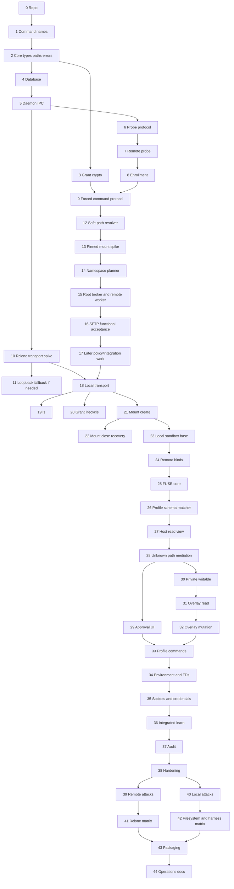

# Astral Project Implementation Plan
## Plain-English Edition

**Tool:** Astral Project  
**Commands:** `astral-project` and `aspr`  
**Primary architecture file:** `astral-project-architecture-caveman.md`  
**Primary platform:** Linux  
**Primary language:** Python 3.12 for version 1
**Package manager:** `uv`

> This edition preserves the packet numbers, dependency order, security requirements, tests, release gates, and session boundaries of the original implementation plan. Only the writing style has been changed.

## How to read this plan

The plan is divided into small work packets. Each packet should produce a testable result and a clean handoff before the next packet begins. The sequence is intentionally conservative: foundational types and protocols come first; remote isolation and transport come next; local sandboxing and profile learning follow; audit, hardening, adversarial testing, packaging, and operations finish the core release.

The five-hour session groupings near the end are estimates. A coding agent should stop at a clean interface when a packet becomes too large, document the split in an ADR or handoff note, and continue in a fresh session. Security requirements must never be reduced merely to fit a context window.

This document tells the implementing coding agent what to build and how to divide the work.
Complete the work packets in order unless a packet explicitly says otherwise.
Most packets are intended to fit within one ordinary five-hour ChatGPT Plus coding session.
Several small packets may be combined when they finish cleanly and share the same context.
A release-gate packet may require an entire session by itself.
If a packet exposes a contradiction in the architecture, stop and write an Architecture Decision Record (ADR). Do not introduce an undocumented workaround.

---

# 1. Rules for every work packet

At the start of each packet:

1. Read architecture file.
2. Read this packet only.
3. Read ADRs named by packet.
4. Inspect current repo.
5. Run current tests.
6. State exact packet goal in work log.

While implementing the packet:

1. Keep change narrow.
2. Do not add unrelated feature.
3. Do not weaken failure behavior to make test green.
4. Do not add harness-specific security branch.
5. Do not accept raw shell string where argv can be typed.
6. Do not log secret.
7. Add tests with code.
8. Add stable error code for new failure class.
9. Update docs when public behavior changes.
10. Record unresolved question immediately.
11. Never use `shell=True`.
12. Pass subprocess arguments as lists.
13. Keep trusted import paths fixed and isolated.
14. Do not load user plugins into trusted process.
15. Keep any `ctypes` or native syscall wrapper in one narrow reviewed module.

At the end of each packet:

1. Format code.
2. Run lint with warnings denied.
3. Run unit tests.
4. Run packet integration tests.
5. Update ADR or protocol fixture if needed.
6. Make clean commit or clean patch set.
7. Write handoff note.
8. Handoff note says:
   - what changed;
   - files changed;
   - tests run;
   - known failures;
   - next packet entry point;
   - security assumptions added or removed.

Do not begin the next packet while the current packet's acceptance tests are failing.

---

# 2. Repository target

Suggested workspace:

```text
astral-project/
├── pyproject.toml
├── uv.lock
├── .python-version
├── src/
│   └── astral_project/
│       ├── __init__.py
│       ├── cli.py
│       ├── core/
│       ├── protocol/
│       ├── crypto/
│       ├── daemon/
│       ├── host/
│       ├── server/
│       ├── transport/
│       ├── rclone/
│       ├── sandbox/
│       ├── homed/
│       ├── overlay/
│       ├── audit/
│       └── test_support/
├── native/
│   └── README.md
├── tests/
│   ├── unit/
│   ├── integration/
│   ├── adversarial/
│   └── fixtures/
├── packaging/
│   ├── systemd-user/
│   ├── launchers/
│   ├── shell-completions/
│   └── install/
├── docs/
│   ├── architecture.md
│   ├── threat-model.md
│   ├── protocol.md
│   ├── profile-format.md
│   └── operations.md
└── scripts/
```

Use one Python distribution unless a later ADR proves a split is needed.
Keep security-sensitive boundaries in explicit modules.
Install `astral-project` and `aspr` as two launchers for the same CLI.
Trusted launchers must use a fixed interpreter, fixed application path, and Python isolated mode.
Do not execute trusted services through `uv run` in production.

---

# 3. Dependency order



Packets 45 and later are optional, post-core work.

---

# Phase 0. Foundation

## Packet 0 — Create the Python project

**Objective:** Create an empty `uv`-managed Python project that formats, lints, type-checks, and tests successfully from the beginning.

**Implementation tasks:**

1. Initialize `pyproject.toml`.
2. Pin the supported Python minor version in `.python-version`.
3. Set `requires-python = ">=3.12,<3.13"` for version 1 unless an ADR chooses a broader range.
4. Create the `src/astral_project` package layout.
5. Create `uv.lock` and require locked synchronization in CI.
6. Add Ruff for formatting and linting.
7. Add mypy with strict settings.
8. Add pytest and coverage.
9. Add basic CI for lock validation, formatting, linting, type checking, and tests.
10. Add license and contribution files.
11. Add architecture and ADR directories.
12. Add a test-helper script entry point.
13. Add dependency-review and lockfile-diff checks.
14. Document that trusted production launchers use Python isolated mode rather than inheriting user import paths.

**Constraints:**

- Do not add a network protocol yet.
- Do not add the real daemon yet.
- Do not choose the FUSE library without an ADR.
- Do not add native code unless the descriptor-pinned syscall gate proves it necessary.
- Do not permit unpinned runtime dependencies.

**Required tests:**

```bash
uv sync --locked --all-groups
uv run ruff format --check .
uv run ruff check .
uv run mypy src tests
uv run pytest
```

**Completion criterion:** The empty Python project passes all checks from a clean checkout.

**Handoff requirements:** List each top-level module, every dependency added, and the reason each dependency is needed.

---

## Packet 1 — Implement both command names

**Objective:** `astral-project` and `aspr` must invoke the same program and produce equivalent results.

**Implementation tasks:**

1. Add the public Python CLI entry point.
2. Add `version` command.
3. Add text and JSON output.
4. Add two generated launchers, `astral-project` and `aspr`, that call the same CLI entry point.
5. Add hidden internal subcommand dispatch for daemon, server, transport, and FUSE modes.
6. Add package version, git revision if available, Python version, target platform, and protocol version fields.

**Required tests:**

- both names return same text;
- both names return byte-identical JSON;
- unknown command gives stable error;
- old short name does not exist anywhere.

**Completion criterion:** Both command names are implemented and their behavior is equivalent.

---

## Packet 2 — Implement core identifiers, paths, permissions, and errors

**Objective:** Provide the shared, security-sensitive primitive types and helpers used throughout the system.

**Implementation tasks:**

1. Add typed IDs:
   - host;
   - grant;
   - session;
   - profile;
   - issuer key;
   - transport capability;
   - request number.
2. Use random sortable IDs or UUID design chosen by ADR.
3. Add XDG path resolver.
4. Add secure directory and file creation helpers.
5. Add ownership and mode checks.
6. Add atomic file write helper.
7. Add stable error enum and numeric/string codes.
8. Add text and JSON error envelope.
9. Add config loader with strict unknown-field policy.

**Required tests:**

- invalid ID rejected;
- path traversal in names rejected;
- wrong owner rejected;
- group/world-writable key dir rejected;
- atomic write leaves no partial file;
- error JSON golden files stable.

**Completion criterion:** The remaining modules can safely depend on the core primitives.

---

## Packet 3 — Implement the canonical grant format and cryptography

**Objective:** Define a deterministic signed-grant format that is bound to its intended host, remote user, and validity period.

**Implementation tasks:**

1. Define grant envelope types.
2. Define export types.
3. Define read-only/read-write enum.
4. Define source identity fields.
5. Add canonical CBOR serializer.
6. Add Ed25519 key generation, storage, signing, verify.
7. Bind grant to:
   - host ID;
   - SSH host key fingerprint;
   - remote user;
   - time window;
   - nonce;
   - issuer ID.
8. Define mandatory and optional extension rules.
9. Add zeroization where library supports it.
10. Add golden fixtures checked into repo.

**Required tests:**

- same structure gives same bytes;
- every field mutation breaks signature;
- wrong host fails;
- wrong user fails;
- wrong host fingerprint fails;
- not-before fails early;
- expiry fails late;
- unknown mandatory extension fails;
- unknown optional extension survives if policy says so.

**Completion criterion:** The version 1 grant format is frozen in an approved ADR.

---

## Packet 4 — Implement the SQLite state database

**Objective:** Provide durable local state with transactional and recoverable schema migrations.

**Implementation tasks:**

1. Add SQLite database.
2. Add migrations table.
3. Add tables for:
   - hosts;
   - grants;
   - sessions;
   - mounts;
   - profiles metadata;
   - approvals;
   - audit events;
   - revocation state.
4. Add transaction helpers.
5. Add state version check.
6. Add backup-before-destructive-migration hook.
7. Add restrictive file mode checks.

**Required tests:**

- create from empty;
- reopen;
- migrate from fixture;
- failed migration rolls back;
- wrong file mode fails;
- concurrent read works;
- transaction crash fixture leaves valid DB.

**Completion criterion:** All required local state survives a daemon restart.

---

## Packet 5 — Implement the local daemon and primary IPC protocol

**Objective:** Create the trusted local daemon and a narrow IPC interface for the CLI.

**Implementation tasks:**

1. Add `aspr daemon` internal mode.
2. Create pathname Unix socket under XDG runtime.
3. Use `SO_PEERCRED`.
4. Reject other UID.
5. Define framed request/response protocol.
6. Add request IDs and cancellation IDs.
7. Add daemon startup lock.
8. Add stale socket recovery.
9. Add CLI auto-start or explicit service behavior by ADR.
10. Add `doctor` ping and daemon status.

**Constraints:**

- Do not use abstract Unix socket.
- Do not expose signing key through API.
- Do not expose generic process spawn.

**Required tests:**

- same UID works;
- other UID fails;
- malformed frame does not crash;
- oversized frame fails;
- stale socket repaired;
- two daemon starts do not race;
- restart preserves database.

**Completion criterion:** The CLI can call the daemon and receive a typed response.

---

# Phase 1. Host enrollment and remote primitive proof

## Packet 6 — Define the host probe protocol and host record

**Objective:** Define the complete capability report that enrollment must collect before modifying a server.

**Implementation tasks:**

1. Define machine-readable capability report.
2. Define host record TOML schema.
3. Include:
   - OS;
   - architecture;
   - remote user/home;
   - bubblewrap version;
   - user namespace result;
   - `openat2`;
   - `open_tree`;
   - `move_mount`;
   - `mount_setattr`;
   - Landlock ABI;
   - `sftp-server` path;
   - loader and libraries;
   - filesystems;
   - mount topology;
   - effective authorized-key paths;
   - effective authorized-principals paths.
4. Add capability status: supported, unsupported, unknown, degraded.
5. Add reason and evidence fields.

**Required tests:**

- strict parse;
- unknown field policy;
- host record round-trip;
- fixture for supported host;
- fixture for restricted HPC host.

**Completion criterion:** The probe output contract is frozen and covered by fixtures.

---

## Packet 7 — Implement the read-only remote probe

**Objective:** Use the user's existing SSH configuration to inspect a host without modifying it.

**Implementation tasks:**

1. Add trusted SSH invocation wrapper.
2. Respect user SSH config for enrollment only.
3. Capture host key fingerprint.
4. Execute a temporary probe application or script chosen by ADR.
5. Probe all Packet 6 fields.
6. Discover effective OpenSSH settings with server config tools where possible.
7. Detect filesystem types for candidate roots.
8. Detect autofs and nested mounts.
9. Return exact command failure evidence without secrets.
10. Implement `aspr host probe` and `aspr host doctor --probe-file`.

**Constraints:**

- Do not install key.
- Do not write remote state.
- Do not assume `~/.ssh/authorized_keys` is effective path.

**Required tests:**

- local SSH test container;
- changed host key fixture;
- missing bwrap;
- disabled userns;
- missing SFTP server;
- weird authorized-key path;
- remote command error redaction.

**Completion criterion:** The remote probe is demonstrably read-only and reliable.

---

## Packet 8 — Implement host enrollment, installation, and rollback

**Objective:** Install the remote helper and a dedicated SSH key that cannot obtain a normal shell.

**Implementation tasks:**

1. Copy the exact remote Python runtime and server application bundle atomically.
2. Create remote config/state dirs with strict modes.
3. Generate per-host SSH key locally.
4. Install issuer public key.
5. Add forced-command authorized-key line at effective path.
6. Use OpenSSH `restrict` and explicit no-PTY/no-forwarding options where needed.
7. Record the remote runtime and application-bundle digests.
8. Record control-plane file inode, digest, and link count.
9. Make enrollment idempotent.
10. Add rollback journal.
11. Add `host update-server` and `host remove` skeleton.
12. Run harmless forced-command smoke test.

**Required tests:**

- repeat enrollment no duplicate key;
- partial copy failure rolls back;
- partial authorized-key edit rolls back safely;
- host-key change blocks;
- key cannot get shell;
- key cannot forward TCP;
- key cannot request PTY;
- wrong marker rejected;
- control file with link count over one fails strict enrollment.

**Completion criterion:** An enrolled host accepts the dedicated key only for the restricted Astral Project entry point.

---

## Packet 9 — Implement the remote forced command and framing protocol

**Objective:** Ensure that the dedicated SSH key can open only the Astral Project protocol.

**Implementation tasks:**

1. Add `aspr server ssh-entry`.
2. Require exact `SSH_ORIGINAL_COMMAND=aspr-channel-v1`.
3. Define bounded length-prefixed preface.
4. Define messages:
   - validate;
   - open SFTP;
   - revoke;
   - health.
5. Verify grant signature before path work.
6. Verify issuer key.
7. Verify host/user/time fields.
8. Add nonce-bound ready/error response.
9. Keep stdout binary-clean.
10. Send diagnostics to stderr.
11. Add parser fuzz target.

**Required tests:**

- empty command fails;
- wrong command fails;
- oversized frame fails;
- truncated frame fails;
- bad signature fails before path resolution;
- stdout contains only protocol bytes;
- unknown protocol version fails.

**Completion criterion:** The remote entry point is narrow, bounded, and covered by parser fuzzing.

---

## Packet 10 — Validate rclone external-SSH transport

**Objective:** Determine whether rclone can reliably use the direct `aspr transport` wrapper.

**This is spike. No production mount code yet.**

**Implementation tasks:**

1. Pin candidate rclone versions.
2. Build stub external SSH wrapper.
3. Record exact argv and environment rclone gives wrapper.
4. Test SFTP-only fake endpoint.
5. Test:
   - `lsjson`;
   - stat;
   - mount temporary directory;
   - read;
   - write;
   - rename;
   - unmount.
6. Set `disable_hashcheck=true`.
7. Do not set `shell_type=none` with external `ssh`.
8. Record all rejected non-SFTP probes.
9. Check whether rejection breaks operation.
10. Write ADR selecting direct wrapper or fallback.

**Accept direct wrapper only if:**

- required operations pass;
- no shell command is needed;
- no host/user override is needed;
- wrapper can reject all non-SFTP commands;
- behavior is stable across supported versions.

**Completion criterion:** A transport strategy has been selected based on passing evidence.

---

## Packet 11 — Prototype the loopback SSH fallback

**Run only if Packet 10 direct wrapper fails or looks fragile.**

**Objective:** Provide rclone with a normal local SSH/SFTP endpoint without exposing remote credentials to the agent.

**Implementation tasks:**

1. Start daemon-owned loopback-only SSH endpoint on Unix socket or localhost port chosen by ADR.
2. Give rclone ephemeral local credential.
3. Restrict endpoint to SFTP subsystem only.
4. Forward SFTP byte stream through daemon remote protocol.
5. Reject forwarding, PTY, shell, exec, agent forwarding.
6. Bind endpoint lifetime to session.
7. Test same rclone matrix as Packet 10.
8. Compare attack surface and complexity.
9. Freeze transport ADR.

**Required tests:**

- endpoint unreachable outside owner/session as designed;
- local credential cannot be reused after session;
- shell fails;
- forwarding fails;
- all required rclone operations pass.

**Completion criterion:** At least one transport method is mandatory, tested, and documented.

---

## Packet 12 — Implement safe remote path resolution

**Objective:** Resolve exported source paths without permitting traversal, symlink, mount, or race-condition escapes.

**Implementation tasks:**

1. Open trusted root descriptors.
2. Implement `openat2` resolver with safe flags.
3. Add component-dirfd fallback only if equally reasoned.
4. Reject:
   - NUL;
   - relative path;
   - `.`;
   - `..`;
   - magic link;
   - forbidden type;
   - unsupported symlink behavior.
5. Return canonical path and open descriptor.
6. Collect device, inode, mount ID, file type, filesystem type.
7. Handle autofs explicitly.
8. Report nested mount topology.
9. Never reopen absolute path after validation.

**Required tests:**

- traversal corpus;
- absolute symlink out;
- relative symlink out;
- symlink loop;
- rename during resolve;
- deleted path;
- NFS fixture where possible;
- autofs mock or integration fixture.

**Completion criterion:** The path resolver returns a pinned object handle rather than only a pathname string.

---

## Packet 13 — Validate AppArmor-compatible descriptor-pinned mount construction

**Objective:** Prove that Astral Project can resolve and pin an allowed source, construct a read-only staging mount from that pinned object, and perform the construction under an AppArmor-compatible trusted setup process. The final workload must not retain mount authority.

**Prerequisites:**

* Packet 12 is complete.
* A disposable enrolled Linux host is available.
* The host has bubblewrap, AppArmor tooling where applicable, and the required kernel mount syscalls.
* The probe is run manually from a trusted shell outside the implementation-agent sandbox.

**Implementation tasks:**

### A. Add precise probe diagnostics

1. Divide the probe into named stages:

   * bubblewrap startup;
   * user-namespace creation;
   * UID/GID mapping;
   * mount-namespace creation;
   * mount-propagation privatization;
   * trusted-root opening;
   * source resolution and descriptor pinning;
   * `open_tree`;
   * `mount_setattr`;
   * `move_mount`;
   * directory invariant checks;
   * file invariant checks;
   * nested-mount invariant checks.

2. Ensure every failing operation reports structured output containing:

   * result;
   * stage;
   * syscall or operation name;
   * errno;
   * evidence;
   * kernel version;
   * distribution;
   * bubblewrap version;
   * AppArmor user-namespace restriction state;
   * relevant filesystem type and mount options.

3. Use these result classes:

   * `passed`: every required invariant passed;
   * `failed`: the mechanism ran but violated a security invariant;
   * `unsupported`: the host policy or kernel cannot support this backend;
   * `inconclusive`: an unexpected environmental or diagnostic failure prevented a conclusion.

4. Do not map every `EPERM` to the same guessed explanation.

5. Remove and permanently prohibit `--cap-add ALL`.

### B. Test the generic distribution bubblewrap profile

6. Run the probe using the distribution-provided restricted bubblewrap/AppArmor profile.

7. Determine whether the trusted mount-construction operations can run before the workload is confined.

8. Confirm that the final ordinary bubblewrap child cannot perform mount operations or create a new user namespace.

### C. Add the Astral setup launcher when required

If the distribution profile allows bubblewrap startup but denies Astral’s required descriptor-mount operations:

9. Write an ADR describing the setup/workload privilege split.

10. Add a fixed, root-owned launcher, provisionally:

```text
/usr/libexec/astral-project/aspr-namespace-setup
```

11. The launcher must:

* accept only a typed, bounded Astral namespace plan;
* reject arbitrary bubblewrap arguments;
* reject arbitrary commands and executable paths;
* create the required user and mount namespaces;
* resolve source paths beneath trusted roots;
* retain pinned descriptors;
* call `open_tree`, `mount_setattr`, and `move_mount`;
* construct the complete staging tree;
* mark required mounts read-only;
* make mount propagation private;
* close all unintended descriptors;
* drop setup-only authority;
* transition or execute the fixed final workload under a tighter AppArmor profile.

12. Add an Astral-specific AppArmor policy which:

* is bound only to root-owned, non-user-writable executable paths;
* permits the setup launcher to create the required namespace;
* permits only the capabilities needed during namespace construction;
* permits execution only of the fixed Astral runtime and workload;
* transitions the final workload into a profile without mount authority;
* denies further user-namespace creation by the final workload;
* denies arbitrary shell execution;
* denies arbitrary bubblewrap use through the Astral launcher.

13. Keep policy parsing, grant validation, and namespace-plan construction in Python.

14. Keep any native or `ctypes` layer limited to narrow typed syscall wrappers.

15. Do not place grant policy, path policy, protocol parsing, or user-interface behavior in privileged or native code.

### D. Re-run the descriptor-pinning invariants

16. Prove that a directory source remains bound to the original inode after an attacker replaces its pathname.

17. Prove that a file source is mounted from the pinned object.

18. Prove that read-only directory and file mounts reject writes with the expected error.

19. Prove that a nonrecursive mount clone excludes nested mounts while retaining the nested mountpoint directory.

20. Prove that the final workload cannot:

* call `mount`;
* call `open_tree` with clone authority;
* call `mount_setattr`;
* call `move_mount`;
* create another user namespace;
* alter the completed staging tree.

21. Prove that unrelated Python programs, raw `unshare`, and arbitrary bubblewrap children do not gain the Astral setup authority.

**Constraints:**

* Do not disable AppArmor.
* Do not change global user-namespace sysctls as a production solution.
* Do not grant `CAP_SYS_ADMIN` to the final SFTP server or agent workload.
* Do not use `--cap-add ALL`.
* Do not add a pathname-based reopen fallback.
* Do not classify a host-policy denial as a descriptor-pinning invariant failure.
* Do not begin Packet 14 until this packet returns `passed` on at least one declared supported host configuration.
* Do not claim support for filesystems or distributions that have not passed this probe.

**Required tests:**

* Unit tests for every structured result class.
* Unit tests for stage-specific syscall error reporting.
* A fixture for Ubuntu AppArmor denying UID-map setup.
* A fixture for AppArmor denying a mount-construction operation.
* A test proving the generated bubblewrap command never contains `--cap-add ALL`.
* A test proving arbitrary launcher arguments are rejected.
* A test proving mutable or user-owned launcher paths are rejected.
* A test proving pathname replacement does not redirect the mounted object.
* A test proving read-only enforcement for files and directories.
* A test proving nested mounts are excluded by the nonrecursive clone.
* A test proving the final workload lacks mount and user-namespace authority.
* An adversarial test proving an unrelated process cannot invoke the privileged setup interface.
* A clean external run on an enrolled disposable host.

**Acceptance evidence:**

Store:

* the complete structured probe result;
* kernel and distribution versions;
* AppArmor package and loaded-profile versions;
* bubblewrap version;
* filesystem type and mount options;
* syscall trace for the mount-construction path;
* relevant AppArmor audit records;
* the exact Astral package or commit revision;
* the approved ADR when an Astral-specific launcher is required.

**Completion criterion:** The packet is complete only when the probe reports `result=passed` on at least one explicitly declared supported host configuration, all descriptor-pinning invariants pass, and the final workload demonstrably lacks mount and user-namespace construction authority.

**Handoff requirements:** Record the supported host configuration, selected AppArmor mode, launcher/profile installation requirements, remaining unsupported configurations, and the exact interface consumed by Packet 14.


---

## Packet 14 — Implement the typed remote namespace planner

**Objective:** Translate a verified grant into a deterministic, typed mount plan.

**Implementation tasks:**

1. Normalize target paths.
2. Build ancestor tree.
3. Reject target collisions.
4. Merge exact duplicate exports.
5. Collapse nested same-mode export if safe.
6. Reject nested different-mode export.
7. Add runtime reservation.
8. Add control-plane reservation checks.
9. Add deterministic ordering.
10. Make plan serializable for tests and audit.

**Required tests:**

- same grant same plan;
- random export order same plan;
- target collision fails;
- runtime overlap fails;
- nested RO/RW fails;
- root grant fails when reserved descendant present.

**Completion criterion:** The namespace planner is deterministic and performs no process or mount operations.

---

## Packet 15 — Implement the root broker and remote namespace worker

**Objective:** Completed in Packets 15A–15F. 15A creates mapped worker namespace; 15B performs descriptor-pinned mount construction; 15C builds digest-verified runtime closure; 15D constructs synthetic root and removes setup authority; 15E packages systemd/AppArmor integration; 15F gates packaged deployment. Root-owned broker authenticates peers, validates signed grants and server ceilings, resolves sources under target-user DAC, consumes pinned descriptors and sealed bounded plans, and starts confined OpenSSH `sftp-server`. Bubblewrap is not production remote backend; it remains local-agent sandbox mechanism.

**Frozen acceptance evidence:** Packet 15C runtime manifest and closure; 15D synthetic-root and authority-removal tests; 15E systemd/AppArmor package; 15F positive/adversarial gate on Ubuntu 26.04 amd64. Any change to frozen invariants requires ADR/security review.

---

## Packet 16 — Full SFTP functional acceptance and integration

**Goal:** Exercise packaged SFTP behavior atop frozen Packet 15C–15F, without absorbing Packet 15 trusted-boundary work.

**Frozen Packet 15 input:** root broker is sole remote namespace authority; signed grants and server ceilings are enforced; source resolution uses target-user DAC; descriptors are pinned; execution plan is sealed and bounded; mapped namespace/mount worker builds synthetic root; runtime is fixed, digest-verified `sftp_v1`; workload selection and argv are fixed; setup authority is removed; AppArmor confines final workload; expiry/cancellation supervision exists; forced-command entry and broker bridge exist.

Packet 16 may make narrowly necessary fixed-workload integration changes. Any change to `aspr-mount-worker.c`, fixed SFTP argv, worker FD ABI, runtime closure, namespace construction, AppArmor confinement, or broker authority model is a Packet 15 trusted-boundary change. It must remain fixed and caller-unselectable and must rerun relevant Packet 15 regression evidence on certified platforms.

### Packet 16A — Direct SFTP acceptance harness

Build reusable harness against actual packaged path:

```text
SFTP test client
→ forced aspr-server entry
→ root broker
→ Packet 15 worker
→ confined OpenSSH sftp-server
```

Own SFTP INIT/VERSION, REALPATH, STAT/LSTAT, OPENDIR/READDIR, OPEN/READ/CLOSE, OPEN/WRITE/CLOSE, MKDIR/RMDIR, REMOVE, basic RENAME, and RO/RW baselines. Direct SFTP must pass before rclone testing.

### Packet 16B — Filesystem and authority-sensitive semantics

Own traversal; rename/overwrite; cross-export rename; relative, absolute, dangling, and `..`-attempting symlinks; symlink to another granted export; STAT/LSTAT; replacement races; file versus directory grants; RO/RW behavior; nested/export boundaries; stable SFTP-visible failures; and discovery plus allowlisting of extensions exposed by fixed OpenSSH `sftp-server`. OpenSSH defaults are not Astral policy. Disable or reject unsupported/unsafe extensions. The synthetic namespace is authority boundary; do not duplicate it with pathname filtering without evidence.

Symlinks must never enlarge authority beyond objects reachable inside constructed synthetic namespace. Test symlink operations on RO exports. Test hardlink creation within one RW export; reject on RO export; require kernel/filesystem failure across exports or mounts where forbidden; prove no hardlink reaches outside granted namespace. Prefer normal kernel/filesystem behavior; no bespoke inode policy without evidence.

### Packet 16C — Concurrency, coherence, and large I/O

Own multiple active SFTP sessions, multiple handles per session, external filesystem changes, rename/delete/recreate races, large reads/writes, partial/interrupted transfers, and disconnect during I/O. Descriptor pinning stabilizes export-root identity, not descendant contents as a snapshot: renaming/replacing `/host/project` leaves an existing session on the originally pinned object, while changes inside that object follow normal kernel/filesystem semantics. Test identity and descendant behavior separately; do not claim snapshot consistency.

Concurrent active workers are required, not concurrent broker parsing. Brief serialized broker setup followed by independently supervised workers is acceptable. Change broker concurrency only if acceptance proves current behavior insufficient; do not add thread pools, async rewrites, or concurrent authority-state mutation by assumption.

Large-file acceptance covers zero-length files, multi-packet transfers, offset reads/writes, EOF, interrupted writes, source truncation during access, large metadata, and files over 32-bit size where supported. Slow/package acceptance may cover expensive sizes; routine tests need not transfer multi-gigabyte fixtures.

### Packet 16D — Lifecycle, readiness, errors, and logging

Own active-session expiry, explicit cancellation, stream termination and cleanup, rejection of already-expired grants at setup, worker termination, broker/setup failures, and validation of any already-defined revocation interface. Wording is **expiry and cancellation integration; revocation acceptance only through already-defined authoritative interfaces, with broader grant lifecycle remaining later work**. Do not add revocation databases, polling systems, daemon-to-broker revocation protocols, public revoke CLI, or background revocation distribution.

Exact readiness contract:

> `RemoteSessionReadyV1` means the authenticated, confined SFTP byte stream is established and ready to receive the client's SFTP INIT packet.

It does not mean SFTP VERSION exchange occurred. Preserve:

```text
remote request authenticated
→ broker creates and registers confined worker
→ NamespaceReadyV1
→ RemoteSessionReadyV1
→ raw SFTP stream begins
→ client sends SSH_FXP_INIT
→ server returns SSH_FXP_VERSION
```

Do not consume or synthesize client negotiation before `RemoteSessionReadyV1`. Astral setup/control failures remain `RemoteSessionRejectedV1` or `NamespaceRejectedV1`. Once SFTP is established, ordinary filesystem failures remain SFTP responses, generally `SSH_FXP_STATUS`. Expiry, cancellation, worker death, and transport loss terminate the stream and produce trusted diagnostics only; never inject text into SFTP bytes.

Logging invariant: SFTP stdout is protocol data only; `aspr-server` stdout carries framing until Ready, then raw SFTP bytes; worker diagnostics go to worker stderr/log; broker/server diagnostics go to stderr/journal. Add a negative test which causes SFTP and worker errors and verifies byte-clean protocol output.

### Packet 16E — rclone compatibility

Own compatibility evidence only. Test ADR-0007's pinned rclone versions against fixed remote SFTP and operation patterns they emit, using a narrow wrapper if useful. Do not implement `aspr transport`, private per-rclone sockets, environment-bound transport tokens, daemon `OpenSftpStream`, local sandbox transport authority, or final production rclone transport plumbing; those remain Packet 18. ADR-0007 remains authoritative unless new rclone evidence triggers reconsideration.

**Stop when:** Direct 16A–16D acceptance passes on certified target, protocol bytes remain clean, and pinned rclone compatibility passes without weakening or reimplementing Packet 15.


---

## Packet 17 — Later policy and integration work

**Status:** Broker-side server-ceiling validation and remote policy enforcement were absorbed into completed Packet 15 and are frozen. Do not duplicate them here. Any genuinely new policy or portability change requires an ADR/security review before implementation.

**Objective:** Define only later work not already present in Packet 15; no weakening or alternate remote backend.

**Status:** This work is already implemented and frozen in Packet 15 broker/server-ceiling validation. Future policy changes are later work only after explicit ADR/security review. Packet 16 must consume this interface, not reimplement or weaken it.

---

# Phase 2. Local remote access

## Packet 18 — Implement the private local transport capability

**Objective:** Have the trusted daemon open the SFTP transport while keeping the sandbox-visible wrapper free of ambient authority.

**Implementation tasks:**

1. Create private per-rclone transport socket.
2. Create random environment-bound token.
3. Spawn `aspr transport` with token and socket.
4. Parse only selected rclone SFTP invocation shape.
5. Reject host, user, arbitrary option, command, forwarding.
6. Ask daemon `OpenSftpStream` with private capability.
7. Daemon selects fixed host and signed grant.
8. Daemon opens OpenSSH exact marker.
9. Exchange preface.
10. Proxy stdin/stdout.
11. Add cancellation and shutdown.
12. Ensure diagnostics stay stderr.

**Required tests:**

- token absent from command line;
- token absent from rclone config;
- wrong token fails;
- socket copied without token fails;
- shell invocation fails;
- host override fails;
- stdout byte-for-byte proxy.

**Completion criterion:** A stub rclone process can open a real remote SFTP stream through the private transport.

---

## Packet 19 — Implement `ls`

**Objective:** Allow both humans and sandboxed programs to list granted files safely, with readable output by default and exact rclone JSON only when explicitly requested.

**Implementation tasks:**

1. Generate an ephemeral rclone configuration.
2. Sanitize all `RCLONE_*` environment variables.
3. Run the pinned rclone version under daemon control using its `lsjson` operation.
4. Implement the public command `aspr ls`.
5. Implement the narrow sandbox method `RunLs`.
6. Restrict the sandbox method to the session's existing grant and path capability.
7. Support recursion, stat mode, maximum depth, filters, timeout, and cancellation.
8. Parse rclone `lsjson` output into typed internal entries.
9. Make the default output a reader-friendly table with stable columns:
   - type;
   - human-readable size;
   - ISO 8601 modification time;
   - path.
10. Escape newlines, tabs, control characters, invalid byte representations, and terminal escape sequences in all displayed names.
11. Add `--no-header`, sorting, and reverse-order options for the table.
12. Add `--json` for a stable, normalized Astral Project JSON schema intended for automation.
13. Add `--raw` to return the exact underlying rclone `lsjson` bytes.
14. Make incompatible output flags mutually exclusive.
15. Preserve rclone diagnostic output on standard error without corrupting standard output.
16. Add stable exit-code and error mapping.
17. Bound input size and fail clearly on malformed or unexpectedly large JSON.

**Required tests:**

- Default output is readable and matches golden table fixtures.
- Files containing tabs, newlines, control bytes, and ANSI escape sequences cannot alter terminal structure.
- `--raw` is byte-identical to the direct pinned-rclone fixture.
- `--json` matches the normalized Astral schema fixture.
- `--raw` and `--json` cannot be combined.
- A sandbox cannot name another grant.
- Rclone configuration overrides are blocked.
- Transport replacement is blocked.
- Cancellation terminates the child process.
- A malformed remote path fails before rclone starts.
- Malformed rclone JSON fails closed with a stable error.

**Completion criterion:** `aspr ls` works end to end in formatted, normalized JSON, and raw modes.

---

## Packet 20 — Implement grant lifecycle commands

**Objective:** Implement the complete user-facing lifecycle for grants.

**Implementation tasks:**

1. Add `grant create` draft builder.
2. Call remote validation.
3. Show canonical changes and nested mounts.
4. Require explicit human approval.
5. Sign canonical grant.
6. Store grant.
7. Add list/show/validate.
8. Add renew with fresh validation and signature.
9. Add local revoke marker.
10. Send signed remote revocation request.
11. Report partial failure when remote offline.
12. Add grant audit events.

**Required tests:**

- no sign before remote validation;
- changed canonical path needs approval;
- renew cannot silently widen;
- revoke blocks new local session immediately;
- remote offline reports partial state;
- revoked grant cannot be re-imported as active.

**Completion criterion:** Grant creation, inspection, renewal, and revocation work without mount support.

---

## Packet 21 — Implement daemon-managed rclone mounts

**Objective:** Have the trusted local daemon create and supervise rclone mounts.

**Implementation tasks:**

1. Validate local mountpoint.
2. Create session config and cache.
3. Spawn rclone mount outside agent sandbox.
4. Use selected transport ADR.
5. Set candidate safe options.
6. Detect readiness positively.
7. Record PID, mount ID, grant, cache, transport capability.
8. Add health probe.
9. Add `aspr mount`, `session open`, `session list`, `session show`.
10. Restrict modes and local path ownership.

**Required tests:**

- RO remote is RO;
- RW remote writes;
- readiness detects failure without sleep guess;
- mountpoint collision fails;
- stale config not reused;
- agent user cannot read ephemeral config through normal path.

**Completion criterion:** A daemon-managed host mount reaches the Ready state and passes its basic I/O tests.

---

## Packet 22 — Implement mount shutdown, draining, and recovery

**Objective:** Shut mounts down safely, report incomplete writeback, and clean up stale state.

**Implementation tasks:**

1. Implement state machine: Creating, Ready, Draining, Failed, Closed.
2. Add close request.
3. Stop new work where possible.
4. Wait bounded write flush.
5. Unmount.
6. Kill child if needed.
7. Report possible unflushed writes.
8. Recover state after daemon restart.
9. Find stale mounts and stale cache.
10. React to grant expiry.
11. React to revocation.
12. Add remote-loss policy hook.

**Required tests:**

- clean close;
- flush timeout;
- rclone crash;
- daemon crash/restart;
- remote network loss;
- expiry during write;
- revoke during write;
- no false clean result after failed flush.

**Completion criterion:** The mount lifecycle remains correct across the required crash and restart tests.

---

# Phase 3. Local sandbox and learned profile

## Packet 23 — Implement the local sandbox foundation

**Objective:** Run an arbitrary command inside a minimal local bubblewrap sandbox.

**Implementation tasks:**

1. Add typed local sandbox plan.
2. Bind read-only system runtime.
3. Add private `/tmp`.
4. Add minimal `/dev` without `/dev/fuse`.
5. Add separate PID, IPC, UTS namespaces.
6. Add sandbox `/proc`.
7. Add new session.
8. Drop capabilities.
9. Close all unneeded FDs.
10. Hide real home.
11. Hide main daemon and transport sockets.
12. Add shell mode and `-- command` mode.
13. Add network mode `inherit` and `none`.

**Required tests:**

- arbitrary `/bin/sh` runs;
- real home absent;
- host PIDs absent;
- SSH keys absent;
- `/dev/fuse` absent;
- main daemon socket absent;
- `network=none` has only loopback.

**Completion criterion:** An empty local sandbox can run an arbitrary command without a profile.

---

## Packet 24 — Bind pre-mounted remote views into the sandbox

**Objective:** Expose daemon-created remote mounts inside the sandbox without giving the sandbox mount authority.

**Implementation tasks:**

1. Parse repeated `--remote` arguments.
2. Restrict all paths to one signed grant in version 1.
3. Start and verify each host mount before sandbox.
4. Bind each mount at fixed sandbox target.
5. Add `--grant` shorthand.
6. Add target collision checks.
7. Add default remote-loss behavior: terminate sandbox.
8. Bind narrow session socket.
9. Implement `DescribeSession`, `GetRemoteMounts`, `GetExpiry`, `CloseOwnSession`.
10. Do not expose mount creation or SFTP stream method.

**Required tests:**

- multiple subpaths same grant work;
- second grant rejected in v1;
- target collision fails;
- agent sees remote;
- agent cannot see rclone config;
- agent cannot mount new path;
- remote loss terminates sandbox by default.

**Completion criterion:** A sandboxed agent can use the pre-mounted remote files through normal filesystem operations.

---

## Packet 25 — Implement the projected-home FUSE core

**Objective:** Mount a reliable empty projected home using FUSE.

**Implementation tasks:**

1. Choose and pin the Python FUSE3 binding and async runtime by ADR; prefer `pyfuse3` with Trio unless testing rejects it.
2. Add `aspr homed` internal mode.
3. Create mount lifecycle.
4. Build synthetic inode table.
5. Build file-handle table.
6. Handle lookup, getattr, open, release, forget with empty/deny behavior.
7. Handle request cancellation.
8. Bound request queue and memory.
9. Add crash cleanup.
10. Bind FUSE mount into sandbox at ordinary `$HOME` path.
11. Keep admin socket outside sandbox.

**Required tests:**

- empty home mounts;
- concurrent lookup does not corrupt table;
- forget works;
- cancelled request releases state;
- daemon crash makes mount unusable;
- stale mount cleaned;
- sandbox sees correct `$HOME` string.

**Completion criterion:** The basic FUSE filesystem is stable before any real host files are exposed.

---

## Packet 26 — Implement the profile schema and policy matcher

**Objective:** Return a deterministic policy decision for every path and filesystem operation.

**Implementation tasks:**

1. Implement profile TOML schema.
2. Add rule modes:
   - host-ro;
   - host-rx;
   - private-rw;
   - overlay-rw;
   - deny.
3. Add exact/subtree scope.
4. Add operation classes.
5. Implement precedence:
   - exact before subtree;
   - longer before shorter;
   - deny before allow at same specificity;
   - equal conflict invalid.
6. Add validation for overlapping writable roots.
7. Add sensitivity labels.
8. Add draft/sealed state fields.
9. Compile profile into matcher optimized for FUSE calls.

**Required tests:**

- golden precedence table;
- ambiguous conflict fails;
- parent subtree and child exact works;
- deny behavior deterministic;
- path normalization rejects escape;
- serialize/parse round-trip.

**Completion criterion:** The policy matcher is deterministic and has no filesystem side effects.

---

## Packet 27 — Implement host-backed, read-only projected-home access

**Objective:** Expose approved host configuration inside the projected home without exposing unrelated home-directory content.

**Implementation tasks:**

1. Open real home with `O_PATH` root descriptor.
2. Implement safe relative resolver.
3. Add host-ro exact.
4. Add host-ro subtree.
5. Add host-rx.
6. Separate lookup/stat/read/readdir permission.
7. Add synthetic inode mapping to backing descriptors.
8. Prevent symlink escape.
9. Prevent magic-link escape.
10. Keep live host changes visible.
11. Never write host.

**Required tests:**

- exact config read works;
- sibling listing denied;
- subtree listing allowed only with list permission;
- host symlink out fails;
- absolute symlink out fails;
- host change becomes visible;
- chmod/write/truncate fail.

**Completion criterion:** Existing harness configuration can be read only through explicit profile rules.

---

## Packet 28 — Implement mediation for unknown paths

**Objective:** Mediate unknown path accesses through the trusted approval system rather than exposing them automatically.

**Implementation tasks:**

1. Add pending request type.
2. Include path component, operation, session, request number, timeout.
3. Hold FUSE request for bounded time.
4. Add allow-once session rule.
5. Add deny/hide response.
6. Add opaque ancestor traversal.
7. Deny `readdir` for opaque ancestor.
8. Minimize metadata.
9. Coalesce duplicate requests.
10. Rate-limit and cap queue.
11. Add provenance skeleton.
12. Add optional full-path observer interface.
13. Observer output is diagnostic only.
14. Feature works when observer disabled.

**Required tests:**

- unknown parent then child can progress;
- opaque ancestor cannot list siblings;
- timeout fails closed;
- queue flood stays bounded;
- duplicate requests coalesce;
- observer off changes prompt quality only;
- observer lie cannot grant path.

**Completion criterion:** Unknown accesses are either held for bounded approval or denied safely.

---

## Packet 29 — Implement the trusted approval interface

**Objective:** Ensure that output produced by the sandboxed child cannot approve its own access request.

**Implementation tasks:**

1. Run child under PTY controlled by parent.
2. Reserve `Ctrl-]` or configurable key.
3. Intercept key before child.
4. Add non-authoritative pending status.
5. On trusted transition:
   - stop forwarding input;
   - pause/buffer child output;
   - show session ID;
   - show monotonic request number;
   - show operation/path/sensitivity;
   - accept decision.
6. Restore terminal.
7. Add external approval mode.
8. Handle resize, signals, job control, suspend/resume.
9. Restore terminal after crash with guard process or robust cleanup.
10. Never expose approval socket to sandbox.

**Required tests:**

- fake child prompt gives no authority;
- child cannot consume approval choice;
- repeated escape works;
- full-screen test app works;
- resize works;
- SIGINT behavior defined;
- crash restores terminal;
- external terminal can approve exact session.

**Completion criterion:** The trusted approval interface passes its security and terminal-behavior tests.

---

## Packet 30 — Implement private writable profile state

**Objective:** Allow a harness to write cache and state without modifying the real host home directory.

**Implementation tasks:**

1. Add per-profile private backing root.
2. Implement create, open, read, write, truncate.
3. Implement mkdir/rmdir.
4. Implement rename/unlink within one private root.
5. Implement fsync.
6. Add synthetic ownership and mode rules.
7. Clear setuid/setgid.
8. Reject device node.
9. Add quota hooks or size limits.
10. Persist across projects.
11. Keep per-session locks safe.

**Required tests:**

- write survives new session;
- host home unchanged;
- rename/unlink works;
- concurrent writes defined;
- quota fails stable;
- setuid cleared;
- unsupported xattr stable error.

**Completion criterion:** The `private-rw` mode is usable for caches, logs, and other private state.

---

## Packet 31 — Implement overlay reads and copy-up

**Objective:** Allow a harness to read host configuration while redirecting writes into an overlay.

**Implementation tasks:**

1. Define lower host and upper profile roots.
2. Lookup upper first.
3. Respect whiteout marker format.
4. Fallback to lower.
5. Copy regular lower file to upper on first write.
6. Preserve safe mode and timestamps policy.
7. Clear dangerous bits.
8. Add merged directory listing.
9. Add lock ordering.
10. Make lower changes visible until shadowed.
11. Ensure copy-up uses descriptors and atomic temp rename.

**Required tests:**

- lower read works;
- first write copies up;
- lower not changed;
- lower update visible before shadow;
- lower update hidden after shadow;
- concurrent copy-up gives one valid upper;
- merged list no duplicate.

**Completion criterion:** Overlay reads and copy-up behavior pass the required correctness tests.

---

## Packet 32 — Implement overlay mutation, whiteouts, and recovery

**Objective:** Implement the core writable-overlay behavior required by real applications.

**Implementation tasks:**

1. Implement create.
2. Implement unlink with whiteout.
3. Implement directory whiteout.
4. Implement rename within overlay root.
5. Return `EXDEV` across rule roots.
6. Restrict hardlinks to safe same-root case or deny.
7. Add crash-consistent metadata journal.
8. Recover after daemon restart.
9. Add randomized model test.
10. Document unsupported POSIX behavior.
11. Add mmap/lock feature flags based on tests.

**Required tests:**

- whiteout survives restart;
- deleted lower stays hidden;
- rename lower source works through copy-up;
- crash at each mutation phase recovers;
- randomized operation sequence matches model;
- host lower never changes.

**Completion criterion:** The overlay remains consistent through destructive and crash-recovery tests.

---

## Packet 33 — Implement profile management and sealing

**Objective:** Provide commands for creating, reviewing, editing, sealing, and reusing profiles.

**Implementation tasks:**

1. Add create.
2. Add learn draft transaction.
3. Add review.
4. Add diff.
5. Add edit through safe editor temp file.
6. Add seal/unseal.
7. Add list.
8. Add export/import.
9. Add archive.
10. Add provenance for persisted approvals.
11. Add profile revision number.
12. Make import strict and path-safe.
13. Make sealed unknown behavior deny or hide.

**Required tests:**

- profile survives two projects;
- export/import same semantics;
- bad conflict rejected;
- sealed unknown path fails;
- unseal explicit;
- failed learning session does not corrupt prior revision;
- provenance preserved.

**Completion criterion:** The complete reusable profile lifecycle works.

---

## Packet 34 — Control the environment, PATH, and inherited file descriptors

**Objective:** Remove ambient authority that would bypass the projected-home policy.

**Implementation tasks:**

1. Add environment allowlist.
2. Add explicit unset list.
3. Detect secret-like variable names.
4. Show names, never values.
5. Validate each PATH component is visible.
6. Remove invisible PATH component.
7. Close all FDs except documented set.
8. Add FD inventory debug test mode.
9. Ensure child PID namespace and sandbox `/proc`.
10. Sanitize rclone and SSH-related environment.
11. Add stable warning/error policy.

**Required tests:**

- SSH_AUTH_SOCK absent;
- AWS secret vars absent;
- secret values absent from logs;
- invisible PATH entry removed;
- inherited secret FD absent;
- only documented FDs survive.

**Completion criterion:** The environment and inherited-file-descriptor boundary is demonstrated by tests.

---

## Packet 35 — Control sockets and credentials

**Objective:** Expose only explicitly approved sockets and credential resources.

**Implementation tasks:**

1. Add profile socket entries.
2. Default deny known dangerous sockets.
3. Bind exact pathname sockets only.
4. Reject abstract trusted sockets.
5. Add sensitivity and warning levels.
6. Add credential file sensitivity prompt.
7. Add raw socket authority warning.
8. Add short-lived credential recipe interface only if generic.
9. Do not build full broker yet.
10. Redact socket and credential audit details as configured.

**Required tests:**

- Docker socket absent;
- SSH agent absent;
- approved harmless socket works;
- different socket path fails;
- credential approval requires strong confirmation;
- no credential content logged.

**Completion criterion:** Every exposed socket or credential capability is explicit and auditable.

---

## Packet 36 — Integrate and complete `profile learn`

**Objective:** Deliver `profile learn` as one complete, enforced workflow rather than a trace-only partial feature.

**Implementation tasks:**

1. Join local sandbox.
2. Join projected home.
3. Join profile matcher.
4. Join unknown mediation.
5. Join trusted approval UI.
6. Join private and overlay state.
7. Join environment/socket policy.
8. Join pre-mounted remote views.
9. Add optional observer.
10. Add clean session teardown.
11. Add restart under sealed profile.
12. Add command:

```bash
aspr profile learn agents-default -- any-program
```

13. Add noninteractive external approval mode.
14. Do not expose feature as stable until all acceptance tests pass.

**End-to-end acceptance criteria:**

- customized harness starts;
- known config appears;
- unknown config prompts;
- human approves through trusted UI;
- rule persists;
- private/overlay writes persist;
- real home is unchanged;
- unrelated home stays hidden;
- second project reuses profile;
- sealed session needs no prompt for known config;
- observer disabled still secure and usable.

**Completion criterion:** The complete promised `profile learn` workflow works end to end.

---

# Phase 4. Audit, hardening, attacks, release

## Packet 37 — Implement the audit system

**Objective:** Record enough security events to reconstruct activity without recording secret content.

**Implementation tasks:**

1. Define event schema and versions.
2. Add enrollment events.
3. Add grant events.
4. Add session and transport events.
5. Add mount events.
6. Add profile request and approval events.
7. Add sandbox launch event.
8. Add degradation event.
9. Add path hashing/redaction mode.
10. Add `audit list/show/export`.
11. Add provenance links to profile revisions.
12. Add rotation and retention config.

**Required tests:**

- no private key;
- no credential content;
- no secret env value;
- path redaction deterministic when configured;
- event chain references valid IDs;
- malformed old event does not crash reader.

**Completion criterion:** A reviewer can reconstruct a session from audit data without access to secret content.

---

## Packet 38 — Add Landlock and process hardening

**Objective:** Add defense-in-depth controls without treating them as substitutes for the primary namespace and capability boundaries.

**Implementation tasks:**

1. Detect Landlock ABI.
2. Add remote SFTP child Landlock rules.
3. Add practical `aspr-homed` Landlock restriction.
4. Add daemon restrictions that do not break function.
5. Set `no_new_privs` where valid.
6. Drop capabilities.
7. Set rlimits.
8. Set core-dump policy.
9. Use secure temp files.
10. Add dependency version reporting.
11. Add parser fuzz jobs.
12. Report unavailable hardening in doctor and audit.

**Required tests:**

- Landlock on path limits access;
- Landlock off does not enlarge beyond namespace;
- capability list empty where expected;
- core dumps disabled for secret-owning process;
- fuzz corpus runs in CI.

**Completion criterion:** Unavailable or failed defense-in-depth controls are reported explicitly.

---

## Packet 39 — Build the remote adversarial test suite

**Objective:** Convert every remote security invariant into an executable adversarial test.

**Implementation tasks:**

Build tests for:

1. `..` traversal.
2. Absolute symlink escape.
3. Relative symlink escape.
4. Symlink swap race.
5. Rename race.
6. Export source replacement race.
7. `/proc/self/fd` escape.
8. Inherited FD escape.
9. Nested mount surprise.
10. Wrong-host grant replay.
11. Wrong-user grant replay.
12. Expired grant.
13. Revoked grant.
14. Runtime bundle leakage.
15. Multi-connection incoherence.
16. Hardlink alias to authorized keys.
17. Hardlink alias to server application or runtime file.
18. Concurrent alias creation.
19. Writable persistence path warning.
20. Forced-command shell attempt.

**Acceptance criteria:**

- each architecture invariant maps to test ID;
- failures print useful evidence;
- known rootless hardlink race is marked residual, not fake pass.

**Completion criterion:** Every remote threat-model invariant is represented by an executable adversarial test.

---

## Packet 40 — Build the local adversarial test suite

**Objective:** Build adversarial tests against the local sandbox and projected home.

**Implementation tasks:**

Build tests for:

1. hidden home read;
2. host `/proc` inspection;
3. same-UID daemon signal/ptrace attempt;
4. main socket discovery;
5. abstract socket discovery;
6. SSH key search;
7. SSH agent use;
8. Docker socket use;
9. inherited FD;
10. FUSE symlink escape;
11. hardlink restriction;
12. prompt flooding;
13. unknown-parent brute force;
14. fake approval screen;
15. child trying to consume `Ctrl-]`;
16. approval request replay;
17. session socket relay;
18. rclone config replacement;
19. alternate SSH execution;
20. FUSE daemon crash;
21. overlay crash recovery;
22. terminal crash restoration.

**Acceptance criteria:**

- every local invariant maps to test;
- queue and memory limits measured;
- no attack becomes broad approval.

**Completion criterion:** Every local threat-model invariant is represented by an executable adversarial test.

---

## Packet 41 — Automate the rclone compatibility matrix

**Objective:** Establish and automate the exact range of supported rclone versions.

**Implementation tasks:**

1. Create matrix runner.
2. Download or use pinned test binaries through CI-approved mechanism.
3. Test selected transport strategy.
4. Test fallback strategy if supported.
5. Test:
   - list;
   - stat;
   - mount;
   - read;
   - write;
   - rename;
   - unmount;
   - expiry;
   - revoke;
   - crash.
6. Capture wrapper argv.
7. Capture forbidden command attempts.
8. Publish machine-readable result.
9. Teach `doctor` supported ranges.

**Tests:** Matrix itself has fixture mode and failure detection.

**Completion criterion:** The supported rclone versions and transport behavior are explicit and machine-readable.

---

## Packet 42 — Build the filesystem, distribution, and harness compatibility matrix

**Objective:** Establish the exact distributions, filesystems, and harness environments in which the system is supported.

This packet may require access to several physical or virtual environments.
The tests may run separately in each environment, but the matrix automation should remain one coherent implementation.

**Implementation tasks:**

1. Build reusable matrix runner.
2. Test distributions:
   - Ubuntu LTS;
   - Debian stable;
   - Fedora;
   - RHEL-compatible;
   - HPC-like restricted-userns host.
3. Test filesystems:
   - ext4;
   - XFS;
   - tmpfs;
   - NFS;
   - Lustre or GPFS where available.
4. Test:
   - path identity;
   - pinned mount;
   - nested mounts;
   - locks;
   - mmap;
   - rename;
   - FUSE;
   - rclone mount.
5. Run compatibility smoke tests for common harnesses.
6. Test nested native harness sandbox.
7. Publish JSON result.
8. Teach `doctor` unsupported combinations.

**Important:** A harness compatibility failure may justify a recipe or a documented limitation, but it must not create a harness-specific branch in the security engine.

**Completion criterion:** The platform support matrix is repeatable and accurately reflects observed results.

---

## Packet 43 — Implement packaging and service lifecycle management

**Objective:** Provide a safe, repeatable installation and update experience for ordinary users.

**Implementation tasks:**

1. Build the locked Python wheel, source distribution, and production launcher bundle with `uv build`.
2. Install both command launchers from the same locked application bundle.
3. Add systemd user service/socket activation or chosen equivalent, using a fixed interpreter and Python isolated mode.
4. Add shell completion.
5. Add man pages or command help generation.
6. Add remote runtime and application-bundle update with digests and rollback.
7. Add local database migration path.
8. Add uninstall.
9. Add residue scanner.
10. Add version skew checks between local and remote.
11. Add key rotation procedure.
12. Add package signatures/checksums.

**Required tests:**

- clean install;
- repeat install;
- upgrade old fixture;
- failed remote update rolls back;
- both command names work;
- uninstall reports remote residue;
- version skew blocks unsafe protocol.

**Completion criterion:** A supported distribution can install, upgrade, and remove the software without manual file editing.

---

## Packet 44 — Write operations and incident-response documentation

**Objective:** Document normal operations and the required response to common failures and security incidents.

**Implementation tasks:**

Write:

1. install guide;
2. host enrollment guide;
3. grant guide;
4. profile learning guide;
5. sandbox mode guide;
6. remote-only warning;
7. network mode warning;
8. credential warning;
9. revocation guide;
10. lost-key response;
11. changed host-key response;
12. stale mount cleanup;
13. FUSE cleanup;
14. failed writeback response;
15. remote residue cleanup;
16. audit export/redaction guide;
17. known residual risks;
18. unsupported userns host explanation.

**Required tests:**

- every documented command in smoke script;
- examples use `aspr` and `astral-project` correctly;
- no old command alias;
- no promise stronger than tests.

**Completion criterion:** A new operator can reproduce the supported workflow from the documentation.

---

# Phase 5. Optional and later work

## Packet 45 — Add an optional generic MCP adapter

**Objective:** Provide convenient MCP tool calls without introducing any new authority.

**Prerequisite:** Stable CLI and narrow session API.

**Implementation tasks:**

1. Expose only narrow operations such as session description and `ls`.
2. Never expose grant signing, SSH stream, main daemon socket, or approval.
3. Use same sandbox session capability.
4. Make adapter removable.
5. Add tests proving removal changes no security property.

**Completion criterion:** The MCP adapter provides convenience without changing any security property.

---

## Packet 46 — Add declarative compatibility recipes

**Objective:** Provide optional compatibility recipes without adding harness-specific logic to the security engine.

**Implementation tasks:**

1. Define recipe schema.
2. Recipe may suggest:
   - config paths;
   - private cache paths;
   - overlay state paths;
   - executable paths;
   - environment names;
   - socket warnings.
3. Recipe cannot auto-approve credential.
4. Recipe cannot override organization policy.
5. Add sample recipes for common harnesses.
6. Mark recipes advisory and versioned.

**Required tests:**

- unknown harness works with no recipe;
- recipe removal changes no security invariant;
- credential suggestion still asks human.

**Completion criterion:** Compatibility recipes remain declarative data rather than security-engine branches.

---

## Packet 47 — Design a backend for hosts with restricted user namespaces

**This is a separate design project. Do not begin implementation without a dedicated review.**

**Objective:** Design a separate supported architecture for sites that disable rootless user namespaces.

Possible forms:

- root-owned `aspr-serverd`;
- administrator-installed namespace launcher;
- site container runtime integration;
- embedded path-mediating SFTP server.

**Before writing code:**

1. Write new threat model.
2. Define privileged API.
3. Define authentication.
4. Define per-user isolation.
5. Define policy ownership.
6. Define audit.
7. Define upgrade and rollback.
8. Get security review.

**Completion criterion:** No implementation may begin until the new threat model and ADR are approved.

---

# 4. Release gates

## Python runtime injection gate

Before daemon, remote helper, transport wrapper, or FUSE daemon is treated as trusted:

1. launch it with a fixed interpreter and fixed application path;
2. use Python isolated mode;
3. prove `PYTHONPATH`, user site-packages, current directory, and user-controlled `.pth` files cannot inject code;
4. sanitize all `PYTHON*` environment variables;
5. verify dependency lock and installed artifact digests;
6. prove no trusted process imports harness or project plugins.

No security-candidate build before this gate passes.


These gates block later work until their requirements are satisfied.

## Gate 1: transport

Packet 10 or 11 must prove one rclone transport.
Do not implement or ship mount support until this gate passes.

## Gate 2: pinned mount

Packet 13 must prove no pathname reopen.
Do not claim strict remote isolation until this gate passes.

## Gate 3: SFTP functional acceptance

Packet 16 must prove complete SFTP functionality and integration atop frozen Packet 15 boundary. Runtime closure and confinement are Packet 15 evidence, not Packet 16 construction. Do not release remote MVP until this gate passes.

## Gate 4: integrated learner

Packets 25 through 36 must all pass.
Do not ship trace-only learner.
Do not ship prompt UI without FUSE enforcement.
Do not ship FUSE view without trusted approval.

## Gate 5: attack suites

Packets 39 and 40 must map every invariant to test.
Do not label a build as a security candidate until this gate passes.

## Gate 6: compatibility matrix

Packets 41 and 42 define supported versions and hosts.
Do not make a general “works on Linux” claim without an explicit support matrix.

---

# 5. Suggested coding-agent session bundles

Each bundle is a reasonable amount of work for one fresh coding-agent context window.
Do not combine a release-gate packet with unrelated implementation work.
Small packets may share a session when the first packet finishes cleanly and leaves sufficient context.

```text
Window A: Packet 0 + Packet 1
Window B: Packet 2
Window C: Packet 3
Window D: Packet 4 + Packet 5
Window E: Packet 6
Window F: Packet 7
Window G: Packet 8
Window H: Packet 9
Window I: Packet 10
Window J: Packet 11 only if needed
Window K: Packet 12
Window L: Packet 13
Window M: Packet 14
Window N: Packet 15
Window O: Packet 16
Window P: Packet 17
Window Q: Packet 18
Window R: Packet 19 + small part of Packet 20 if clean
Window S: finish Packet 20
Window T: Packet 21
Window U: Packet 22
Window V: Packet 23
Window W: Packet 24
Window X: Packet 25
Window Y: Packet 26
Window Z: Packet 27
Window AA: Packet 28
Window AB: Packet 29
Window AC: Packet 30
Window AD: Packet 31
Window AE: Packet 32
Window AF: Packet 33
Window AG: Packet 34 + Packet 35 if narrow
Window AH: Packet 36
Window AI: Packet 37
Window AJ: Packet 38
Window AK: Packet 39
Window AL: Packet 40
Window AM: Packet 41
Window AN: Packet 42 automation
Window AO+: run Packet 42 on each external environment
Window AP: Packet 43
Window AQ: Packet 44
Window AR: Packet 45 + Packet 46, post-core
```

This schedule is an estimate, not a rigid rule.
If a packet grows too large, split it at a natural interface and document the new boundary.
Do not reduce or rush security work merely to fit the session limit.

---

# 6. Required ADR list

Create each ADR before or during the packet that depends upon it.

```text
ADR-0001 Python version, uv project layout, typing, and test policy
ADR-0002 ID format
ADR-0003 Canonical CBOR and extension rules
ADR-0004 Daemon IPC framing
ADR-0005 Daemon activation model
ADR-0006 Remote probe method
ADR-0007 Rclone transport choice
ADR-0008 Safe remote path resolution
ADR-0009 Descriptor-pinned mount syscall sequence
ADR-0010 Remote namespace plan rules
ADR-0011 SFTP runtime closure
ADR-0012 Server policy merge rules
ADR-0013 Local sandbox runtime binds
ADR-0014 Python FUSE library and async runtime
ADR-0015 Projected-home inode model
ADR-0016 Unknown ancestor behavior
ADR-0017 Trusted terminal transition
ADR-0018 Overlay metadata and whiteout format
ADR-0019 Environment and socket policy
ADR-0020 Audit redaction
ADR-0021 Supported version matrix
ADR-0022 Python/native syscall boundary and review rules
ADR-0023 Remote Python runtime and application-bundle format
```

Each ADR must describe:

- problem;
- choices;
- chosen choice;
- security effect;
- rejected choices;
- tests that prove choice;
- future reconsideration trigger.

---

# 7. Stable error groups

Implement these error groups early.
Keep the codes stable after they become public.

Suggested groups:

```text
ASPR_CONFIG_*
ASPR_PERMISSION_*
ASPR_DAEMON_*
ASPR_PROTOCOL_*
ASPR_CRYPTO_*
ASPR_HOSTKEY_*
ASPR_ENROLL_*
ASPR_CAPABILITY_*
ASPR_GRANT_*
ASPR_POLICY_*
ASPR_PATH_*
ASPR_MOUNT_*
ASPR_RCLONE_*
ASPR_TRANSPORT_*
ASPR_SFTP_*
ASPR_SANDBOX_*
ASPR_PROFILE_*
ASPR_APPROVAL_*
ASPR_FUSE_*
ASPR_OVERLAY_*
ASPR_AUDIT_*
ASPR_UNSUPPORTED_*
```

Every error response should include:

```text
code
short message
what was denied or stopped
why boundary would be unsafe
safe next action
source dependency error if useful
```

---

# 8. Security review checklist before stable release

A security reviewer must be able to answer “yes” to every item below.

## Keys and protocol

- Grant key private only in daemon state.
- SSH key private only in daemon state.
- Transport token not in argv or config.
- SSH host key pinned.
- Forced command exact.
- Frame lengths bounded.
- Signature canonical.
- Wrong host/user replay fails.

## Remote filesystem

- Positive grants only.
- Source pinned by descriptor.
- No path reopen.
- RO kernel-enforced.
- Reserved paths unreachable.
- Nested mount behavior proven.
- Runtime closure minimal.
- SFTP child supervised.
- Expiry and revoke kill child.

## Rclone

- Supported version pinned or checked.
- External SSH behavior recorded.
- Shell probes rejected.
- Config override blocked.
- VFS writeback uncertainty reported.

## Local sandbox

- Real home hidden.
- Main daemon socket hidden.
- Transport socket hidden.
- SSH keys hidden.
- SSH agent hidden.
- Docker socket hidden.
- `/dev/fuse` hidden.
- Host PID namespace hidden.
- Extra FDs closed.

## Profile learner

- FUSE is enforcement.
- Observer is diagnostic only.
- Unknown parent works with observer off.
- Opaque traversal cannot list siblings.
- Prompt queue bounded.
- Timeout fails closed.
- Child cannot approve.
- Real home never written in version 1.
- Overlay crash recovery tested.
- Sealed mode fails closed.

## Operations

- Audit redacts secret.
- Install idempotent.
- Upgrade rollback works.
- Uninstall finds residue.
- Unsupported host fails early.
- Known gaps documented.

---

# 9. Final implementation finish line

The first stable release is ready only when every command below works:

```bash
aspr doctor
aspr host enroll alice@cluster
aspr profile create agents-default
aspr profile learn agents-default -- codex
aspr profile seal agents-default
aspr grant create cluster --name job --rw /project/src --ro /project/docs --ttl 8h
aspr ls job:/project/src --recursive
aspr mount job:/project/src ./remote
aspr sandbox --profile agents-default --grant job
aspr grant revoke job
```

The following security properties must also remain true:

```text
Agent has normal approved config.
Agent has project files.
Agent has only granted remote files.
Agent has no normal SSH key.
Agent has no remote shell.
Agent has no unapproved local home.
Agent has no mount power.
Agent has no approval power.
Unknown access fails closed.
Revocation stops session.
Audit tells what happened without secret content.
```

Build the system described above.
Do not ship a weaker system under the same security claims.
